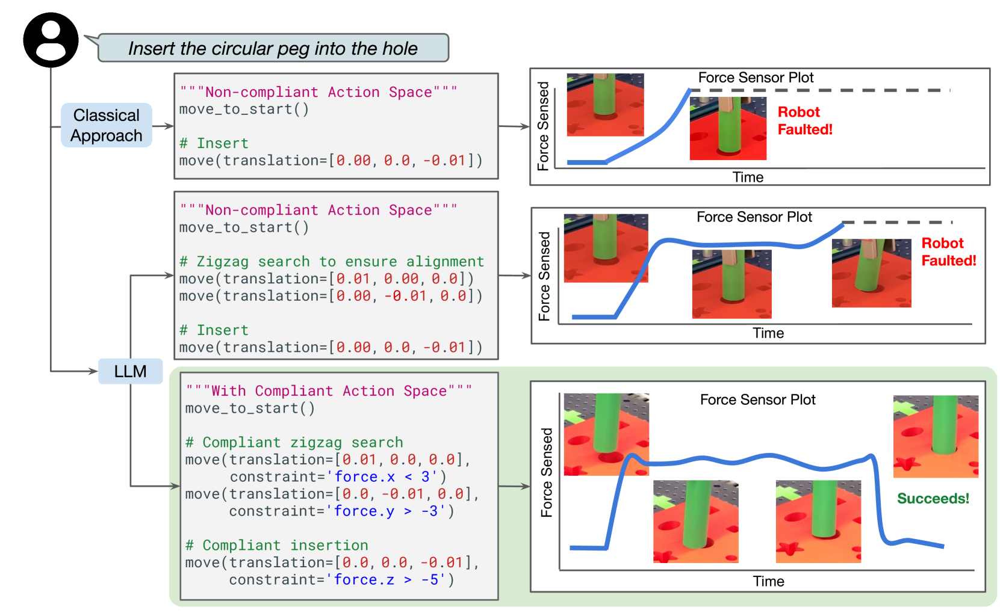
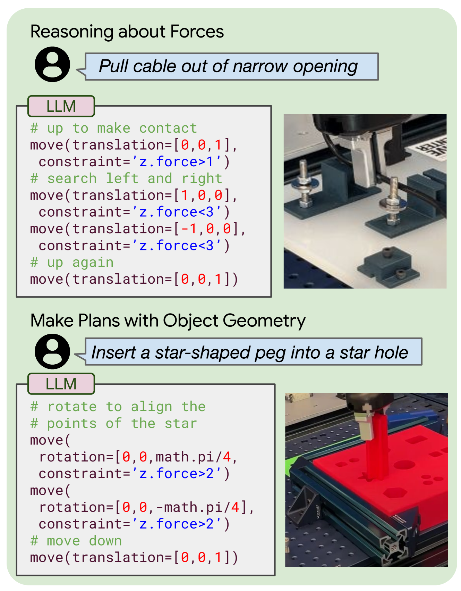
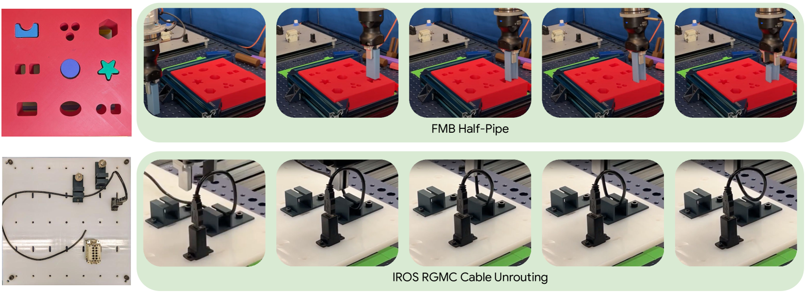
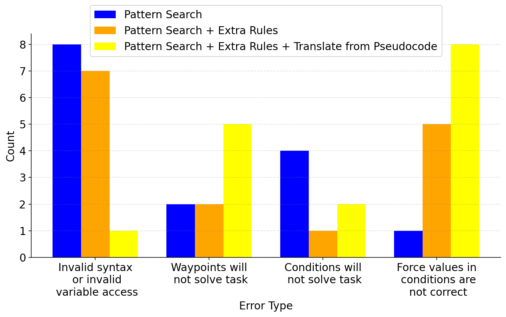
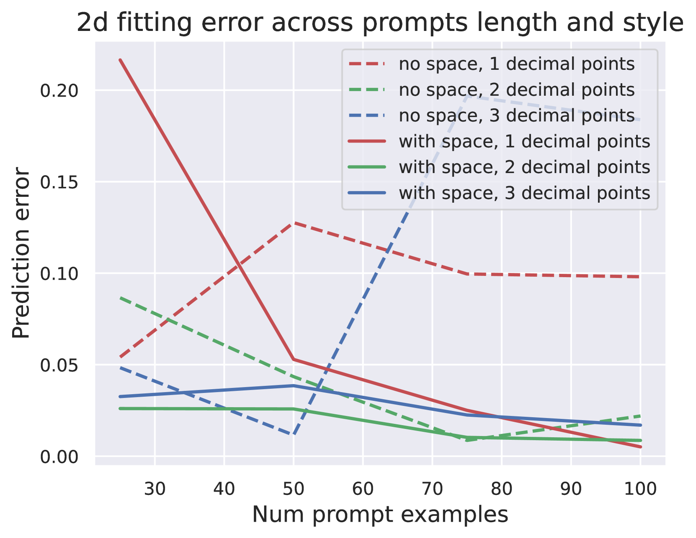
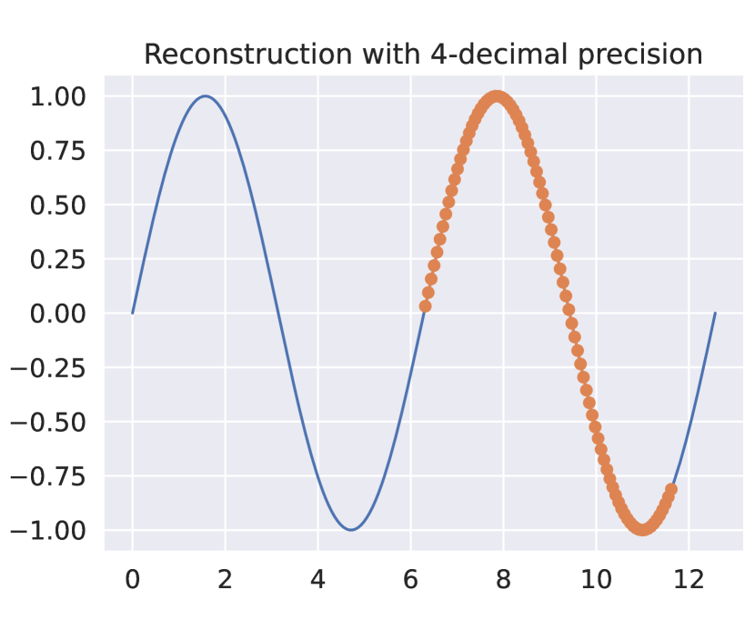
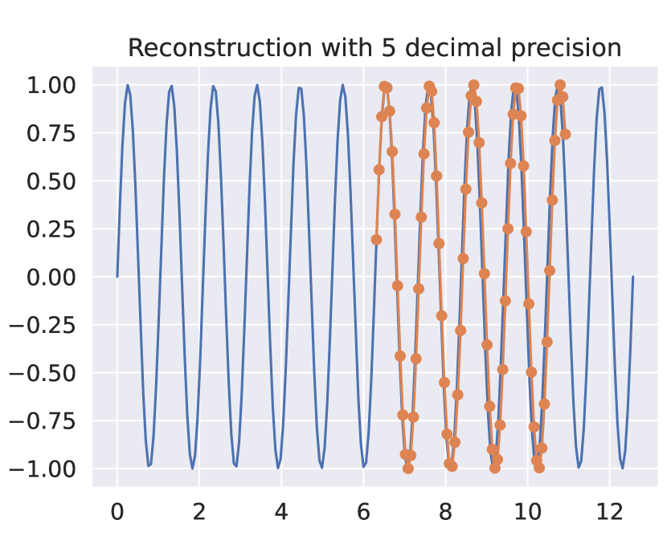
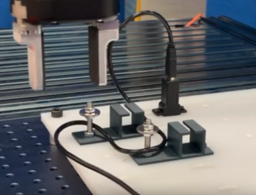
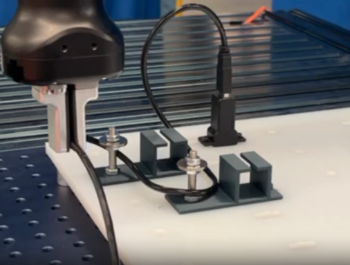
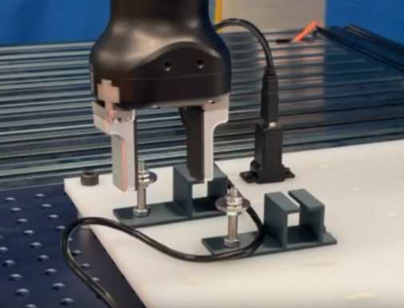

# GenCHiP：针对精密操作和丰富接触任务，自动编写机器人策略代码

发布时间：2024年04月09日

`LLM应用` `机器人` `人工智能`

> GenCHiP: Generating Robot Policy Code for High-Precision and Contact-Rich Manipulation Tasks

# 摘要

> 大型语言模型（LLMs）在编写机器人策略代码方面表现出色，但这些成就大多停留在宏观层面，尚未触及需要精细操作的任务。目前尚不清楚这些方法在涉及接触力推理和严格成功容忍度的任务中的表现如何。我们的研究发现，在适当的动作空间下，即便在诸如感知误差或抓取不准等干扰因素下，LLMs 也能出色地制定出一系列需要接触和精确操控的任务策略。我们对动作空间进行了重新定义，加入了对达到目标姿态过程中交互力和刚度约束的考虑。通过功能操作基准测试（FMB）和 NIST 任务板基准的子任务验证了这一方法。相较于传统的非遵从性动作空间，结合对象姿态估计的方法，能够使 LLM 在策略生成上的效率提升超过 3 倍和 4 倍。

> Large Language Models (LLMs) have been successful at generating robot policy code, but so far these results have been limited to high-level tasks that do not require precise movement. It is an open question how well such approaches work for tasks that require reasoning over contact forces and working within tight success tolerances. We find that, with the right action space, LLMs are capable of successfully generating policies for a variety of contact-rich and high-precision manipulation tasks, even under noisy conditions, such as perceptual errors or grasping inaccuracies. Specifically, we reparameterize the action space to include compliance with constraints on the interaction forces and stiffnesses involved in reaching a target pose. We validate this approach on subtasks derived from the Functional Manipulation Benchmark (FMB) and NIST Task Board Benchmarks. Exposing this action space alongside methods for estimating object poses improves policy generation with an LLM by greater than 3x and 4x when compared to non-compliant action spaces

[Arxiv](https://arxiv.org/abs/2404.06645)