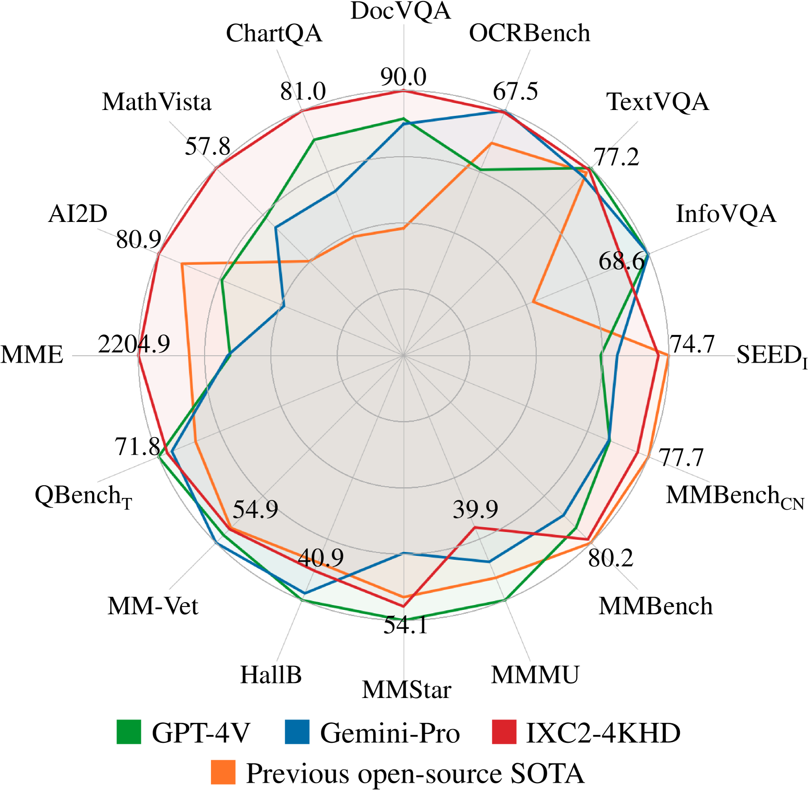
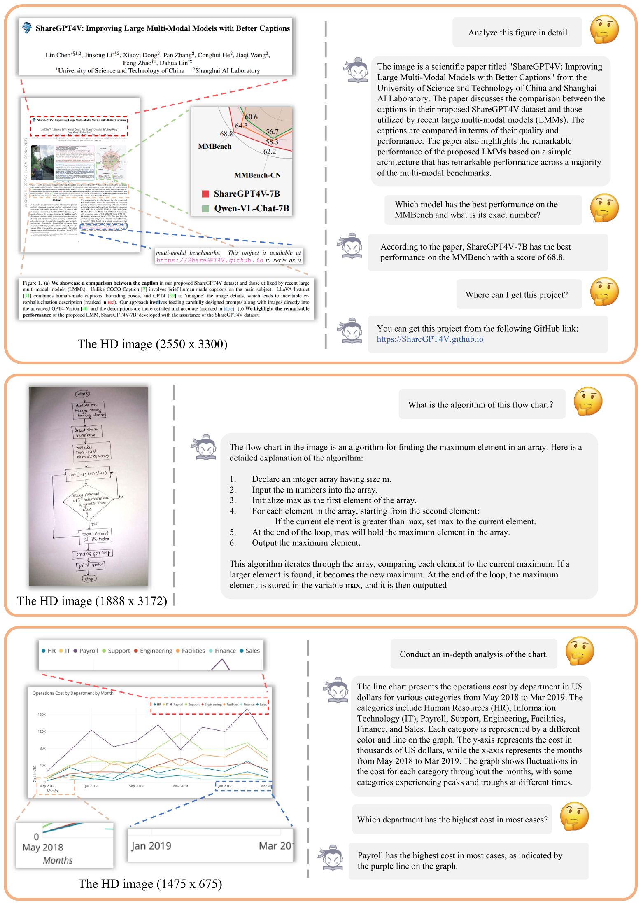
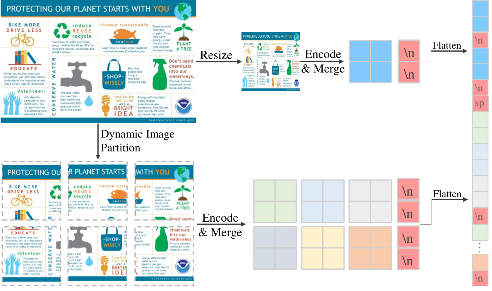
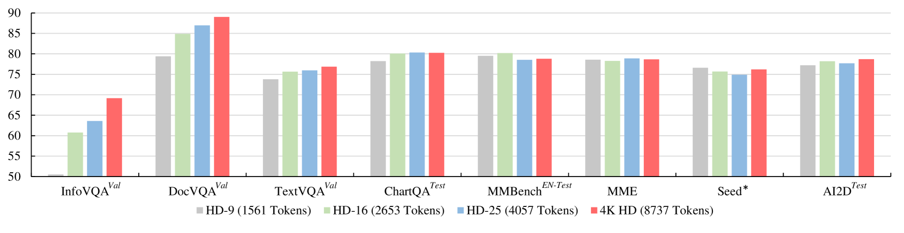

# InternLM-XComposer2-4KHD，作为先锋的大型视觉-语言模型，能够应对从336像素直至4K高清的多样分辨率。

发布时间：2024年04月09日

`LLM应用` `视觉计算` `人工智能`

> InternLM-XComposer2-4KHD: A Pioneering Large Vision-Language Model Handling Resolutions from 336 Pixels to 4K HD

# 摘要

> 大型视觉语言模型（LVLM）领域正迅速发展，但对精细视觉内容的理解仍受限于分辨率的不足。最新研究致力于提升LVLM对高分辨率图像的理解力，但目前仅能达到1500 x 1500像素，且受限于较窄的分辨率范围。本研究提出了InternLM-XComposer2-4KHD，一项创新尝试，将LVLM的解析度提升至4K高清（3840 x 1600）及以上。考虑到超高清并非在所有情况下都必需，该模型还支持从336像素到4K标准的多种分辨率，极大地扩展了其应用范围。研究特别引入了动态分辨率和自动补丁配置的新概念，优化了补丁分割策略。通过自动调整补丁数量和布局，同时保持图像的原始宽高比，实现了从336像素到4K标准的动态训练分辨率。实验表明，提升至4K HD的训练分辨率能够显著增强模型性能，且仍有进一步提升的空间。InternLM-XComposer2-4KHD在16项基准测试中的10项上表现卓越，与GPT-4V和Gemini Pro不相上下。该模型系列的7B参数版本已在GitHub上公开，可通过以下链接访问：https://github.com/InternLM/InternLM-XComposer。

> The Large Vision-Language Model (LVLM) field has seen significant advancements, yet its progression has been hindered by challenges in comprehending fine-grained visual content due to limited resolution. Recent efforts have aimed to enhance the high-resolution understanding capabilities of LVLMs, yet they remain capped at approximately 1500 x 1500 pixels and constrained to a relatively narrow resolution range. This paper represents InternLM-XComposer2-4KHD, a groundbreaking exploration into elevating LVLM resolution capabilities up to 4K HD (3840 x 1600) and beyond. Concurrently, considering the ultra-high resolution may not be necessary in all scenarios, it supports a wide range of diverse resolutions from 336 pixels to 4K standard, significantly broadening its scope of applicability. Specifically, this research advances the patch division paradigm by introducing a novel extension: dynamic resolution with automatic patch configuration. It maintains the training image aspect ratios while automatically varying patch counts and configuring layouts based on a pre-trained Vision Transformer (ViT) (336 x 336), leading to dynamic training resolution from 336 pixels to 4K standard. Our research demonstrates that scaling training resolution up to 4K HD leads to consistent performance enhancements without hitting the ceiling of potential improvements. InternLM-XComposer2-4KHD shows superb capability that matches or even surpasses GPT-4V and Gemini Pro in 10 of the 16 benchmarks. The InternLM-XComposer2-4KHD model series with 7B parameters are publicly available at https://github.com/InternLM/InternLM-XComposer.

[Arxiv](https://arxiv.org/abs/2404.06512)