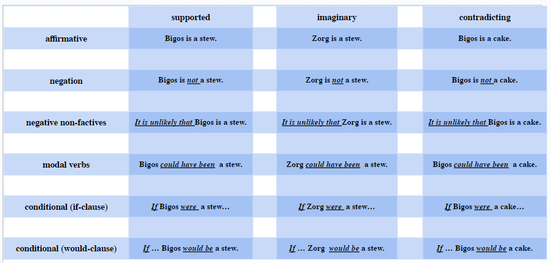
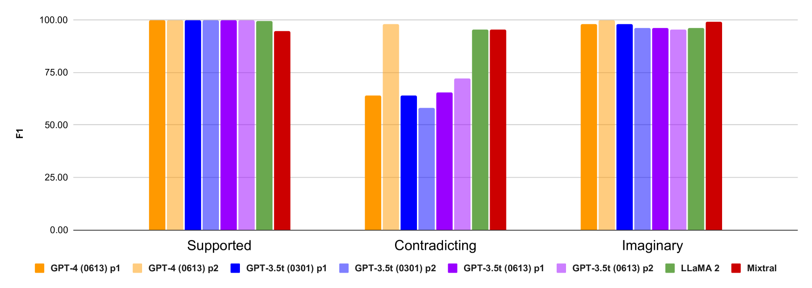
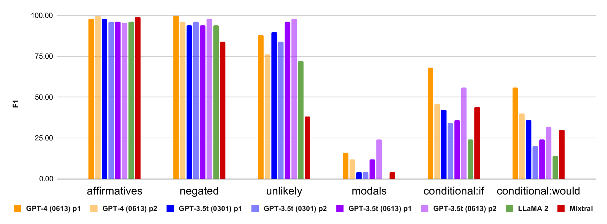
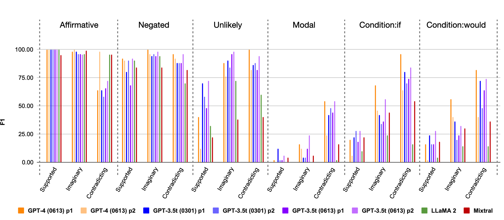
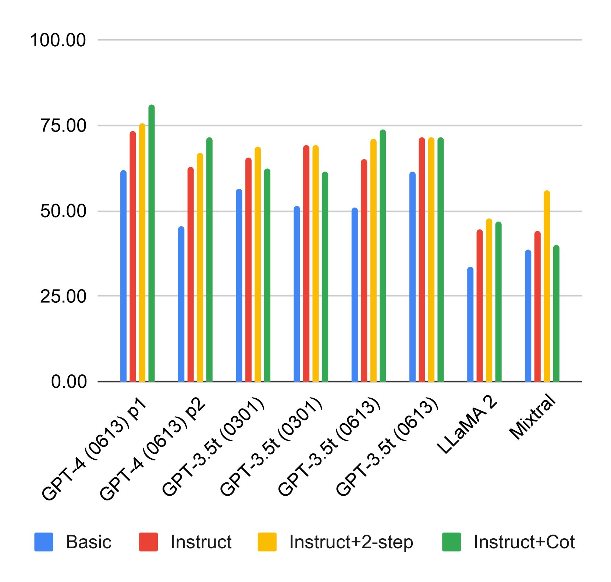

# 大型语言模型在阅读理解方面易受参数知识左右，面对假设性语句时往往力不从心。

发布时间：2024年04月09日

`LLM应用` `语言模型`

> LLMs' Reading Comprehension Is Affected by Parametric Knowledge and Struggles with Hypothetical Statements

# 摘要

> 阅读理解（RC）任务，常通过上下文相关问题回答（QA）来执行，是衡量语言模型理解自然语言（NLU）本领的关键。但面对内置丰富世界知识的大规模语言模型（LLMs），这一方法可能具有欺骗性。若上下文与模型内在知识一致，我们难以分辨模型的回答是基于理解还是其内在信息。相较之下，使用与模型知识相悖的数据会导致错误的判断，从而扭曲结果。为此，我们提议在基于虚构事实和实体的虚构数据上进行阅读理解测试。这一任务与模型的世界知识完全无关，让我们得以纯粹评估LLMs的语言技能。在此类虚构数据上对ChatGPT、GPT-4、LLaMA 2和Mixtral进行测试，我们揭示了一种对现有LLMs构成挑战的语言现象，即在考虑替代性、假设性情境时的思考。尽管所有模型在处理简单的肯定与否定情境时准确度很高，但在面对模态和条件情境时错误率大增。更为关键的是，这些现象也重新触发了LLMs对知识冲突的敏感性。特别是，在肯定与否定情境中对知识冲突免疫的模型，在面对语义更为复杂的模态和条件环境时，常常难以区分文本内容与它们的内在知识。

> The task of reading comprehension (RC), often implemented as context-based question answering (QA), provides a primary means to assess language models' natural language understanding (NLU) capabilities. Yet, when applied to large language models (LLMs) with extensive built-in world knowledge, this method can be deceptive. If the context aligns with the LLMs' internal knowledge, it is hard to discern whether the models' answers stem from context comprehension or from LLMs' internal information. Conversely, using data that conflicts with the models' knowledge creates erroneous trends which distort the results. To address this issue, we suggest to use RC on imaginary data, based on fictitious facts and entities. This task is entirely independent of the models' world knowledge, enabling us to evaluate LLMs' linguistic abilities without the interference of parametric knowledge. Testing ChatGPT, GPT-4, LLaMA 2 and Mixtral on such imaginary data, we uncover a class of linguistic phenomena posing a challenge to current LLMs, involving thinking in terms of alternative, hypothetical scenarios. While all the models handle simple affirmative and negative contexts with high accuracy, they are much more prone to error when dealing with modal and conditional contexts. Crucially, these phenomena also trigger the LLMs' vulnerability to knowledge-conflicts again. In particular, while some models prove virtually unaffected by knowledge conflicts in affirmative and negative contexts, when faced with more semantically involved modal and conditional environments, they often fail to separate the text from their internal knowledge.

[Arxiv](https://arxiv.org/abs/2404.06283)