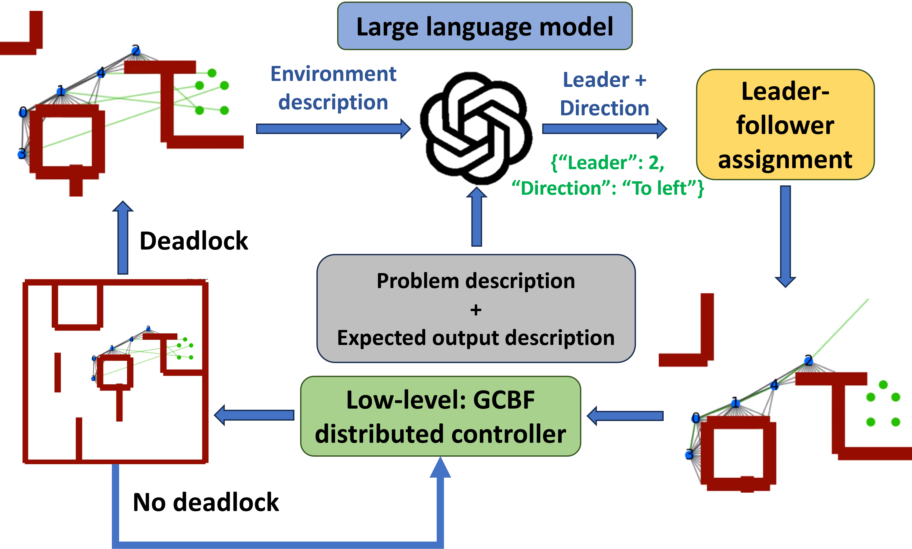
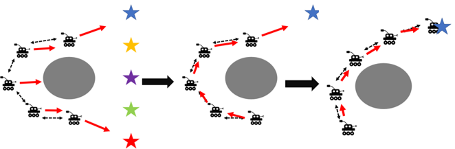
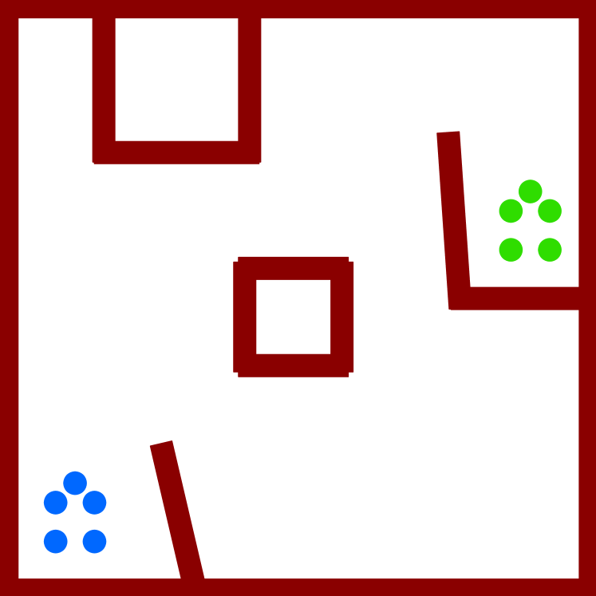
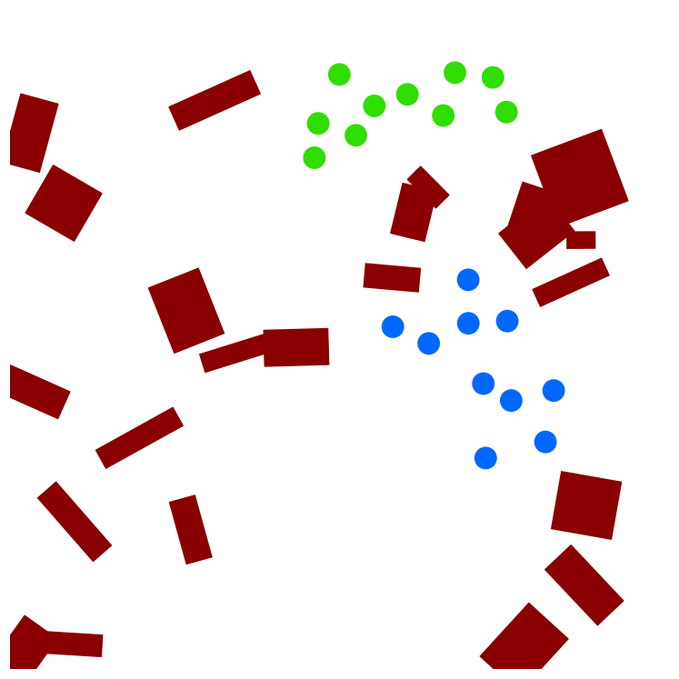
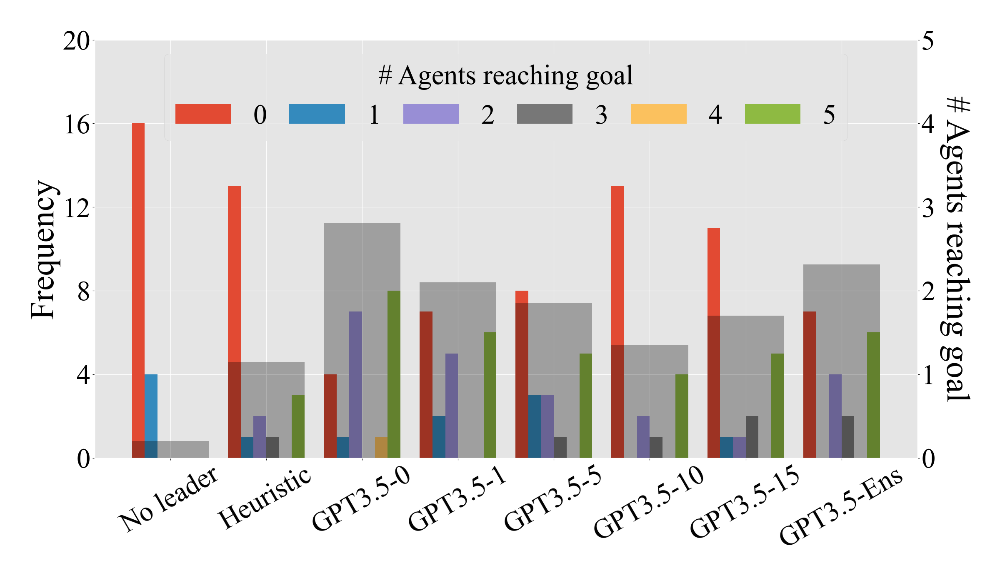
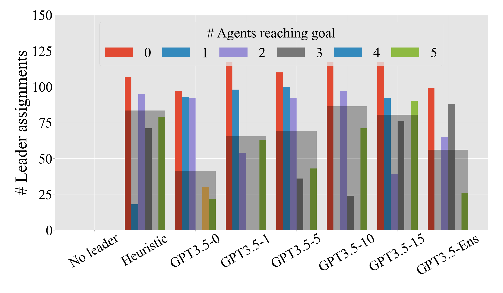
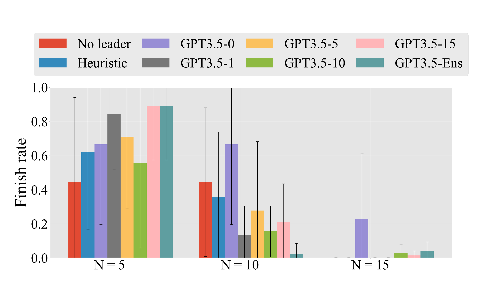
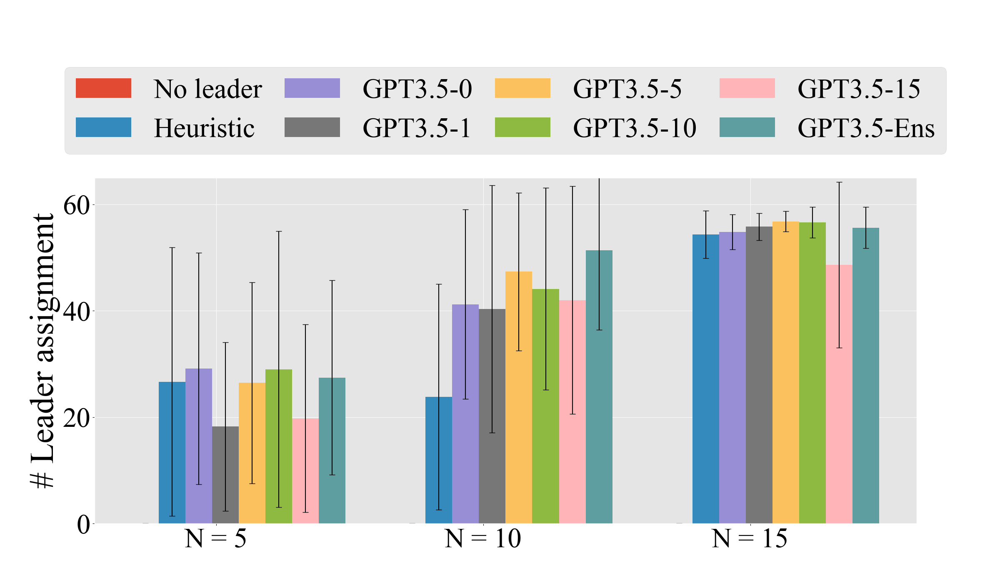

# 大型语言模型破解僵局：多机器人系统的死锁难题

发布时间：2024年04月09日

`Agent` `机器人` `控制系统`

> Large Language Models to the Rescue: Deadlock Resolution in Multi-Robot Systems

# 摘要

> 在充满障碍的环境中，多机器人系统往往会遇到僵局，即使在平顺的低级控制策略下，也可能难以脱困。缺乏高级指令的外部干预，我们无法确保仅靠低级控制策略就能破解僵局。本研究利用大型语言模型（LLMs）的泛化能力和对数据的低需求，探索了LLM在僵局破解中的应用潜力。我们设计了一个层级控制架构，让LLM通过指定领导者和行进方向来巧妙地解决僵局。同时，我们采用基于图神经网络（GNN）的低级分布式控制策略来实施这一计划。通过系统地研究多种提示技巧，我们提升了LLM解决僵局的能力。在提示工程的过程中，我们还为LLM提供了丰富的上下文示例。在多达15个智能体和40个障碍的多机器人环境中进行的广泛实验证明，基于LLM的高级规划策略在打破僵局方面表现出色。

> Multi-agent robotic systems are prone to deadlocks in an obstacle environment where the system can get stuck away from its desired location under a smooth low-level control policy. Without an external intervention, often in terms of a high-level command, it is not possible to guarantee that just a low-level control policy can resolve such deadlocks. Utilizing the generalizability and low data requirements of large language models (LLMs), this paper explores the possibility of using LLMs for deadlock resolution. We propose a hierarchical control framework where an LLM resolves deadlocks by assigning a leader and direction for the leader to move along. A graph neural network (GNN) based low-level distributed control policy executes the assigned plan. We systematically study various prompting techniques to improve LLM's performance in resolving deadlocks. In particular, as part of prompt engineering, we provide in-context examples for LLMs. We conducted extensive experiments on various multi-robot environments with up to 15 agents and 40 obstacles. Our results demonstrate that LLM-based high-level planners are effective in resolving deadlocks in MRS.

[Arxiv](https://arxiv.org/abs/2404.06413)