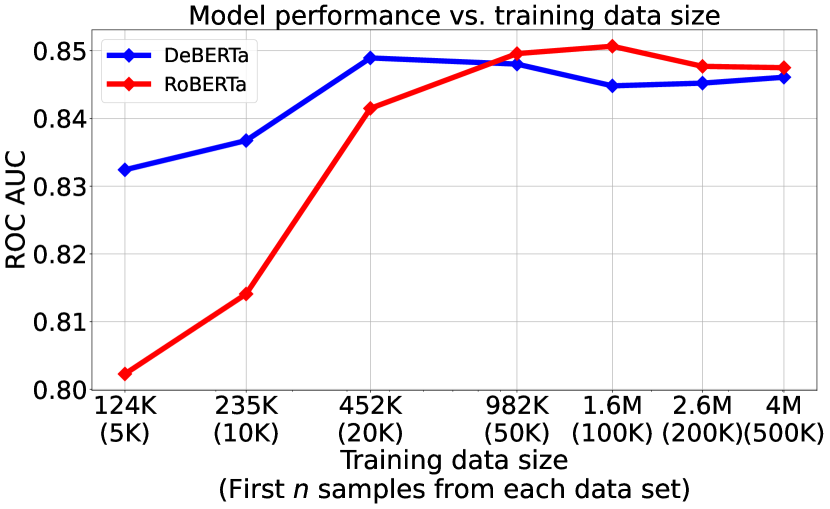
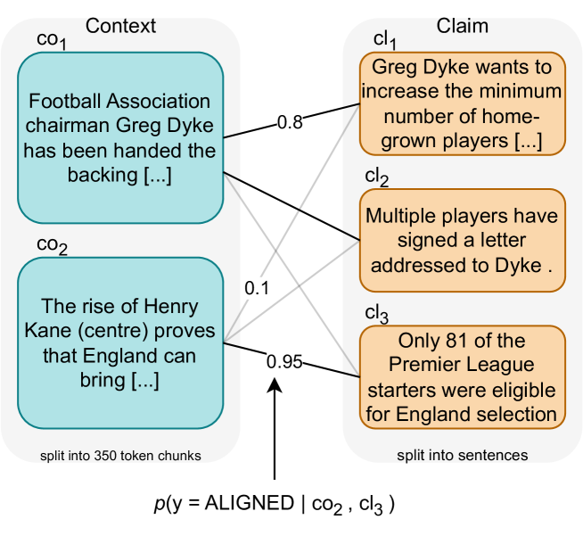
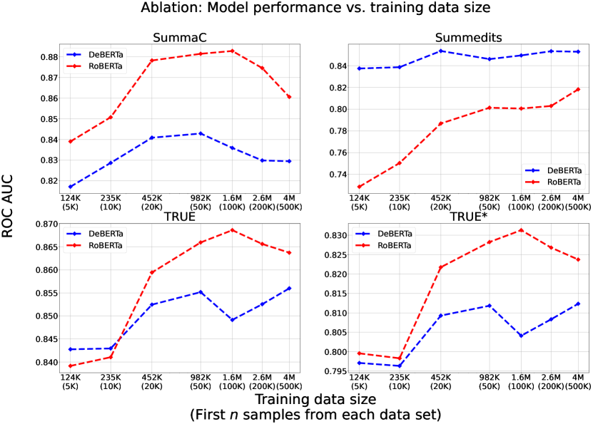

# 简化方法更有助于提升事实一致性的自动评估效果。

发布时间：2024年04月09日

`LLM应用` `自动文本生成` `事实一致性评估`

> Less is More for Improving Automatic Evaluation of Factual Consistency

# 摘要

> 自动生成文本与源上下文的事实一致性评估对于打造可靠的自然语言生成应用非常关键。最新研究提出了AlignScore，它采用统一对齐模型评估事实一致性，并在众多基准测试中显著超越了先前技术。本文深入分析了AlignScore所用数据集，意外发现：使用较少数据点反而能提升性能。我们对原始AlignScore训练集进行降噪处理，加入增强鲁棒性的样本，并采用其中10%的数据子集，训练出一个改进版的事实一致性评估模型，命名为LIM-RA（少即是多，鲁棒对齐）。LIM-RA在四个基准测试中均展现出优异性能，持续领先AlignScore和其他强势基线如ChatGPT（包括两个传统自然语言生成数据集和两个大型语言模型输出的测试）。实验结果显示，LIM-RA在33个测试集中的24个中得分最高，在其他测试中也保持竞争力，树立了新的行业标杆。

> Assessing the factual consistency of automatically generated texts in relation to source context is crucial for developing reliable natural language generation applications. Recent literature proposes AlignScore which uses a unified alignment model to evaluate factual consistency and substantially outperforms previous methods across many benchmark tasks. In this paper, we take a closer look of datasets used in AlignScore and uncover an unexpected finding: utilizing a smaller number of data points can actually improve performance. We process the original AlignScore training dataset to remove noise, augment with robustness-enhanced samples, and utilize a subset comprising 10\% of the data to train an improved factual consistency evaluation model, we call LIM-RA (Less Is More for Robust AlignScore). LIM-RA demonstrates superior performance, consistently outperforming AlignScore and other strong baselines like ChatGPT across four benchmarks (two utilizing traditional natural language generation datasets and two focused on large language model outputs). Our experiments show that LIM-RA achieves the highest score on 24 of the 33 test datasets, while staying competitive on the rest, establishing the new state-of-the-art benchmarks.

[Arxiv](https://arxiv.org/abs/2404.06579)