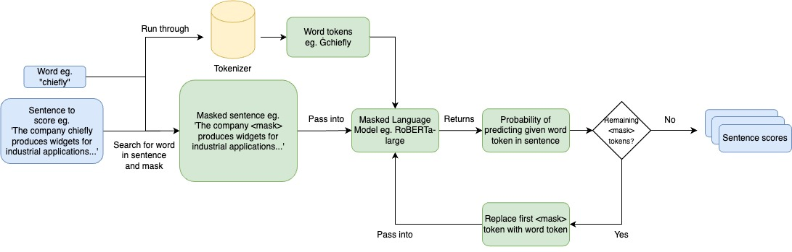

# 通过低成本的方式生成和评价词典中的示例句子，旨在高效地提升语言学习资源的质量。

发布时间：2024年04月09日

`LLM应用` `词典编纂`

> Low-Cost Generation and Evaluation of Dictionary Example Sentences

# 摘要

> 词典中的例句对于解释词汇含义和用法至关重要，但手工创作出优质的例句并非易事。以往的研究已经展示了语言模型能够被训练用来产生例句，但这些研究往往依赖于昂贵的定制模型和词义数据集来进行生成和评估。随着基础模型技术的飞速发展，现在我们有机会开发出低成本、无需特定训练的生成及评估词典例句的方法。本文介绍了一种名为OxfordEval的新型自动评估指标，该指标通过比较生成的例句与牛津词典现有例句的胜率来衡量质量。OxfordEval与人类的评判标准高度吻合，使得我们可以进行大规模的自动化质量评估。我们尝试了多种大型语言模型（LLM）及其配置，以生成各类词性的词典例句，并采用了一种创新方法，利用掩码语言模型来筛选出最能准确表达词义的例句。最终的模型FM-MLM，在OxfordEval的评估中，以超过85.1%的胜率超越了牛津词典的基线例句，而之前的模型生成的例句胜率仅为39.8%。

> Dictionary example sentences play an important role in illustrating word definitions and usage, but manually creating quality sentences is challenging. Prior works have demonstrated that language models can be trained to generate example sentences. However, they relied on costly customized models and word sense datasets for generation and evaluation of their work. Rapid advancements in foundational models present the opportunity to create low-cost, zero-shot methods for the generation and evaluation of dictionary example sentences. We introduce a new automatic evaluation metric called OxfordEval that measures the win-rate of generated sentences against existing Oxford Dictionary sentences. OxfordEval shows high alignment with human judgments, enabling large-scale automated quality evaluation. We experiment with various LLMs and configurations to generate dictionary sentences across word classes. We complement this with a novel approach of using masked language models to identify and select sentences that best exemplify word meaning. The eventual model, FM-MLM, achieves over 85.1% win rate against Oxford baseline sentences according to OxfordEval, compared to 39.8% win rate for prior model-generated sentences.

[Arxiv](https://arxiv.org/abs/2404.06224)