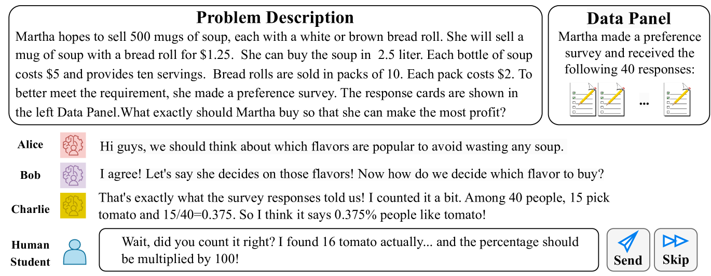
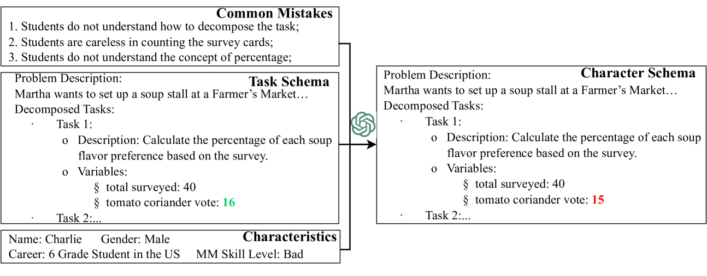
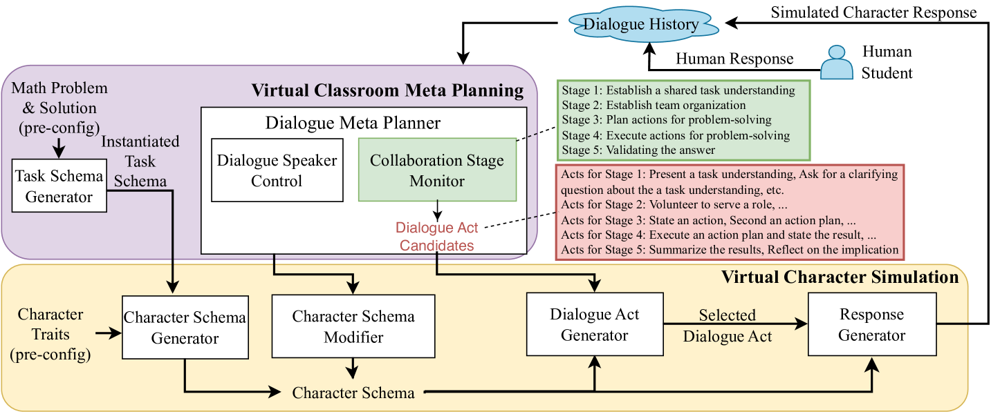
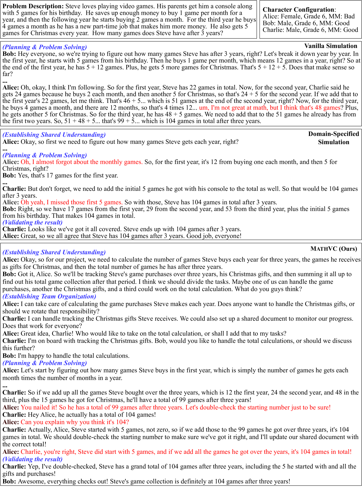

# MathVC：借助大型语言模型打造的多角色虚拟教室，致力于提升数学教学效果。

发布时间：2024年04月09日

`LLM应用` `数学建模`

> MathVC: An LLM-Simulated Multi-Character Virtual Classroom for Mathematics Education

# 摘要

> STEM专业的学生们都知道，数学建模（MM）是他们的必备技能。最有效的练习方式往往是通过小组讨论和协作解决问题。然而，不均衡的教育资源分配让学生们难以平等地获得这种练习机会。幸运的是，大型语言模型（LLMs）在模拟数学问题和塑造多特质角色方面展现出了惊人的潜力。受此启发，我们推出了MATHVC——首个由LLM驱动的虚拟课堂，它拥有多个由LLM模拟的学生角色，学生们可以在此练习MM技能。为了让每个角色的行为与其数学相关特性保持一致，同时让整个对话过程贴近真实的学生讨论，我们创新性地提出了三项措施：融合MM领域知识、建立符号模式基础，以及设计一个元规划者来引导对话流程。经过实验验证，我们的模拟方法行之有效，并预示着MATHVC将为未来的学生带来实实在在的好处。

> Mathematical modeling (MM) is considered a fundamental skill for students in STEM disciplines. Practicing the MM skill is often the most effective when students can engage in group discussion and collaborative problem-solving. However, due to unevenly distributed teachers and educational resources needed to monitor such group activities, students do not always receive equal opportunities for this practice. Excitingly, large language models (LLMs) have recently demonstrated strong capability in both modeling mathematical problems and simulating characters with different traits and properties. Drawing inspiration from the advancement of LLMs, in this work, we present MATHVC, the very first LLM-powered virtual classroom containing multiple LLM-simulated student characters, with whom a human student can practice their MM skill. To encourage each LLM character's behaviors to be aligned with their specified math-relevant properties (termed "characteristics alignment") and the overall conversational procedure to be close to an authentic student MM discussion (termed "conversational procedural alignment"), we proposed three innovations: integrating MM domain knowledge into the simulation, defining a symbolic schema as the ground for character simulation, and designing a meta planner at the platform level to drive the conversational procedure. Through experiments and ablation studies, we confirmed the effectiveness of our simulation approach and showed the promise for MATHVC to benefit real-life students in the future.

[Arxiv](https://arxiv.org/abs/2404.06711)