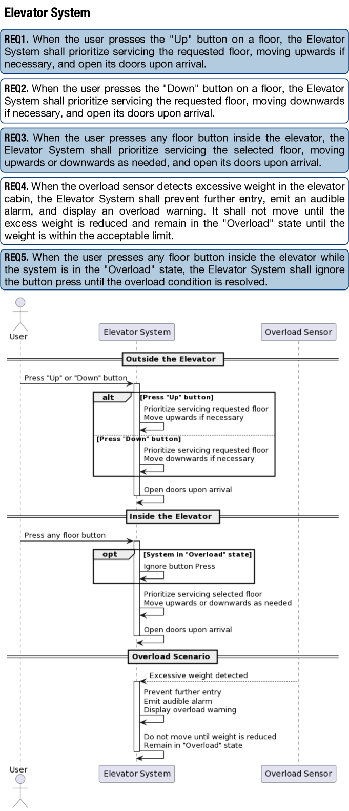
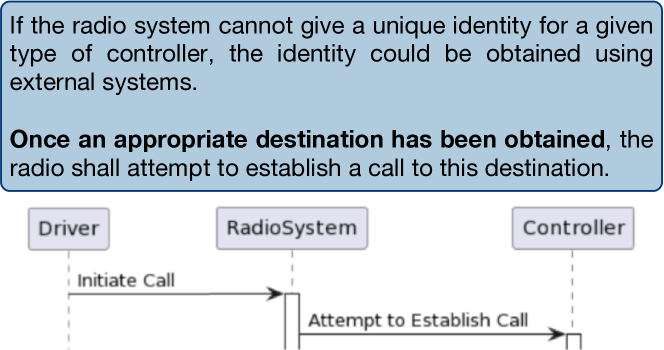
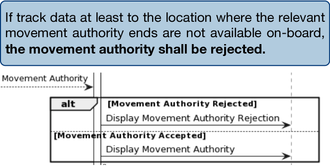
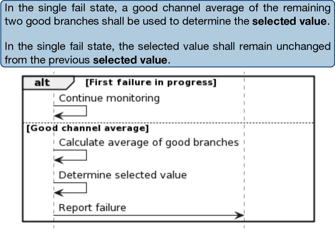
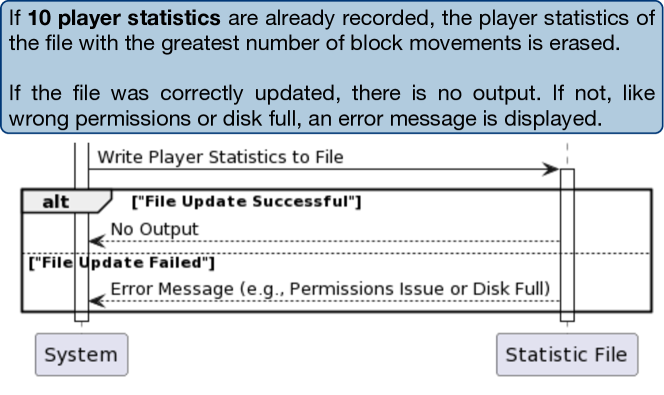
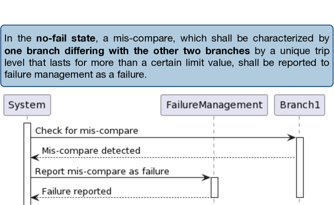
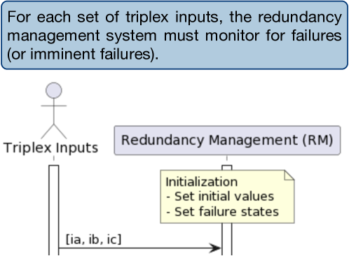
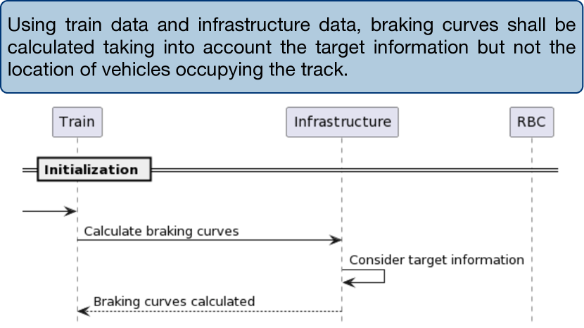
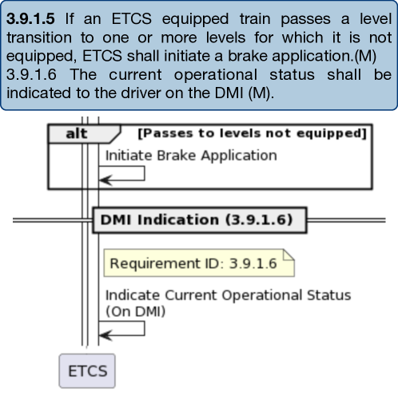

# 基于需求，利用大型语言模型生成模型：探索性研究

发布时间：2024年04月09日

`LLM应用` `软件工程` `需求分析`

> Model Generation from Requirements with LLMs: an Exploratory Study

# 摘要

> 将自然语言需求与图形模型相结合，能有效提升各方沟通并指导系统设计。尽管从需求出发创建模型需要手动操作，但像 ChatGPT 这样的生成性大型语言模型的出现，为自动化模型生成开辟了新途径。本研究探讨了 ChatGPT 根据自然语言需求生成特定类型的模型——UML 序列图的能力。我们对 28 份来自不同领域的不同类型需求文档，由 ChatGPT 生成的序列图进行了定性分析。通过评估日志，我们系统地记录并分类了生成图表的观察结果。研究显示，尽管生成的模型大体上遵循标准且易于理解，但在满足具体需求方面的完整性和准确性常常存在问题，尤其是在需求表述含糊或不一致时更为明显。这些发现将有助于实际运用 LLMs 于需求工程过程，并启发开发新的、专门针对有效模型生成的需求工程提示策略。

> Complementing natural language (NL) requirements with graphical models can improve stakeholders' communication and provide directions for system design. However, creating models from requirements involves manual effort. The advent of generative large language models (LLMs), ChatGPT being a notable example, offers promising avenues for automated assistance in model generation. This paper investigates the capability of ChatGPT to generate a specific type of model, i.e., UML sequence diagrams, from NL requirements. We conduct a qualitative study in which we examine the sequence diagrams generated by ChatGPT for 28 requirements documents of various types and from different domains. Observations from the analysis of the generated diagrams have systematically been captured through evaluation logs, and categorized through thematic analysis. Our results indicate that, although the models generally conform to the standard and exhibit a reasonable level of understandability, their completeness and correctness with respect to the specified requirements often present challenges. This issue is particularly pronounced in the presence of requirements smells, such as ambiguity and inconsistency. The insights derived from this study can influence the practical utilization of LLMs in the RE process, and open the door to novel RE-specific prompting strategies targeting effective model generation.

[Arxiv](https://arxiv.org/abs/2404.06371)