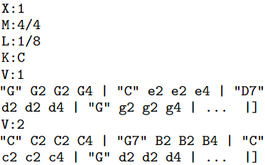
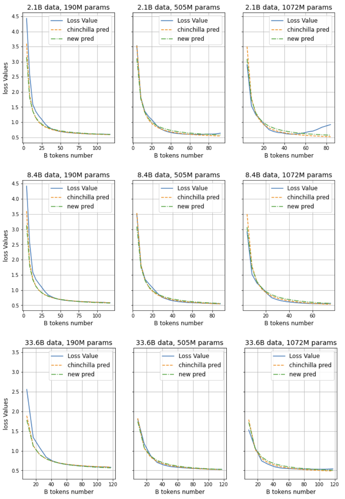
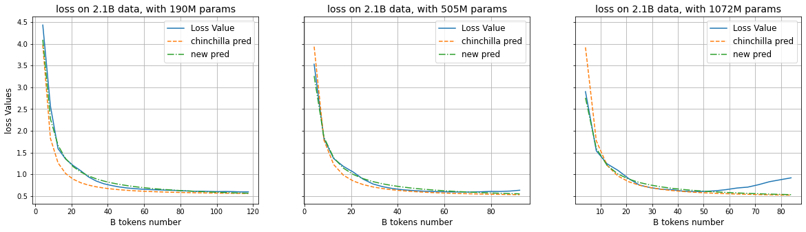
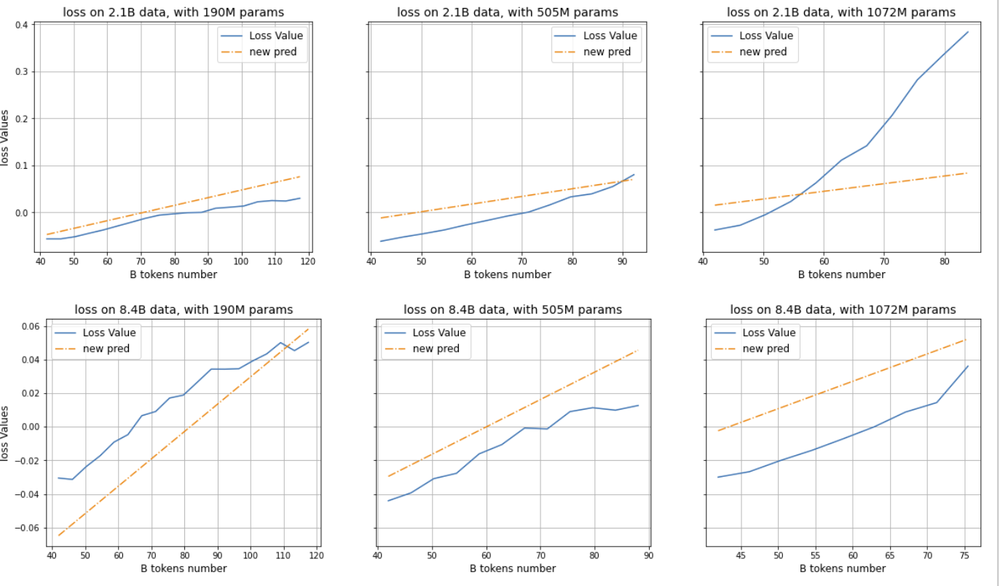

# MuPT：一款预训练的变换器，专注于生成富有象征意义的音乐作品。

发布时间：2024年04月09日

`LLM应用` `人工智能`

> MuPT: A Generative Symbolic Music Pretrained Transformer

# 摘要

> 本文探讨了大型语言模型（LLMs）在音乐预训练领域的应用。研究发现，相较于MIDI，LLMs更适合处理ABC记谱法，这与其设计和优势更加契合，有助于提升音乐创作的表现力。为应对生成过程中音轨不一致的问题，我们提出了一种新颖的\underline{同步多音轨ABC记谱法}（简称\textbf{SMT-ABC记谱法}），以确保多个音乐轨道的协调一致。我们的研究成果涵盖了能够处理高达8192个令牌的模型，覆盖了训练集中90%的符号音乐数据。此外，我们还研究了\underline{符号音乐扩展法则}（简称\textbf{SMS法则}）对模型性能的积极影响。这些成果为音乐节生成的未来研究指引了方向，并借助我们的开源贡献为社区研究提供了丰富的资源。

> In this paper, we explore the application of Large Language Models (LLMs) to the pre-training of music. While the prevalent use of MIDI in music modeling is well-established, our findings suggest that LLMs are inherently more compatible with ABC Notation, which aligns more closely with their design and strengths, thereby enhancing the model's performance in musical composition. To address the challenges associated with misaligned measures from different tracks during generation, we propose the development of a \underline{S}ynchronized \underline{M}ulti-\underline{T}rack ABC Notation (\textbf{SMT-ABC Notation}), which aims to preserve coherence across multiple musical tracks. Our contributions include a series of models capable of handling up to 8192 tokens, covering 90\% of the symbolic music data in our training set. Furthermore, we explore the implications of the \underline{S}ymbolic \underline{M}usic \underline{S}caling Law (\textbf{SMS Law}) on model performance. The results indicate a promising direction for future research in music generation, offering extensive resources for community-led research through our open-source contributions.

[Arxiv](https://arxiv.org/abs/2404.06393)