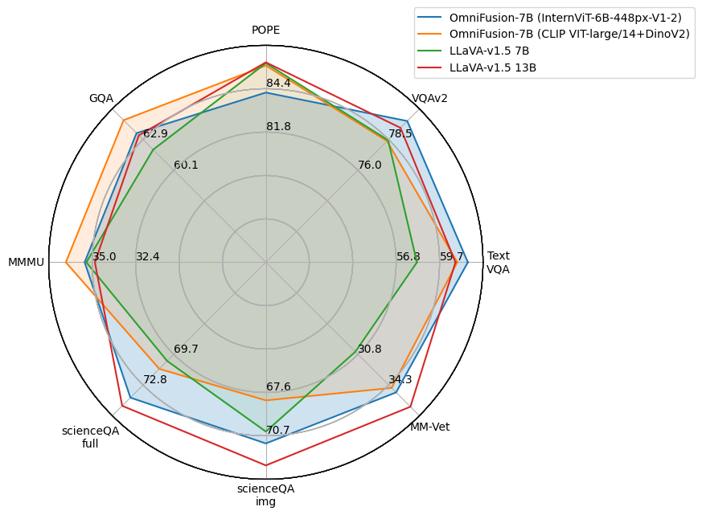
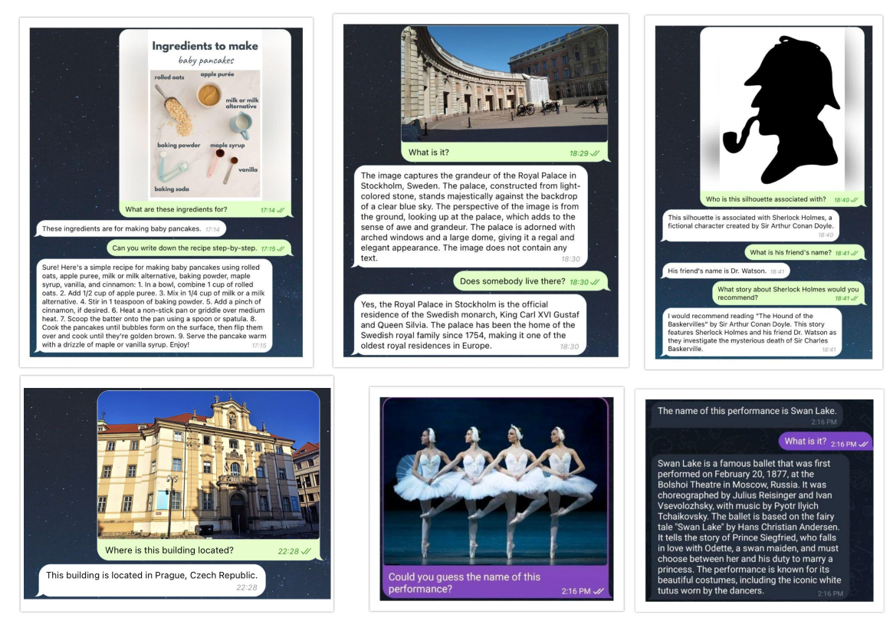
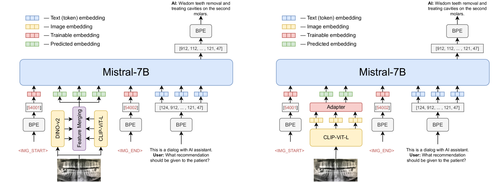
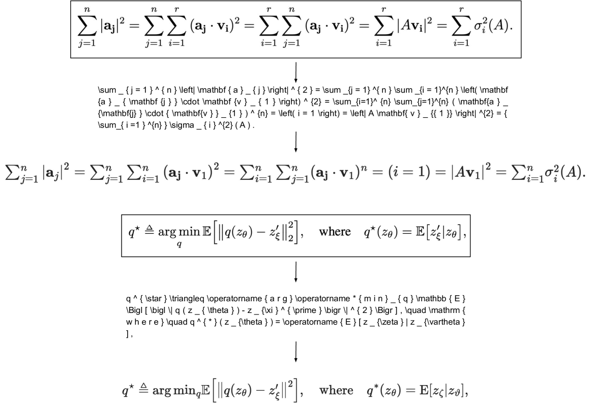

# OmniFusion 技术报告，全面解析

发布时间：2024年04月09日

`LLM应用` `视觉问答` `多模态`

> OmniFusion Technical Report

# 摘要

> 去年，多模态架构在AI领域掀起了一场革新浪潮，极大地增强了大型语言模型（LLM）的功能。我们设计了一个名为\textit{OmniFusion}的模型，它基于预训练的LLM和视觉模态适配器。经过对多种架构设计理念的评估与对比，我们发现了最佳的文本与视觉数据融合方式：包括MLP和变换器适配器，各类基于CLIP ViT的编码器（如SigLIP、InternVIT等），及其融合策略，图像编码方式（整体或分割），还有两种7B规模的LLM（一个是我们自主研发的，另一个是开源的Mistral）。在八大视觉-语言基准测试中，我们的OmniFusion模型在多个视觉问答任务上取得了优异的成绩，超越了现有的开源LLaVA类解决方案，如VizWiz、Pope、MM-Vet、ScienceQA、MMBench、TextVQA、VQAv2、MMMU。OmniFusion模型还能在诸如家务、观光、文化、医学、手写及扫描方程式识别等多个领域提供详尽的答案。这个基于Mistral的OmniFusion模型已经开源，相关权重、训练和推理脚本可在https://github.com/AIRI-Institute/OmniFusion找到。

> Last year, multimodal architectures served up a revolution in AI-based approaches and solutions, extending the capabilities of large language models (LLM). We propose an \textit{OmniFusion} model based on a pretrained LLM and adapters for visual modality. We evaluated and compared several architecture design principles for better text and visual data coupling: MLP and transformer adapters, various CLIP ViT-based encoders (SigLIP, InternVIT, etc.), and their fusing approach, image encoding method (whole image or tiles encoding) and two 7B LLMs (the proprietary one and open-source Mistral). Experiments on 8 visual-language benchmarks show the top score for the best OmniFusion setup in terms of different VQA tasks in comparison with open-source LLaVA-like solutions: VizWiz, Pope, MM-Vet, ScienceQA, MMBench, TextVQA, VQAv2, MMMU. We also propose a variety of situations, where OmniFusion provides highly-detailed answers in different domains: housekeeping, sightseeing, culture, medicine, handwritten and scanned equations recognition, etc. Mistral-based OmniFusion model is an open-source solution with weights, training and inference scripts available at https://github.com/AIRI-Institute/OmniFusion.

[Arxiv](https://arxiv.org/abs/2404.06212)