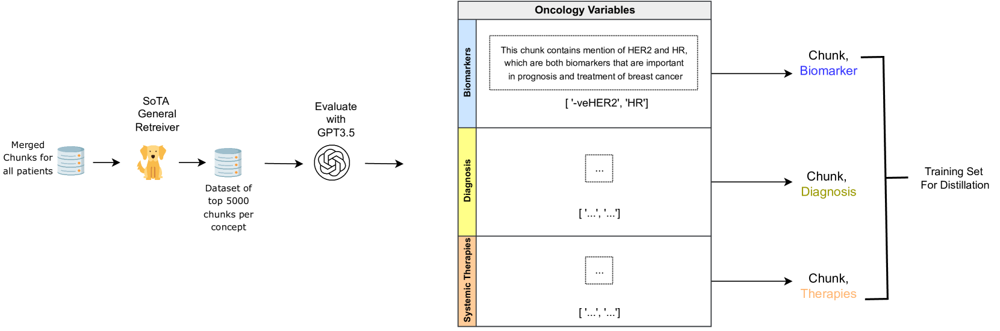
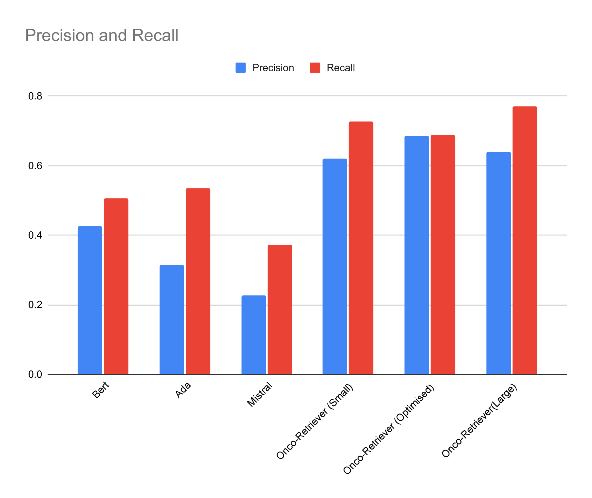
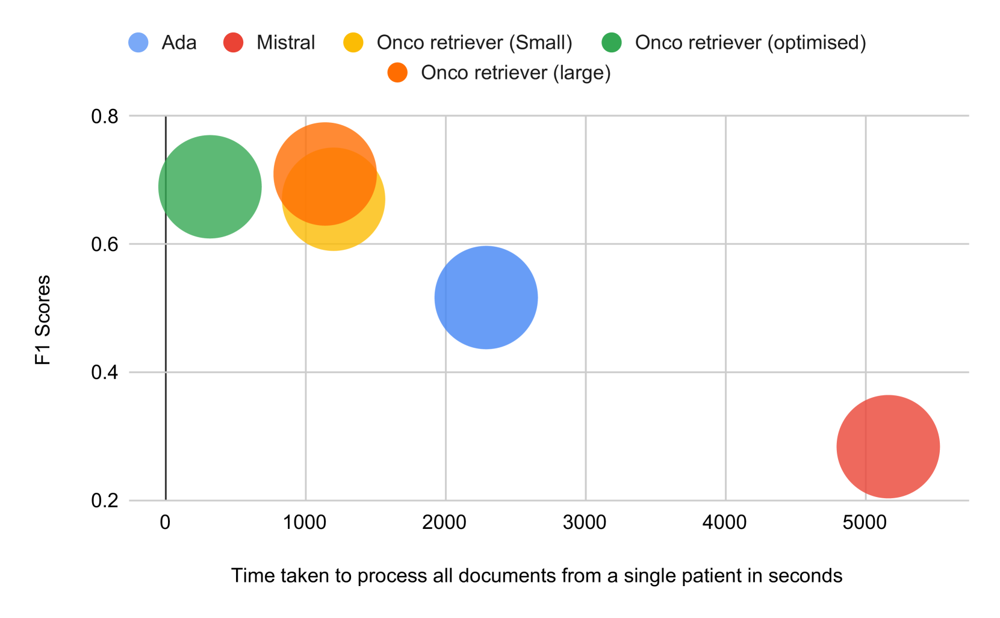
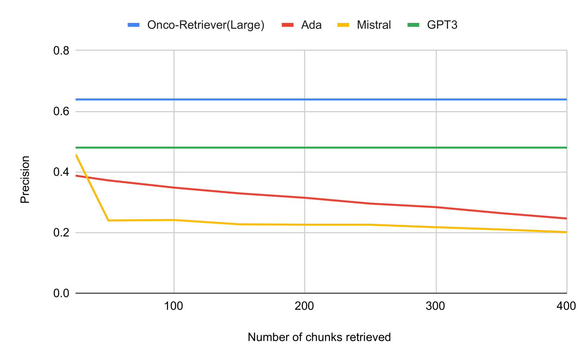
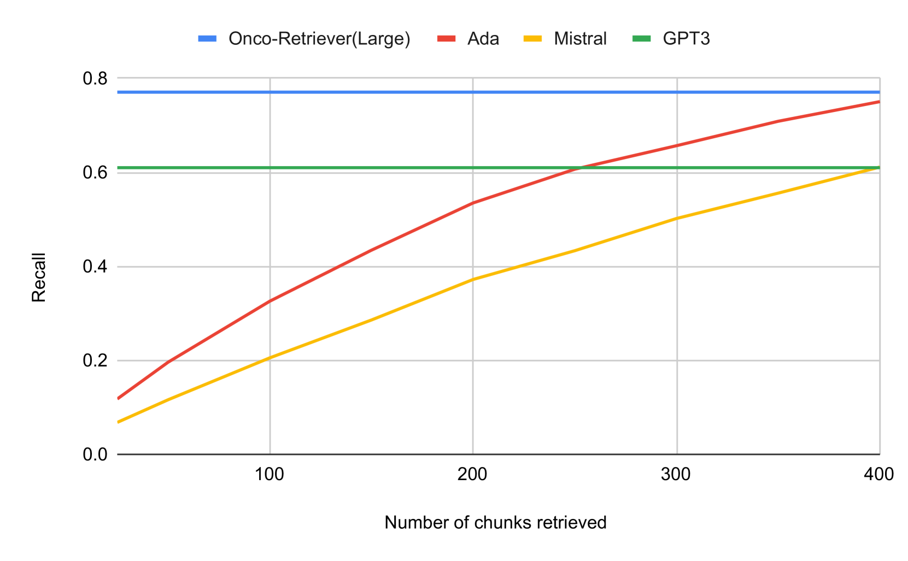

# Onco-Retriever：一种创新的生成式分类器，专门用于在肿瘤学领域快速准确地检索电子健康记录（EHR）。

发布时间：2024年04月09日

`LLM应用` `电子健康记录` `信息检索`

> Onco-Retriever: Generative Classifier for Retrieval of EHR Records in Oncology

# 摘要

> 有效获取电子健康记录系统中的信息对于深入理解患者经历和提升临床服务质量极为关键。目前，众多EHR系统仍主要采用关键词搜索法。但随着大型生成性语言模型（LLMs）的兴起，信息检索得以实现更精准的搜索与摘要功能。这些检索技术还能助力检索增强型生成（RAG）流程，以应对各类查询需求。然而，面对从EHR系统中提取实际临床数据的难题，旨在解决多个实际应用场景的信息检索任务仍充满挑战。我们提出了一种利用大型语言模型高效、经济地构建相关数据集的方案。我们所开发的检索器，在肿瘤数据元素的检索精度上，比市面上的Ada、Mistral等产品高出30-50个F-1分数点。此外，我们还对名为Onco-Retriever的模型进行了评估，并与经过精细调整的PubMedBERT模型进行了对比。通过在真实EHR数据上进行深入的手动评测及不同模型的延迟性分析，我们为医疗组织构建定制化的信息检索工具指明了方向。

> Retrieving information from EHR systems is essential for answering specific questions about patient journeys and improving the delivery of clinical care. Despite this fact, most EHR systems still rely on keyword-based searches. With the advent of generative large language models (LLMs), retrieving information can lead to better search and summarization capabilities. Such retrievers can also feed Retrieval-augmented generation (RAG) pipelines to answer any query. However, the task of retrieving information from EHR real-world clinical data contained within EHR systems in order to solve several downstream use cases is challenging due to the difficulty in creating query-document support pairs. We provide a blueprint for creating such datasets in an affordable manner using large language models. Our method results in a retriever that is 30-50 F-1 points better than propriety counterparts such as Ada and Mistral for oncology data elements. We further compare our model, called Onco-Retriever, against fine-tuned PubMedBERT model as well. We conduct an extensive manual evaluation on real-world EHR data along with latency analysis of the different models and provide a path forward for healthcare organizations to build domain-specific retrievers.

[Arxiv](https://arxiv.org/abs/2404.06680)