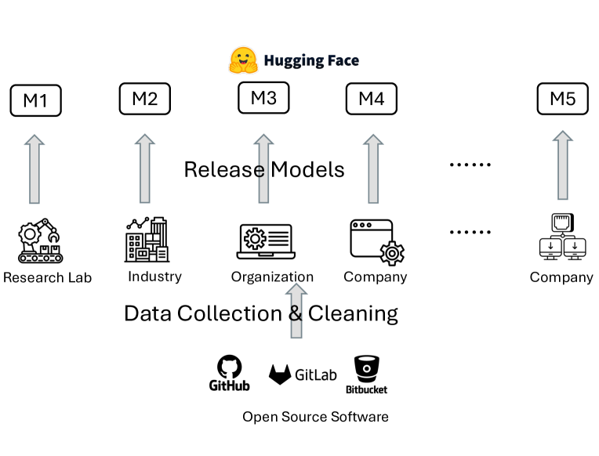
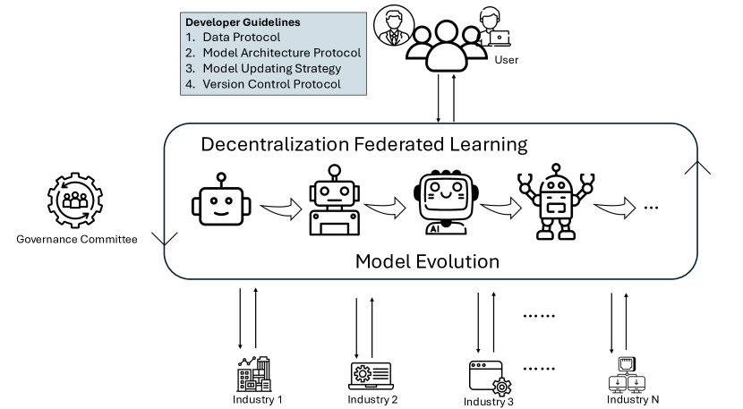

# 开源AI驱动的软件工程工具：携手共进的软件学习新机遇与面临挑战

发布时间：2024年04月09日

`LLM应用` `软件工程` `数据隐私`

> Open-Source AI-based SE Tools: Opportunities and Challenges of Collaborative Software Learning

# 摘要

> 大型语言模型（LLMs）已成为推动软件工程（SE）任务的重要工具，尤其在代码理解方面表现出色。开源合作是打造卓越产品的关键，这一点在传统SE工具和AI模型中都至关重要。然而，AI模型的核心需求在于数据。这些基于AI的SE模型的成功协作，依赖于高质量数据来源的最大化。但高质量数据往往具有商业或敏感价值，不易对开源AI SE项目开放。这一现状对AI SE工具在软件工程社区的发展和完善构成了重大障碍。因此，研究者们亟需探索方法，让开源AI SE模型能够利用各组织的资源，同时保护隐私和商业机密。本文提出了一种解决方案，通过引入以联邦学习（FL）为核心的治理框架，促进开源AI代码模型的共同开发与维护，确保数据隐私和安全得到保障。我们还为开发者提供了AI SE工具协作的指导，包括数据需求、模型架构、更新策略和版本控制等方面。考虑到数据特性对FL性能的重要影响，本研究还探讨了代码数据异质性对FL性能的作用。

> Large Language Models (LLMs) have become instrumental in advancing software engineering (SE) tasks, showcasing their efficacy in code understanding and beyond. Like traditional SE tools, open-source collaboration is key in realising the excellent products. However, with AI models, the essential need is in data. The collaboration of these AI-based SE models hinges on maximising the sources of high-quality data. However, data especially of high quality, often holds commercial or sensitive value, making it less accessible for open-source AI-based SE projects. This reality presents a significant barrier to the development and enhancement of AI-based SE tools within the software engineering community. Therefore, researchers need to find solutions for enabling open-source AI-based SE models to tap into resources by different organisations. Addressing this challenge, our position paper investigates one solution to facilitate access to diverse organizational resources for open-source AI models, ensuring privacy and commercial sensitivities are respected. We introduce a governance framework centered on federated learning (FL), designed to foster the joint development and maintenance of open-source AI code models while safeguarding data privacy and security. Additionally, we present guidelines for developers on AI-based SE tool collaboration, covering data requirements, model architecture, updating strategies, and version control. Given the significant influence of data characteristics on FL, our research examines the effect of code data heterogeneity on FL performance.

[Arxiv](https://arxiv.org/abs/2404.06201)