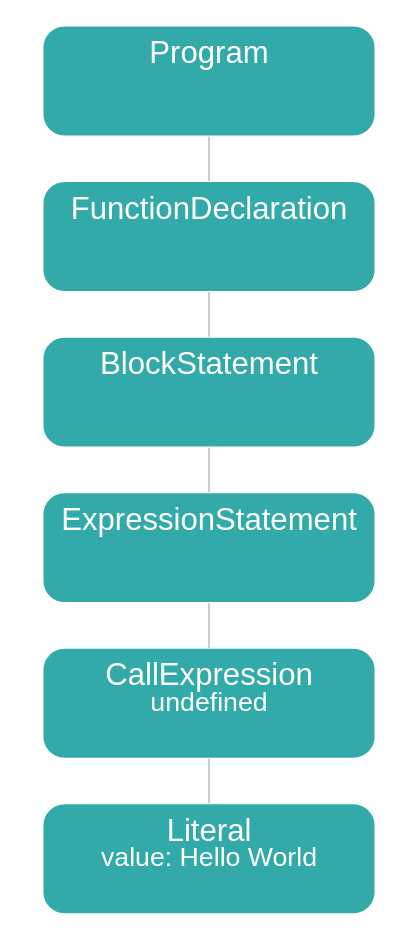
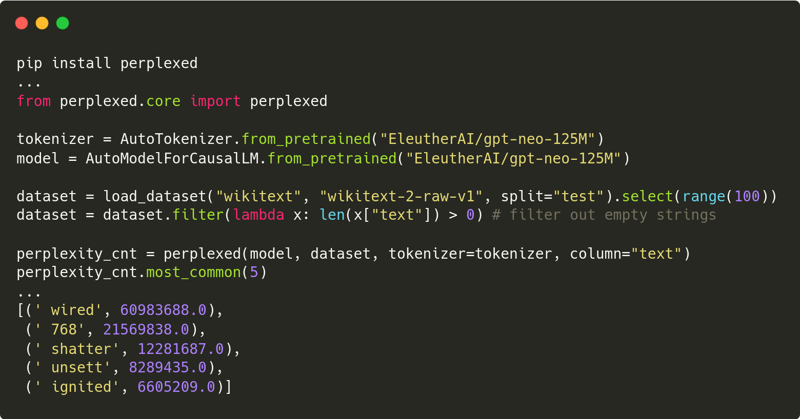
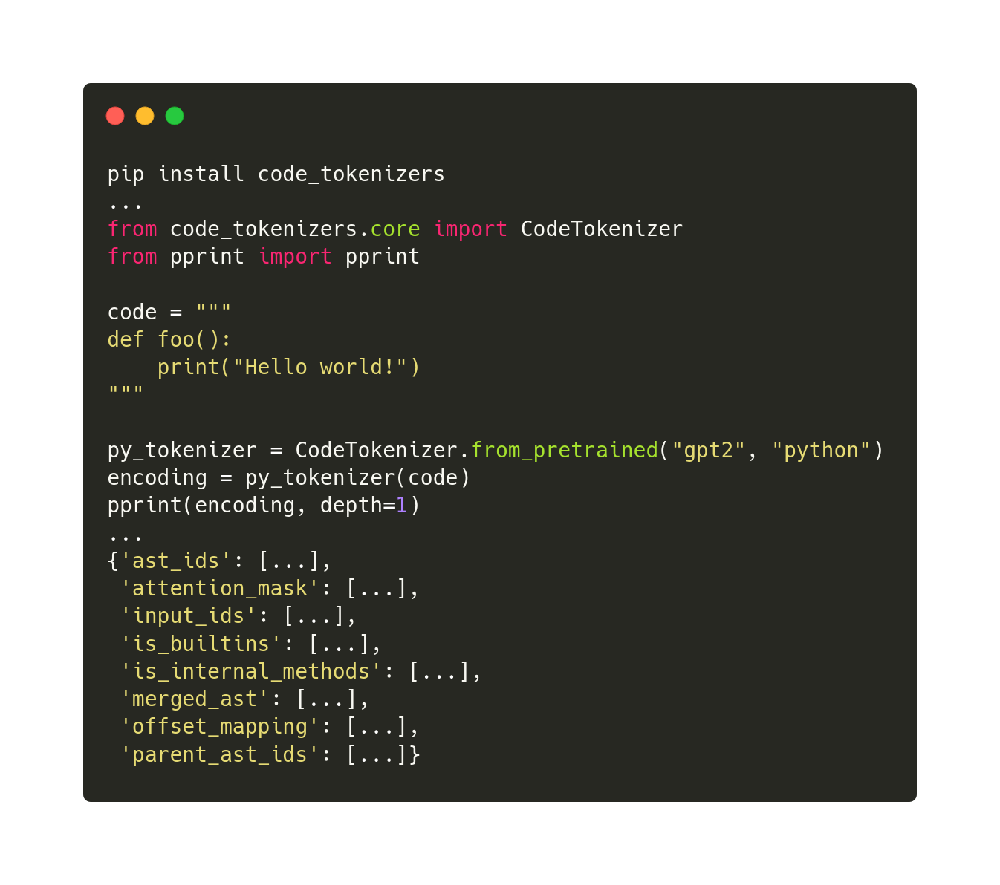
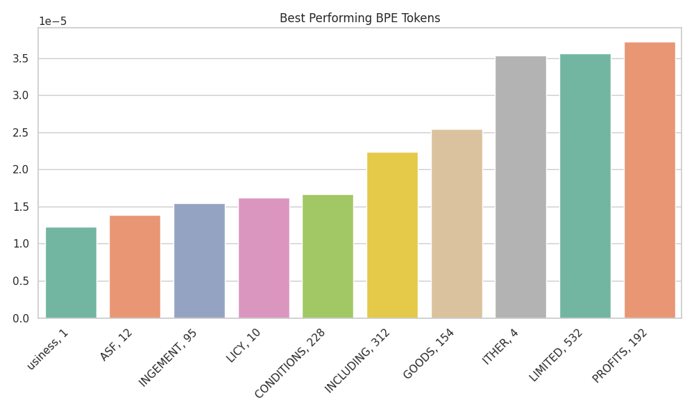
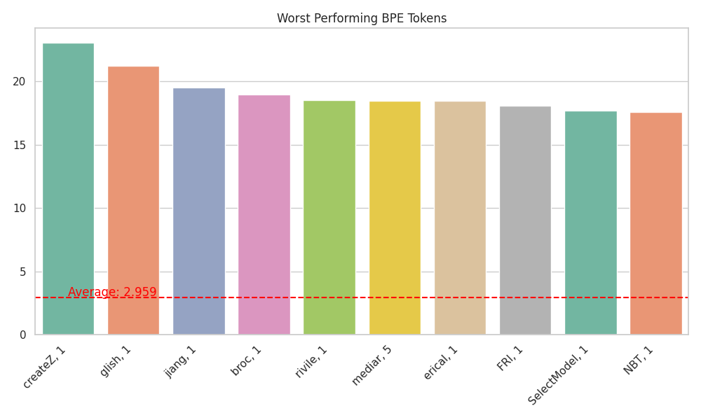
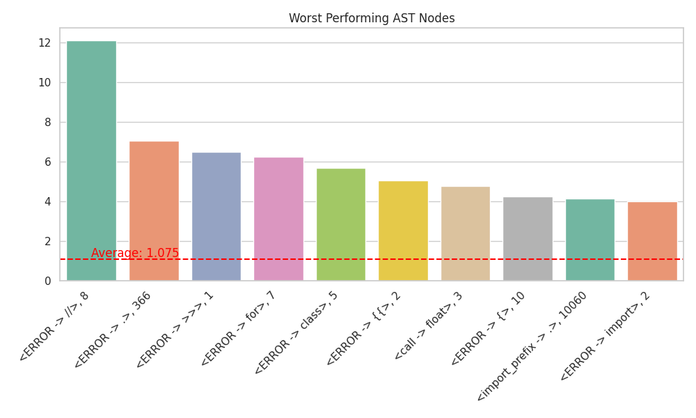
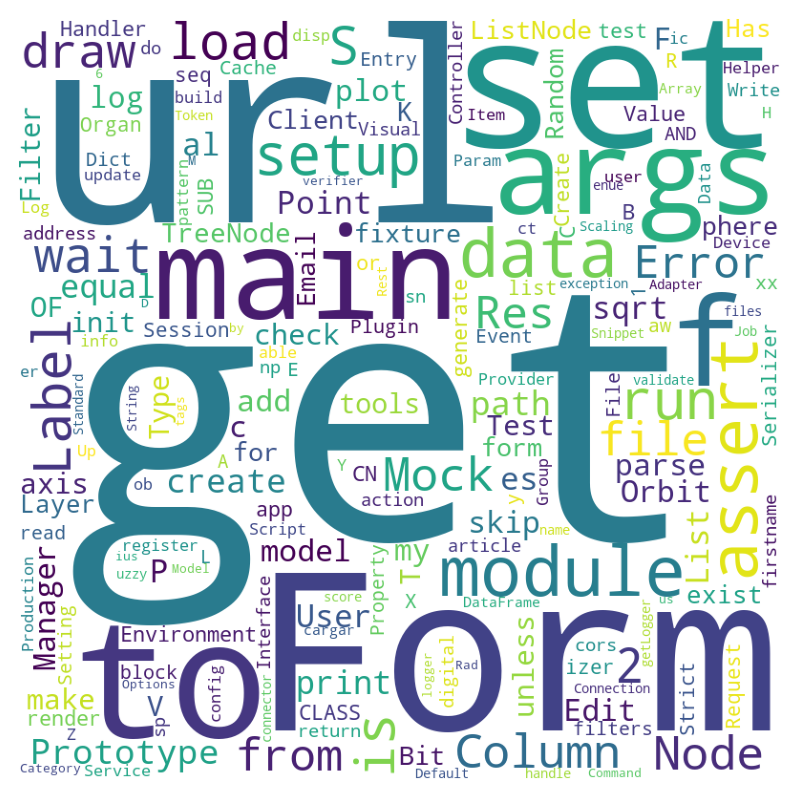
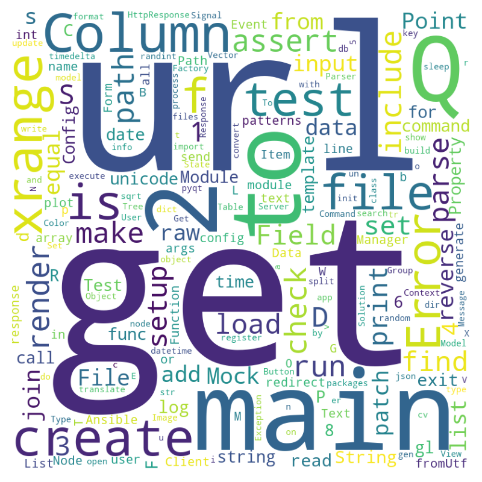

# 探究困惑：揭秘大型语言模型何时陷入迷茫

发布时间：2024年04月09日

`LLM应用`

> Perplexed: Understanding When Large Language Models are Confused

# 摘要

> 大型语言模型（LLMs）在自然语言处理（NLP）界异军突起，迅速推动了技术的进步。然而，它们的不足之处仍是个谜团，通常需要通过特定的数据集来深入探究，比如分析否定、命名解析等高级语言技能。本文介绍了“困惑”（perplexed）库，它能帮助我们发现语言模型的疑惑之处。为了展示该库的灵活性和所能带来的洞察，我们开展了一项针对LLMs代码生成能力的案例研究，并借助我们开发的“codetokenizer”工具进行代码模型分析。我们特别关注了在不同编程场景下，代码LLMs在令牌级别上的成功与失败，例如模型在预测变量名、运算符，以及内部与外部方法调用时的表现差异。研究发现，在代码结构不符合语法规则时，LLMs的表现最为糟糕；同时，模型在预测内部方法调用方面的表现普遍不如外部调用。为了让研究界更深入地理解LLMs，尤其是代码生成领域的LLMs，我们已将这两个工具开源。

> Large Language Models (LLMs) have become dominant in the Natural Language Processing (NLP) field causing a huge surge in progress in a short amount of time. However, their limitations are still a mystery and have primarily been explored through tailored datasets to analyze a specific human-level skill such as negation, name resolution, etc. In this paper, we introduce perplexed, a library for exploring where a particular language model is perplexed. To show the flexibility and types of insights that can be gained by perplexed, we conducted a case study focused on LLMs for code generation using an additional tool we built to help with the analysis of code models called codetokenizer. Specifically, we explore success and failure cases at the token level of code LLMs under different scenarios pertaining to the type of coding structure the model is predicting, e.g., a variable name or operator, and how predicting of internal verses external method invocations impact performance. From this analysis, we found that our studied code LLMs had their worst performance on coding structures where the code was not syntactically correct. Additionally, we found the models to generally perform worse at predicting internal method invocations than external ones. We have open sourced both of these tools to allow the research community to better understand LLMs in general and LLMs for code generation.

[Arxiv](https://arxiv.org/abs/2404.06634)