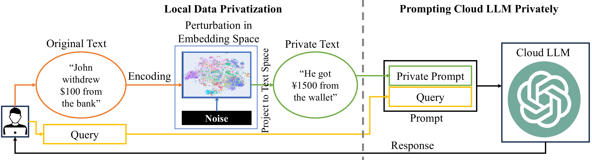
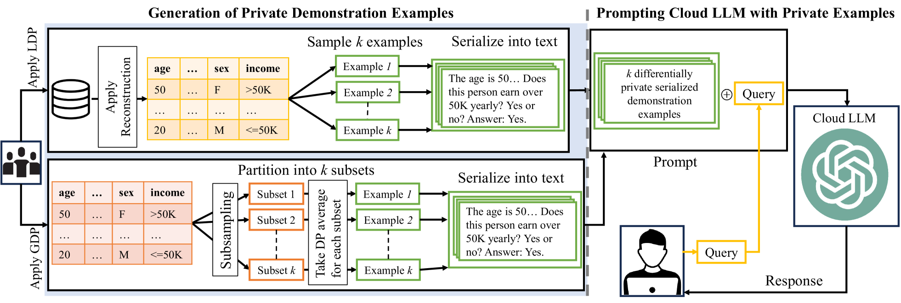
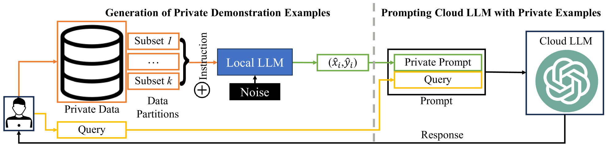
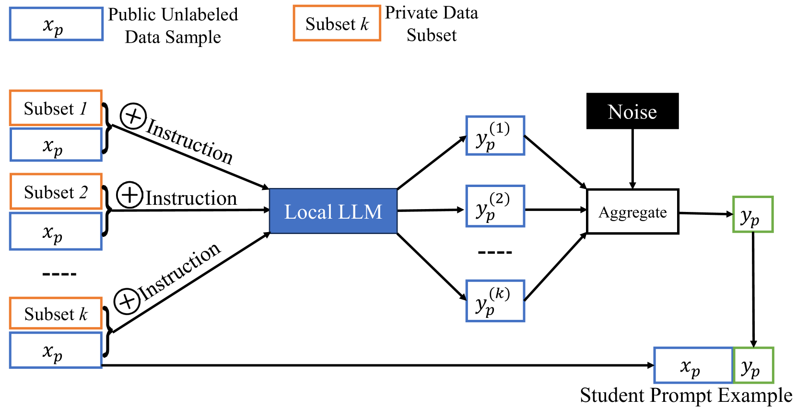
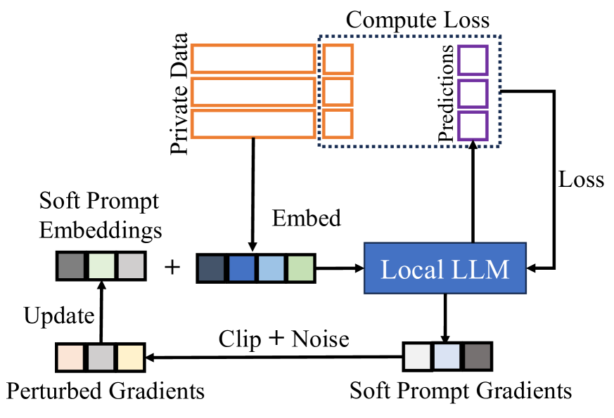
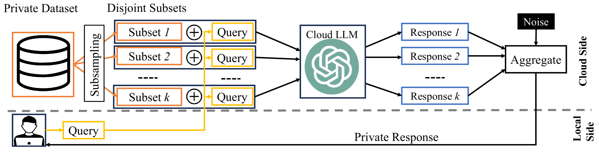

# 本调查研究了隐私保护提示工程领域，探讨了如何在保护用户隐私的同时，提高人工智能系统的效率和性能。

发布时间：2024年04月09日

`LLM理论` `隐私保护`

> Privacy Preserving Prompt Engineering: A Survey

# 摘要

> 预训练语言模型（PLMs）展现出了在处理众多通用自然语言处理（NLP）任务上的卓越能力。研究发现，模型性能与其规模大小直接相关。因此，这些模型的规模在过去几年中急剧增长，促使研究者们用“大型语言模型（LLMs）”来指代这些规模较大的模型。随着规模的扩大，它们获得了一种名为上下文学习（ICL）的特殊能力，这是一种专门的提示方法。这使得我们可以在模型参数固定的情况下，通过示例引导，将LLMs应用于特定的下游任务。尽管这一特性颇具吸引力，但隐私问题却成为了普及应用的主要障碍。众多研究致力于探究ICL和提示所带来的隐私风险，并提出了减轻这些风险的技术手段。因此，整理这些缓解措施对整个社区都大有裨益。本文系统性地回顾了在ICL和提示过程中采用的隐私保护方法，并分析比较了这些方法。同时，我们还总结了可用于这些框架开发的资源。最后，我们讨论了这些框架存在的限制，并深入探讨了那些值得进一步研究的有前景的领域。

> Pre-trained language models (PLMs) have demonstrated significant proficiency in solving a wide range of general natural language processing (NLP) tasks. Researchers have observed a direct correlation between the performance of these models and their sizes. As a result, the sizes of these models have notably expanded in recent years, persuading researchers to adopt the term large language models (LLMs) to characterize the larger-sized PLMs. The increased size is accompanied by a distinct capability known as in-context learning (ICL), which represents a specialized form of prompting. This enables the utilization of LLMs for specific downstream tasks by presenting them with demonstration examples while keeping the model parameters frozen. Although interesting, privacy concerns have become a major obstacle in its widespread usage. Multiple studies have examined the privacy risks linked to ICL and prompting in general, and have devised techniques to alleviate these risks. Thus, there is a necessity to organize these mitigation techniques for the benefit of the community. This survey provides a systematic overview of the privacy protection methods employed during ICL and prompting in general. We review, analyze, and compare different methods under this paradigm. Furthermore, we provide a summary of the resources accessible for the development of these frameworks. Finally, we discuss the limitations of these frameworks and offer a detailed examination of the promising areas that necessitate further exploration.

[Arxiv](https://arxiv.org/abs/2404.06001)