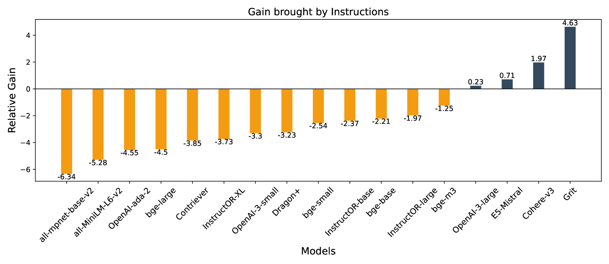
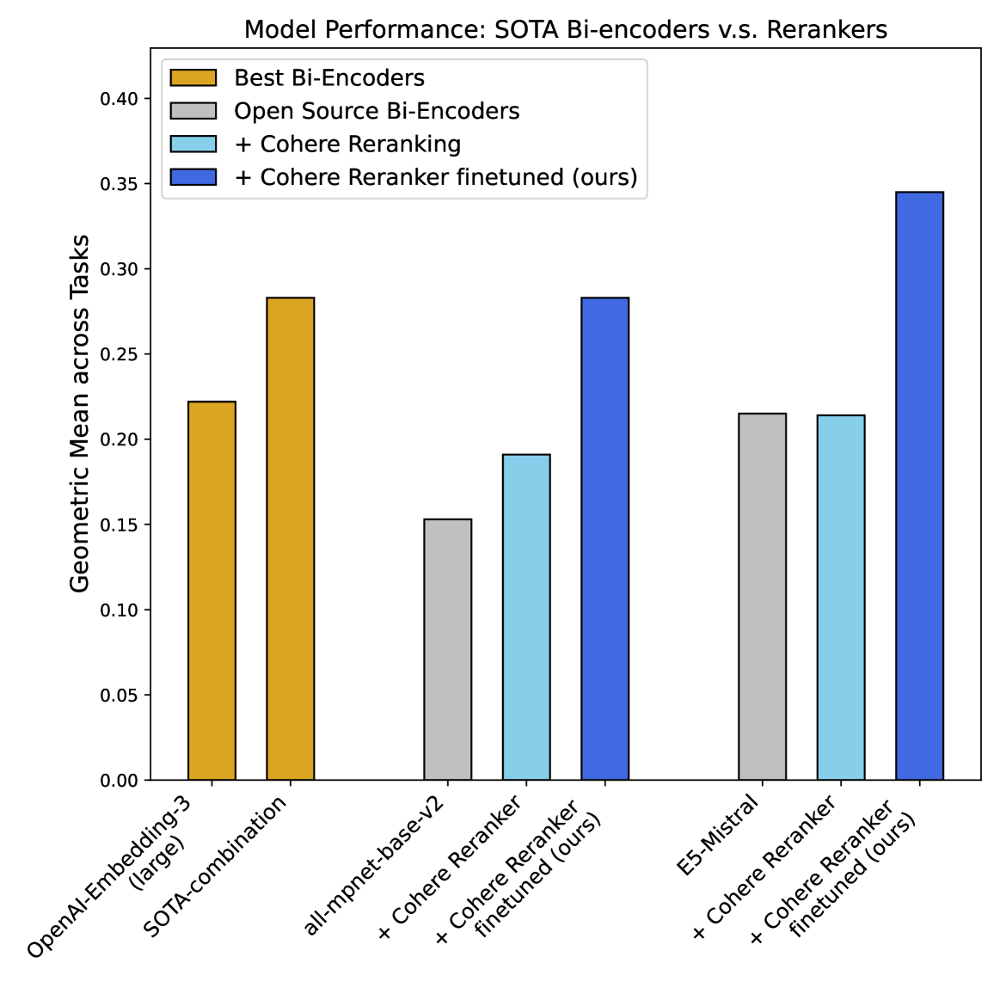
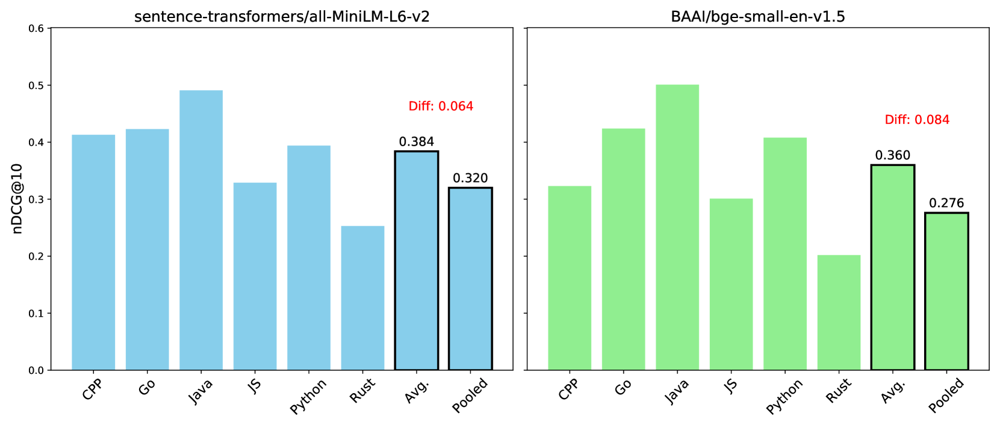

# RAR-b：将推理视作检索的基准测试

发布时间：2024年04月09日

`LLM理论` `信息检索` `语义分析`

> RAR-b: Reasoning as Retrieval Benchmark

# 摘要

> 近年来，语义文本相似性（STS）和信息检索（IR）任务已成为衡量嵌入模型进步的两大支柱。随着检索增强生成（RAG）新范式的兴起，我们期望对嵌入模型的语言理解能力进行更深层次的评估，并深入探讨其内在的推理能力。为此，我们提出了一个关键问题：检索器能否解决推理问题？通过将推理任务转化为检索任务，我们发现即便没有专门针对推理能力进行训练，现有的顶级检索器模型在辅助大型语言模型（LLMs），尤其是处理推理密集型任务时，仍显不足。此外，尽管经过训练以识别指令，但在推理任务的实际应用中，无指令的指令感知IR模型反而表现更佳，这揭示了检索器与LLM间一个被忽略的行为差异，亟待研究界关注和解决。幸运的是，新一代基于解码器的嵌入模型在缩小这一差距上展现出巨大潜力，为嵌入模型迈向推理级语言理解指明了方向。我们还发现，尽管市面上的重排序模型在这些任务上不尽人意，但通过微调赋予它们推理能力，相较于双向编码器而言，仍显得更为可行，我们通过微调一个重排序模型，在所有任务上实现了顶尖的性能。此外，我们推出了推理作为检索基准（RAR-b），这是一套全面的评估工具和测试环境，用以衡量检索器模型中的推理能力。RAR-b的资源已在 https://github.com/gowitheflow-1998/RAR-b 上发布。

> Semantic textual similartiy (STS) and information retrieval tasks (IR) tasks have been the two major avenues to record the progress of embedding models in the past few years. Under the emerging Retrieval-augmented Generation (RAG) paradigm, we envision the need to evaluate next-level language understanding abilities of embedding models, and take a conscious look at the reasoning abilities stored in them. Addressing this, we pose the question: Can retrievers solve reasoning problems? By transforming reasoning tasks into retrieval tasks, we find that without specifically trained for reasoning-level language understanding, current state-of-the-art retriever models may still be far from being competent for playing the role of assisting LLMs, especially in reasoning-intensive tasks. Moreover, albeit trained to be aware of instructions, instruction-aware IR models are often better off without instructions in inference time for reasoning tasks, posing an overlooked retriever-LLM behavioral gap for the research community to align. However, recent decoder-based embedding models show great promise in narrowing the gap, highlighting the pathway for embedding models to achieve reasoning-level language understanding. We also show that, although current off-the-shelf re-ranker models fail on these tasks, injecting reasoning abilities into them through fine-tuning still appears easier than doing so to bi-encoders, and we are able to achieve state-of-the-art performance across all tasks by fine-tuning a reranking model. We release Reasoning as Retrieval Benchmark (RAR-b), a holistic suite of tasks and settings to evaluate the reasoning abilities stored in retriever models. RAR-b is available at https://github.com/gowitheflow-1998/RAR-b.

[Arxiv](https://arxiv.org/abs/2404.06347)