# RULER: 长语境语言模型的实际上下文容量究竟有多大？

发布时间：2024年04月09日

`LLM应用` `语言模型评估` `长文本处理`

> RULER: What's the Real Context Size of Your Long-Context Language Models?

# 摘要

> 针堆测试，一种在冗长干扰文本中寻找特定信息的挑战，虽被广泛用于评估长篇语言模型，但这种测试只能反映对长篇内容的浅层理解。为此，我们推出了全新基准测试RULER，它具有可调整的设置，以适应不同序列长度和任务难度。RULER在经典针堆测试基础上进行了扩展，涵盖了更多种类和数量的“针”。此外，RULER新增了多跳追踪和聚合等任务类别，以评估超出简单搜索的复杂行为。我们利用RULER对十种长篇语言模型进行了13项任务的评估。结果发现，尽管这些模型在经典测试中准确度近乎完美，但在处理更长文本时，性能均有显著下降。尽管这些模型声称能处理32K个以上标记的上下文，实际上只有GPT-4、Command-R、Yi-34B和Mixtral四种模型能在32K长度上维持较佳性能。对能处理200K长度的Yi-34B进行深入分析后，我们发现随着输入长度和任务复杂度的提升，模型性能仍有大幅提升的空间。我们已将RULER开源，旨在推动对长篇语言模型的深度评估。

> The needle-in-a-haystack (NIAH) test, which examines the ability to retrieve a piece of information (the "needle") from long distractor texts (the "haystack"), has been widely adopted to evaluate long-context language models (LMs). However, this simple retrieval-based test is indicative of only a superficial form of long-context understanding. To provide a more comprehensive evaluation of long-context LMs, we create a new synthetic benchmark RULER with flexible configurations for customized sequence length and task complexity. RULER expands upon the vanilla NIAH test to encompass variations with diverse types and quantities of needles. Moreover, RULER introduces new task categories multi-hop tracing and aggregation to test behaviors beyond searching from context. We evaluate ten long-context LMs with 13 representative tasks in RULER. Despite achieving nearly perfect accuracy in the vanilla NIAH test, all models exhibit large performance drops as the context length increases. While these models all claim context sizes of 32K tokens or greater, only four models (GPT-4, Command-R, Yi-34B, and Mixtral) can maintain satisfactory performance at the length of 32K. Our analysis of Yi-34B, which supports context length of 200K, reveals large room for improvement as we increase input length and task complexity. We open source RULER to spur comprehensive evaluation of long-context LMs.

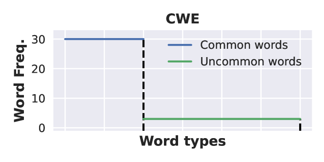

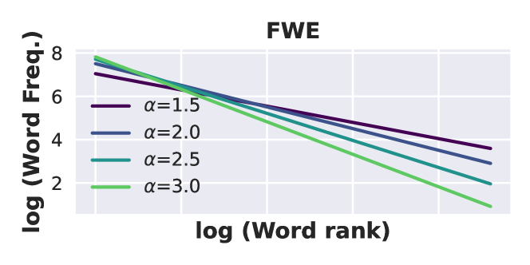

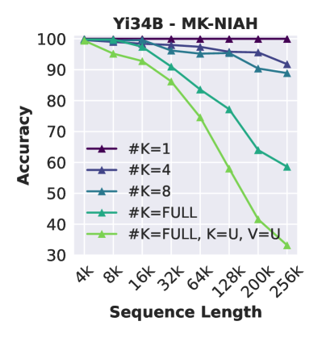

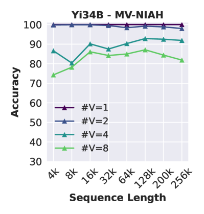

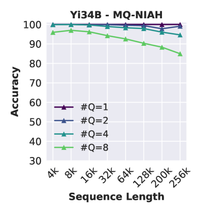

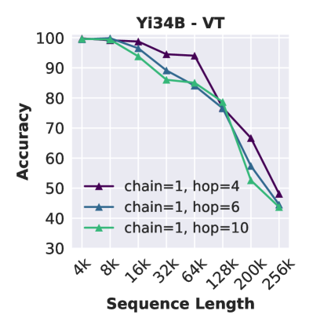

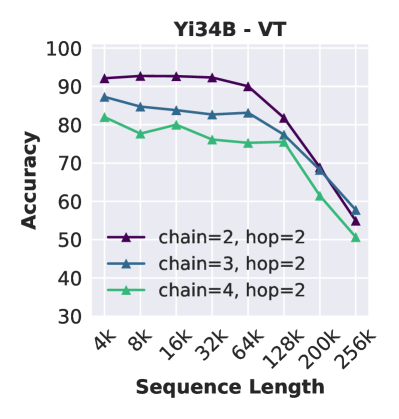

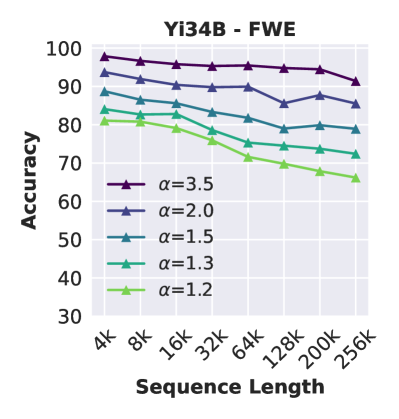

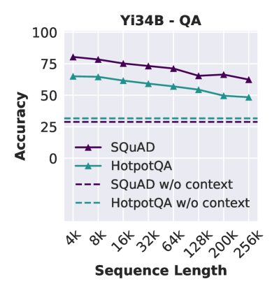

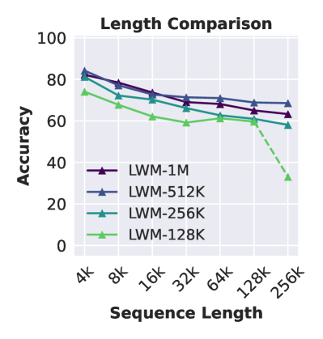

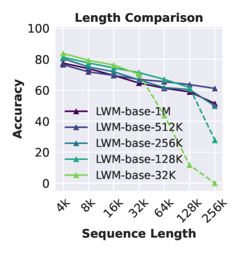

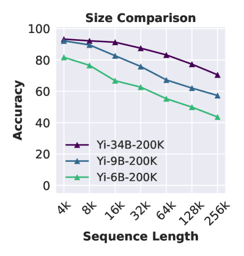

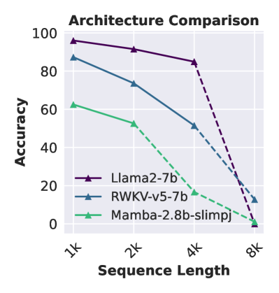

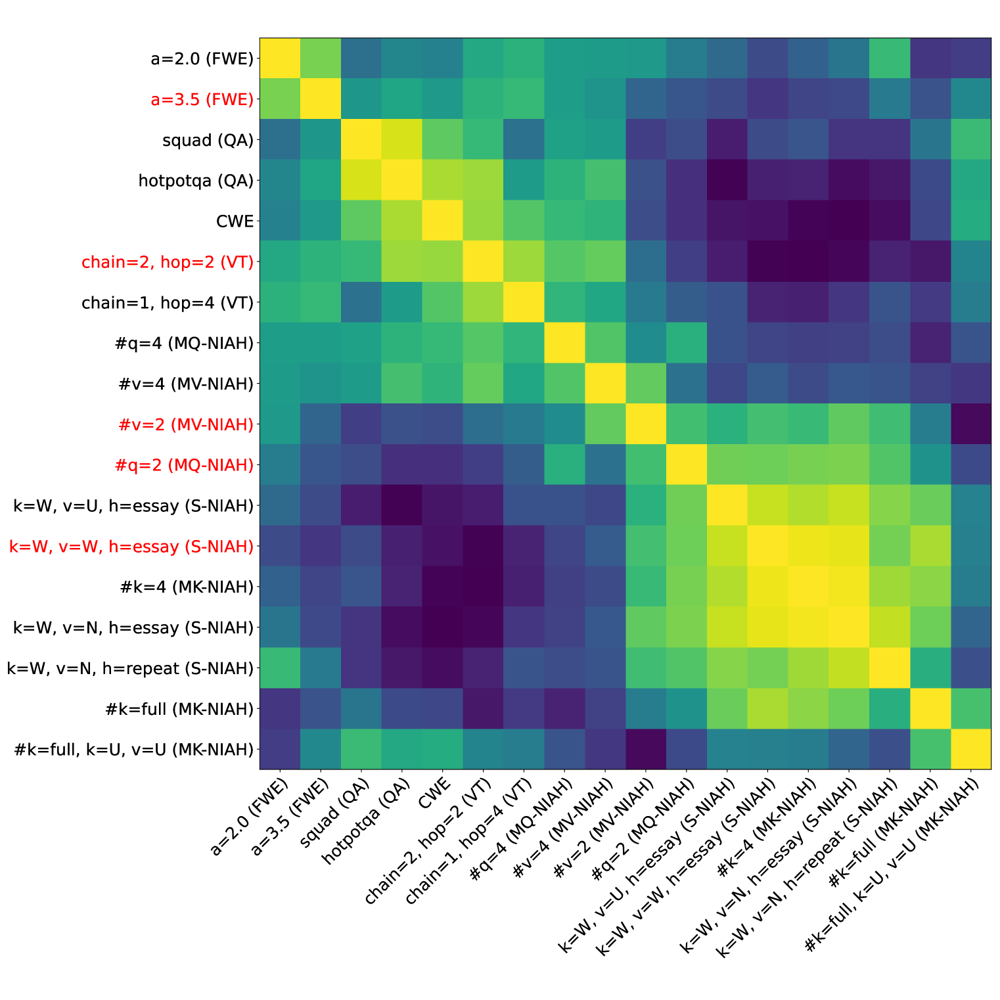

[Arxiv](https://arxiv.org/abs/2404.06654)