# 三维空间中手持物体的重建

发布时间：2024年04月09日

`RAG` `计算机视觉` `三维重建`

> Reconstructing Hand-Held Objects in 3D

# 摘要

> 手部操作的物体重建，从野外捕捉的RGB图像或视频中，向来是个难题。手部遮挡了物体的大部分视野，而且物体往往仅在有限的像素中显现。但幸运的是，我们有两个明确的参考点：一是预测的3D手部模型有助于明确物体的位置与大小，二是相对于无限可能的物体，可操作的物体种类其实并不多。基于这些认识，我们推出了一种新颖的手持物体重建方法，它借助于最新的大型语言/视觉模型和3D物体数据库的进展。我们的MCC-Hand-Object模型能够通过单一的RGB图像和推断出的3D手部数据，同时重建手部和物体的三维结构。接着，我们利用GPT-4(V)找到与图像中的物体相匹配的3D模型，并将其与网络推断的几何结构精确对齐，这一过程我们称之为RAR——检索增强重建。实验结果显示，MCC-HO在实验室和网络数据集上都取得了顶尖的成绩，我们还演示了如何利用RAR技术自动获取野外手部与物体交互图像的三维标签。

> Objects manipulated by the hand (i.e., manipulanda) are particularly challenging to reconstruct from in-the-wild RGB images or videos. Not only does the hand occlude much of the object, but also the object is often only visible in a small number of image pixels. At the same time, two strong anchors emerge in this setting: (1) estimated 3D hands help disambiguate the location and scale of the object, and (2) the set of manipulanda is small relative to all possible objects. With these insights in mind, we present a scalable paradigm for handheld object reconstruction that builds on recent breakthroughs in large language/vision models and 3D object datasets. Our model, MCC-Hand-Object (MCC-HO), jointly reconstructs hand and object geometry given a single RGB image and inferred 3D hand as inputs. Subsequently, we use GPT-4(V) to retrieve a 3D object model that matches the object in the image and rigidly align the model to the network-inferred geometry; we call this alignment Retrieval-Augmented Reconstruction (RAR). Experiments demonstrate that MCC-HO achieves state-of-the-art performance on lab and Internet datasets, and we show how RAR can be used to automatically obtain 3D labels for in-the-wild images of hand-object interactions.

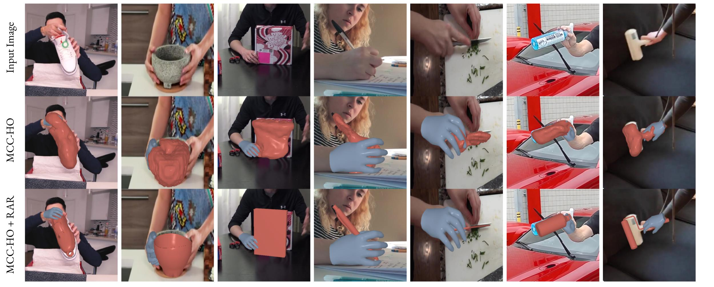

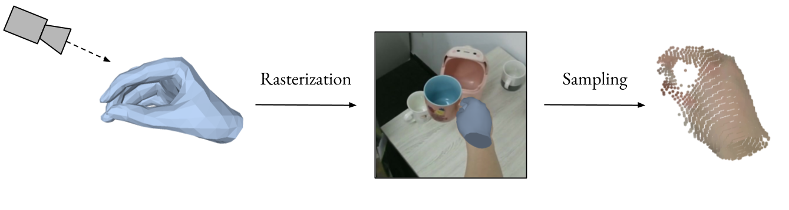

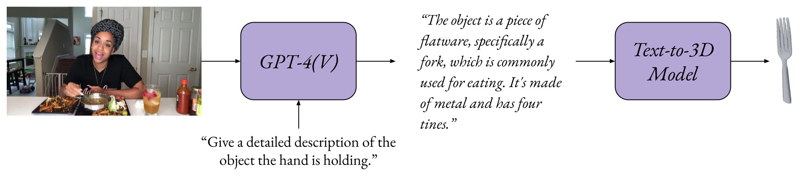

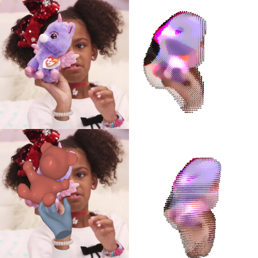

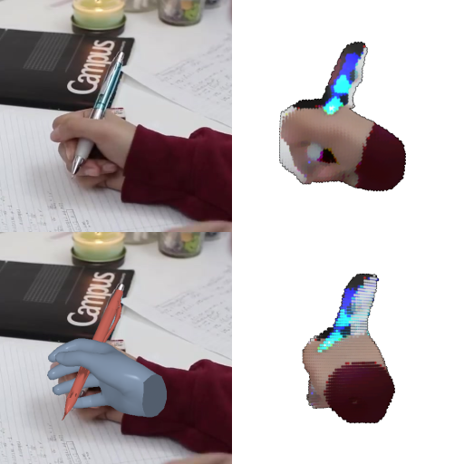

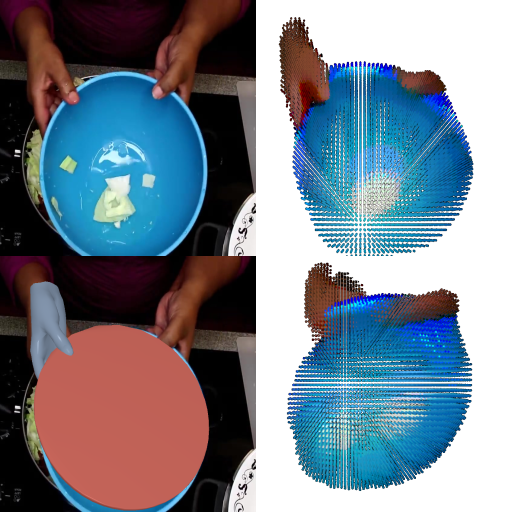

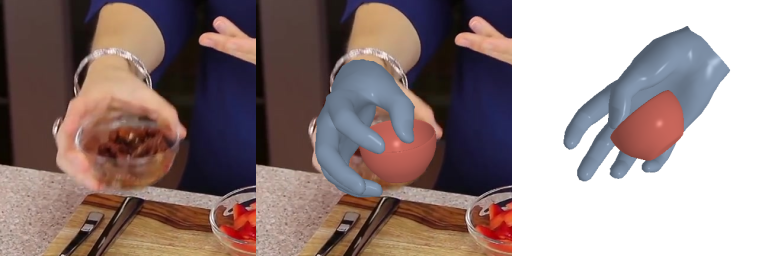

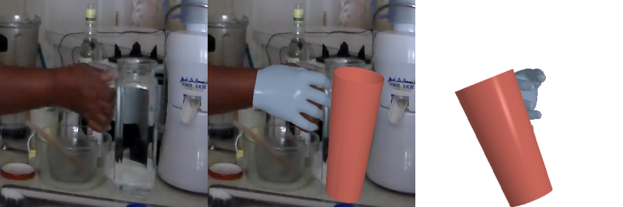

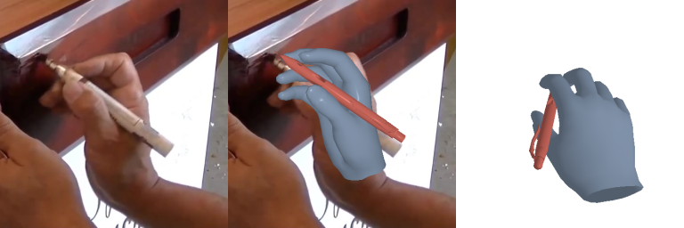

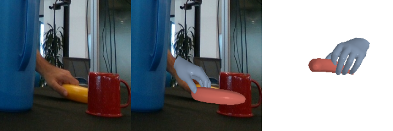

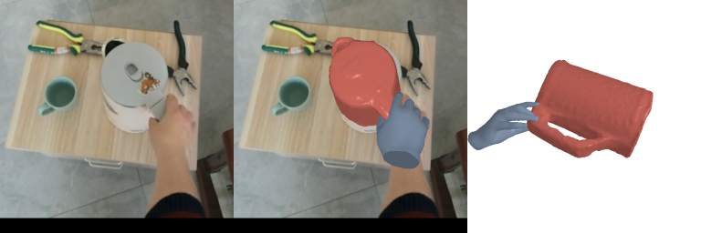

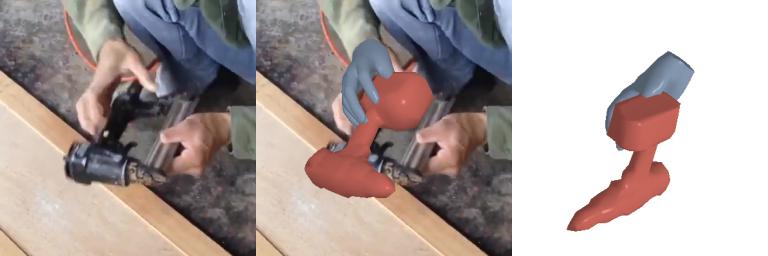

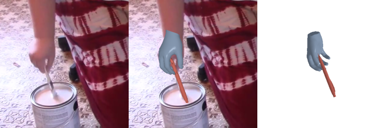

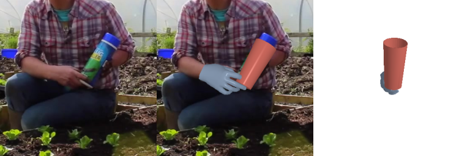

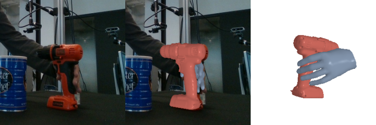

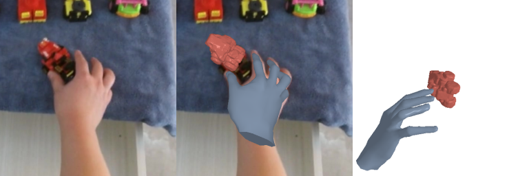

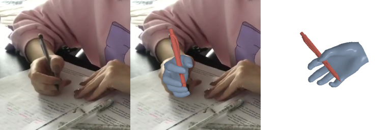

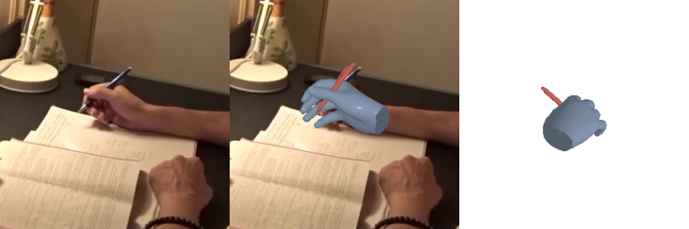

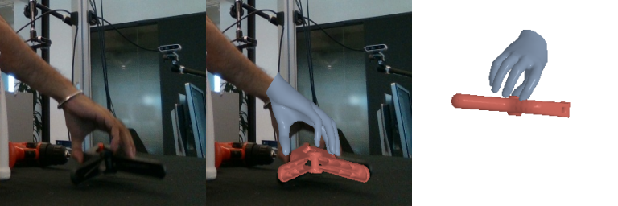

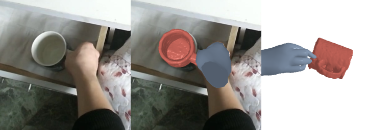

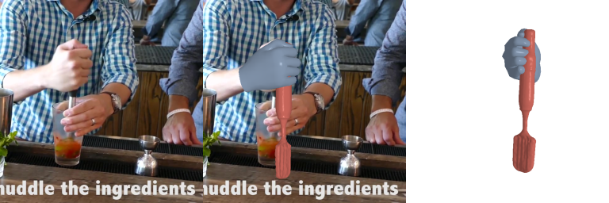

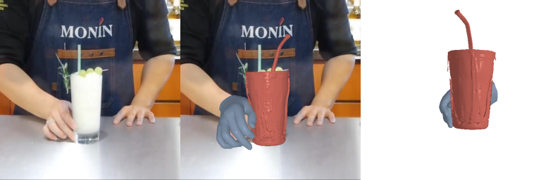

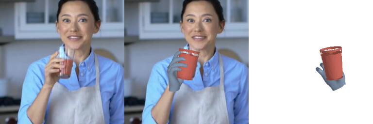

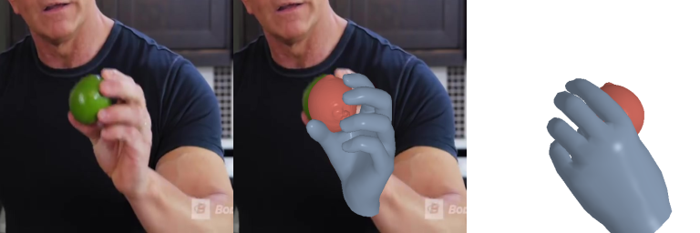

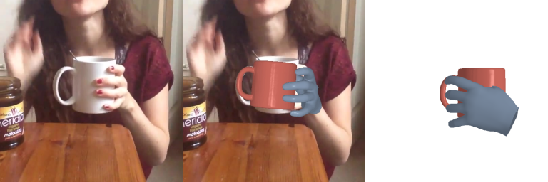

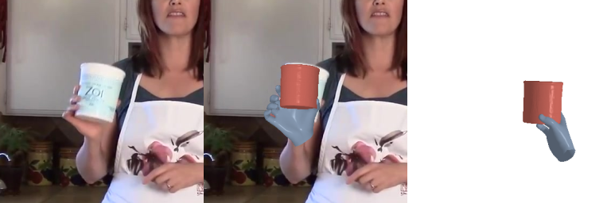

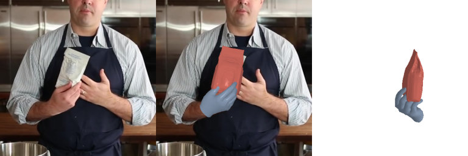

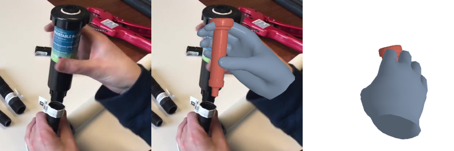

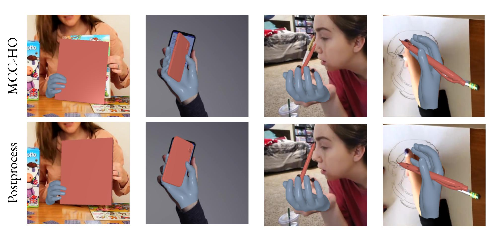

[Arxiv](https://arxiv.org/abs/2404.06507)