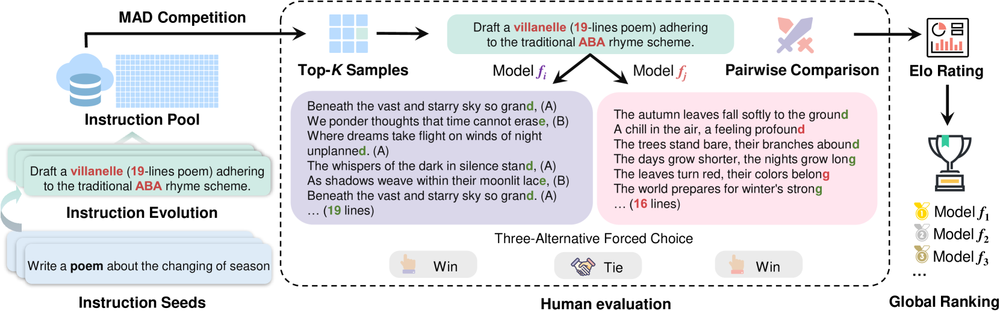
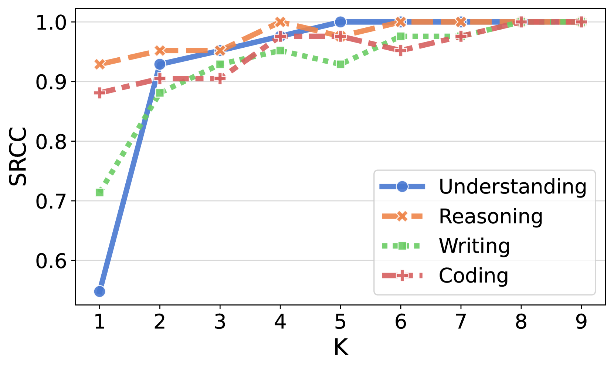
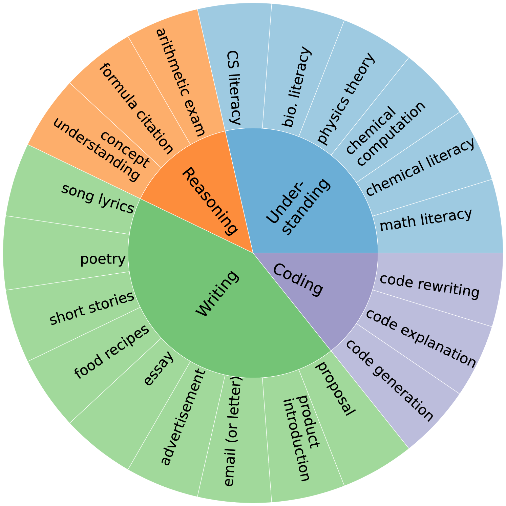
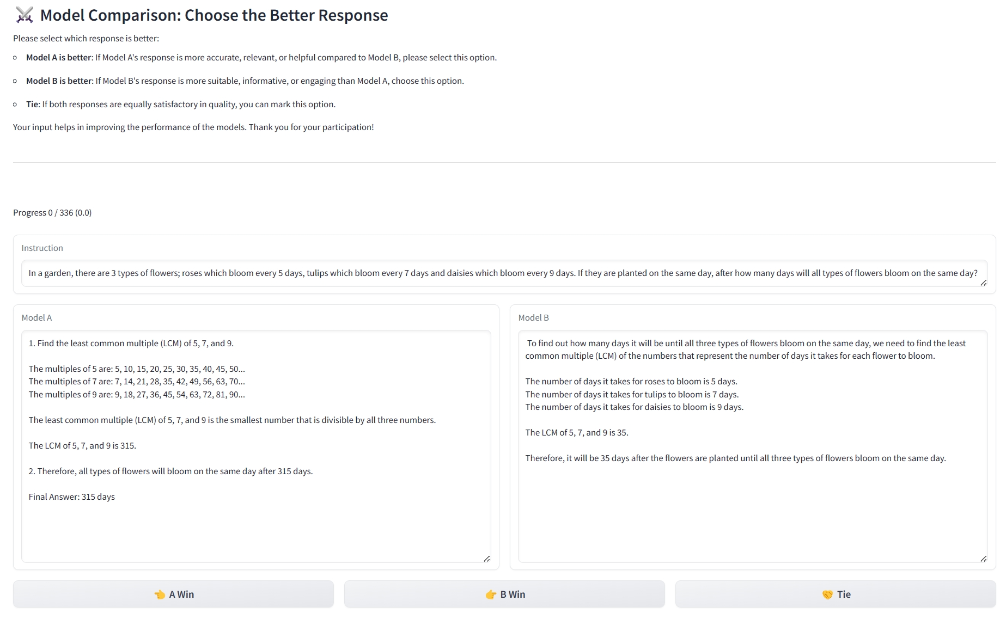
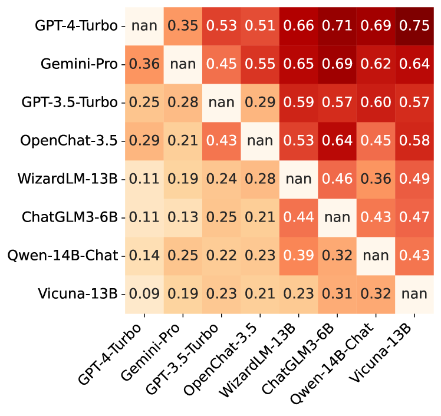
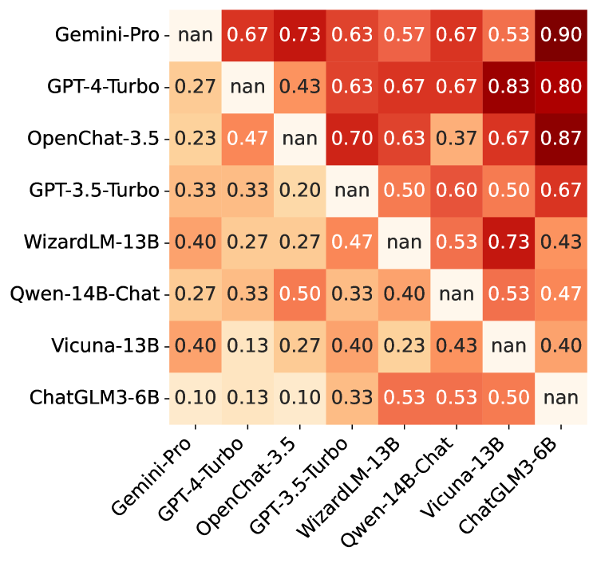
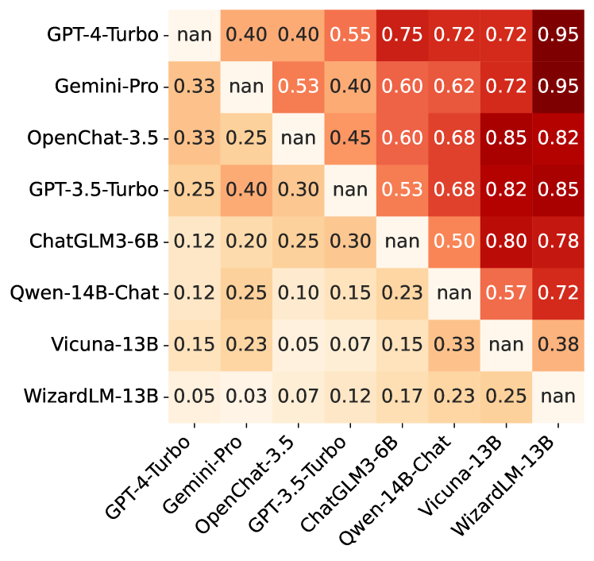
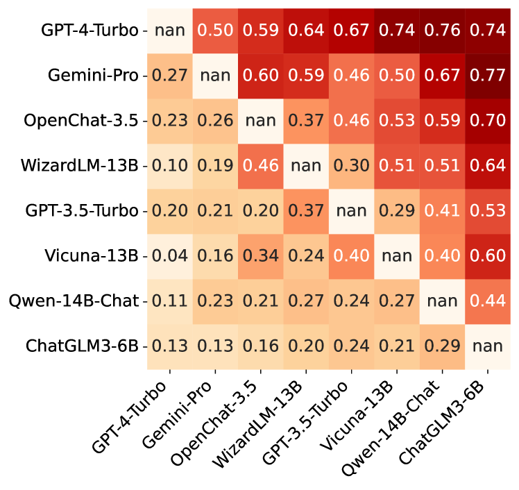
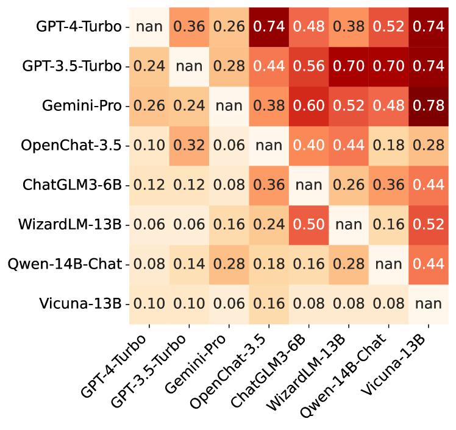
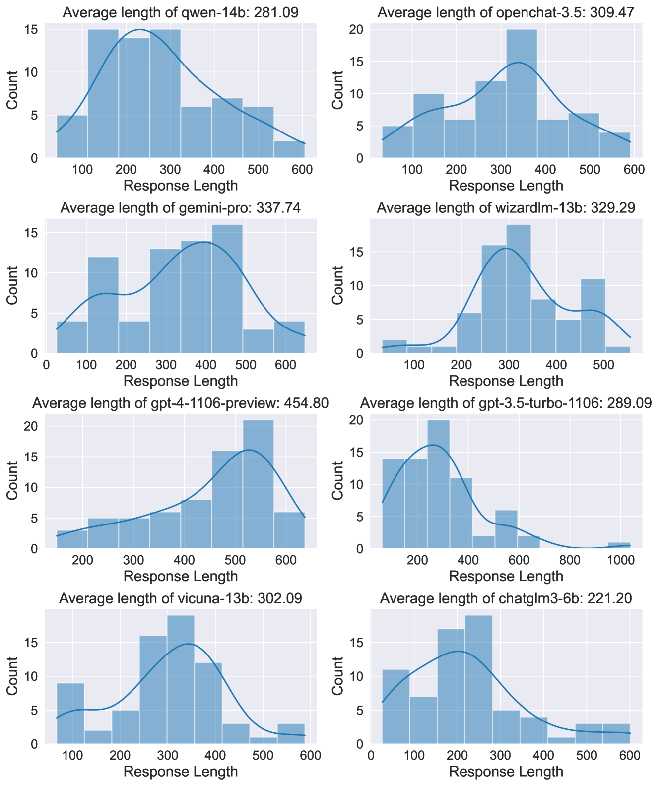

# 利用最大差异竞赛，高效地进行人类对大型语言模型的样本评估

发布时间：2024年04月09日

`LLM理论` `人工智能` `评估方法`

> Sample-Efficient Human Evaluation of Large Language Models via Maximum Discrepancy Competition

# 摘要

> 近年来，大型语言模型（LLMs）如雨后春笋般涌现。但面对LLMs的自动化和公正评估，我们却步履维艰，因为传统评估标准往往无法精准捕捉人类的偏好，同时在挑选具有信息价值和多样性的测试样本上效率不高。尽管人类评估被奉为最高准则，但在处理众多样本时，成本高昂且耗时漫长。为应对这一难题，我们引入了一种基于最大差异（MAD）竞赛的高效人类评估法。该方法能够自动筛选出少量富有信息且多样化的指令，分别适配两种LLM，并由评估者通过三选一的方式对它们的反馈作出选择。通过Elo评分系统，将这些成对比较的结果汇总成一个全球性的排名。我们挑选了八位具有代表性的LLM，从知识理解、数学推理、写作和编程四个维度进行对比。实验结果显示，这种方法不仅能够对LLMs的能力进行可靠且合理的排序，还能揭示它们各自的优势与不足，为LLM的未来发展提供了宝贵的洞见。

> The past years have witnessed a proliferation of large language models (LLMs). Yet, automated and unbiased evaluation of LLMs is challenging due to the inaccuracy of standard metrics in reflecting human preferences and the inefficiency in sampling informative and diverse test examples. While human evaluation remains the gold standard, it is expensive and time-consuming, especially when dealing with a large number of testing samples. To address this problem, we propose a sample-efficient human evaluation method based on MAximum Discrepancy (MAD) competition. MAD automatically selects a small set of informative and diverse instructions, each adapted to two LLMs, whose responses are subject to three-alternative forced choice by human subjects. The pairwise comparison results are then aggregated into a global ranking using the Elo rating system. We select eight representative LLMs and compare them in terms of four skills: knowledge understanding, mathematical reasoning, writing, and coding. Experimental results show that the proposed method achieves a reliable and sensible ranking of LLMs' capabilities, identifies their relative strengths and weaknesses, and offers valuable insights for further LLM advancement.

[Arxiv](https://arxiv.org/abs/2404.08008)