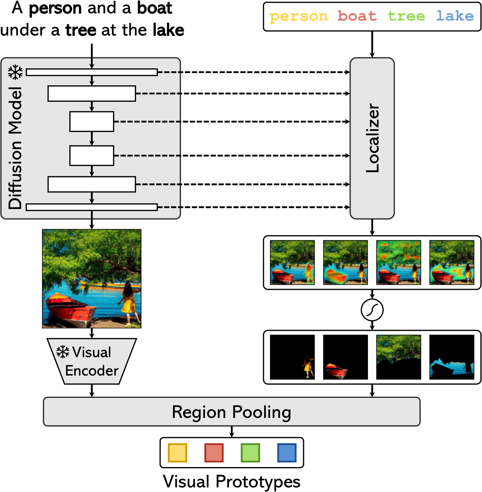
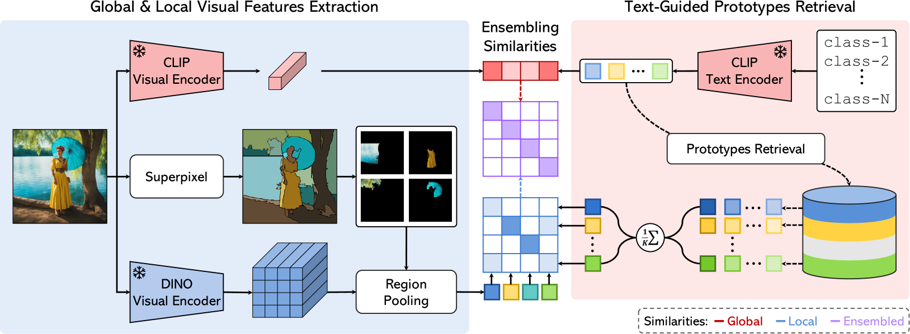
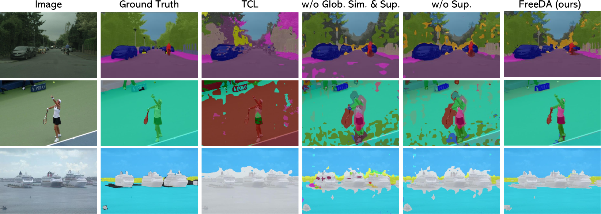
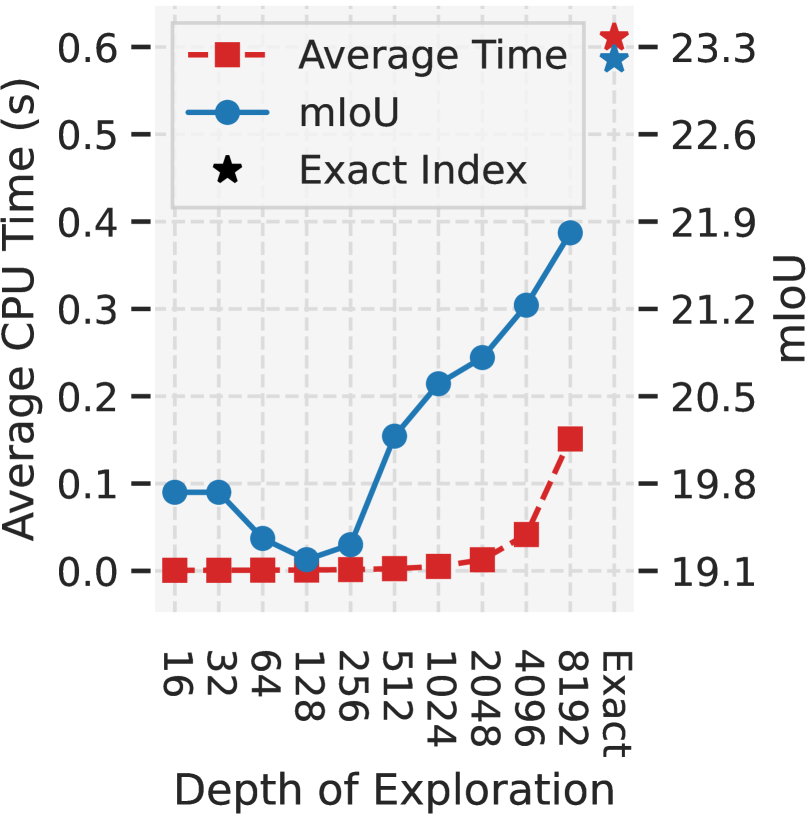
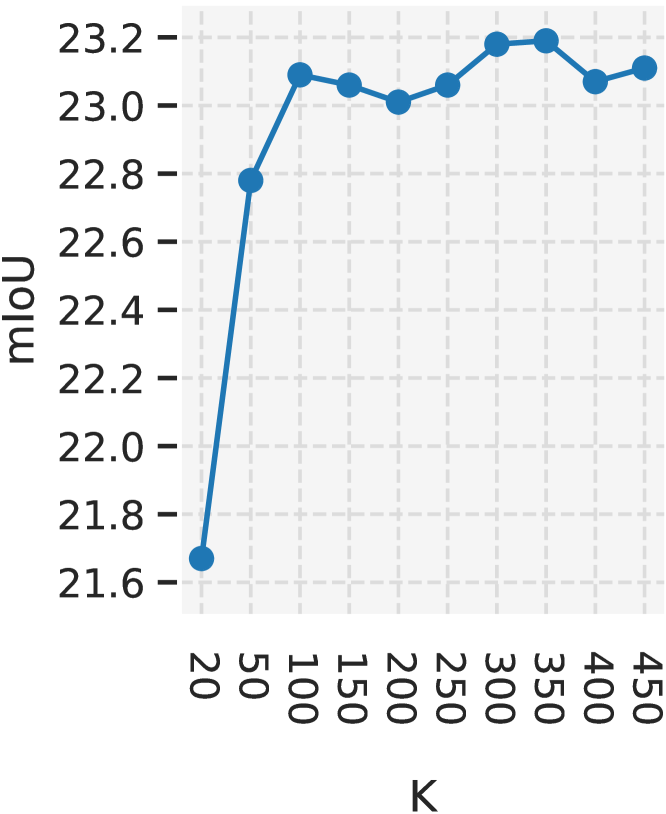
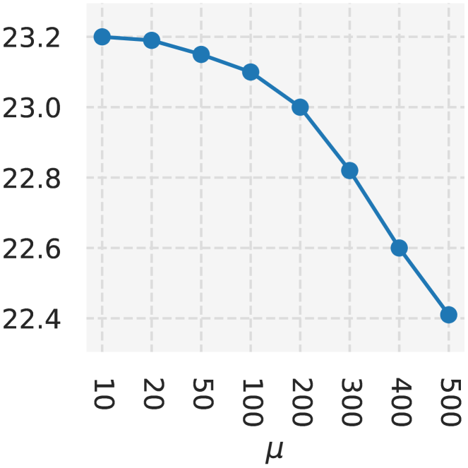
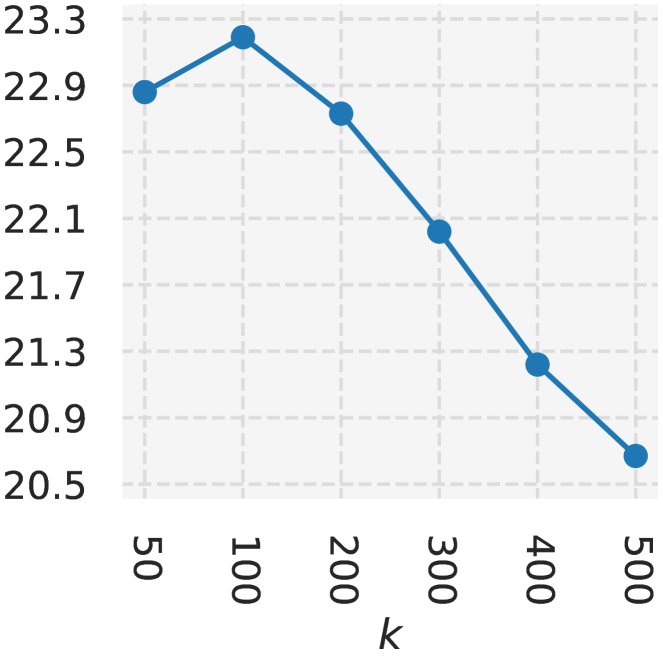
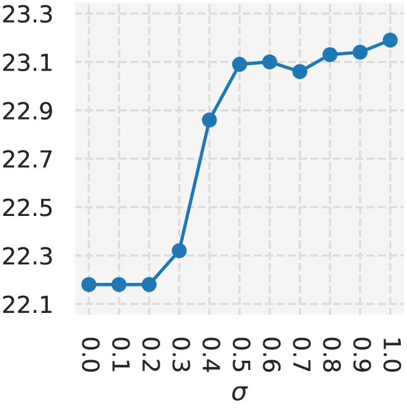
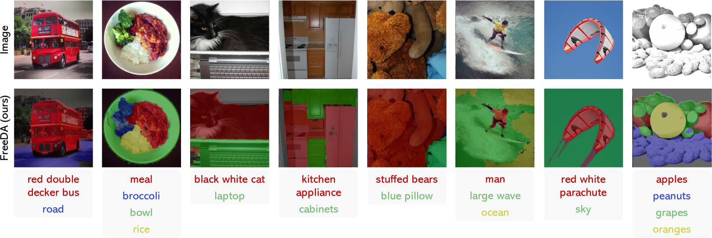

# 通过离线扩散技术增强原型生成，实现无需训练的开放词汇文本分割。

发布时间：2024年04月09日

`RAG` `计算机视觉`

> Training-Free Open-Vocabulary Segmentation with Offline Diffusion-Augmented Prototype Generation

# 摘要

> 开放词汇语义分割致力于对文本描述的各类别进行精准分割。以往研究通过大量图像与标题配对训练，实现像素级多模态融合。但标题只提供了图像语义的宏观信息，缺少对具体概念的精确定位。而且，大规模数据集训练伴随着巨大的计算开销。本文提出了FreeDA，一种无需训练的开放词汇语义分割扩散增强新方法。它借助扩散模型的视觉定位能力和局部与全局的相似性，实现对语义类别的精确匹配。我们的方案包含一个离线阶段，从众多标题中提取文本-视觉参考嵌入，结合视觉与语义上下文。测试阶段，这些嵌入用于辅助视觉匹配，通过综合考虑类别未知区域和全局语义相似性来完成。大量实验证明，FreeDA在五个数据集上达到了新的最佳性能，相比先前方法在mIoU指标上平均提升了超过7个百分点，且无需任何训练。

> Open-vocabulary semantic segmentation aims at segmenting arbitrary categories expressed in textual form. Previous works have trained over large amounts of image-caption pairs to enforce pixel-level multimodal alignments. However, captions provide global information about the semantics of a given image but lack direct localization of individual concepts. Further, training on large-scale datasets inevitably brings significant computational costs. In this paper, we propose FreeDA, a training-free diffusion-augmented method for open-vocabulary semantic segmentation, which leverages the ability of diffusion models to visually localize generated concepts and local-global similarities to match class-agnostic regions with semantic classes. Our approach involves an offline stage in which textual-visual reference embeddings are collected, starting from a large set of captions and leveraging visual and semantic contexts. At test time, these are queried to support the visual matching process, which is carried out by jointly considering class-agnostic regions and global semantic similarities. Extensive analyses demonstrate that FreeDA achieves state-of-the-art performance on five datasets, surpassing previous methods by more than 7.0 average points in terms of mIoU and without requiring any training.

[Arxiv](https://arxiv.org/abs/2404.06542)