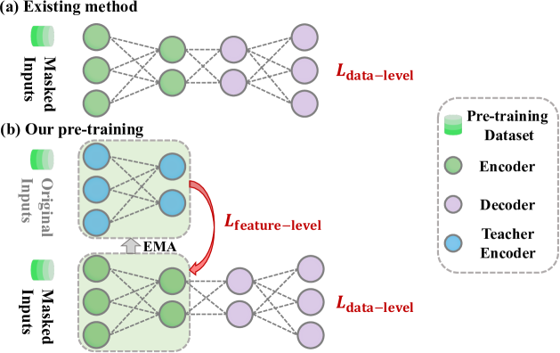
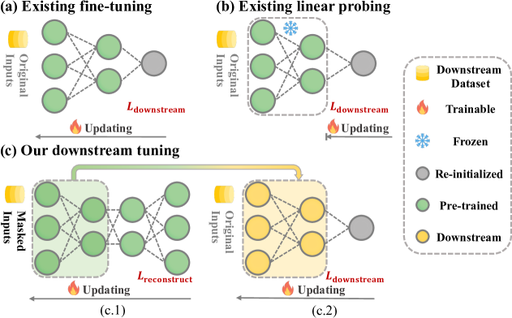
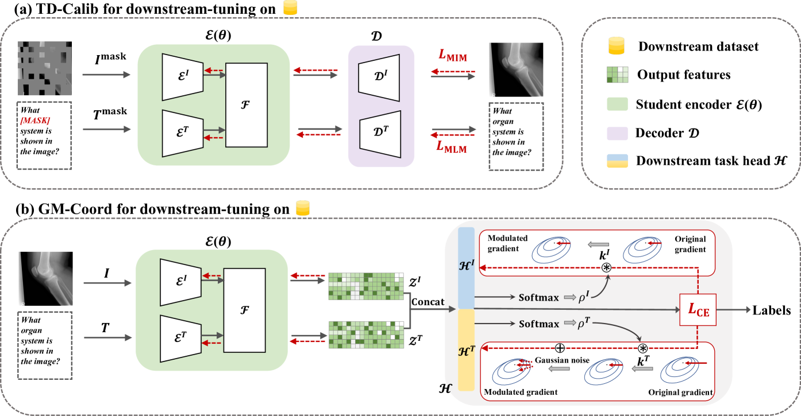
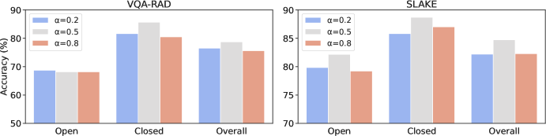
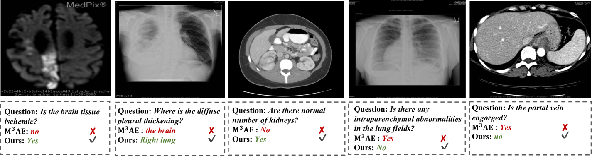
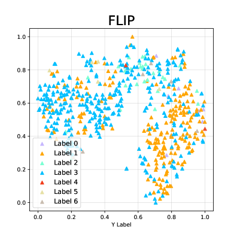
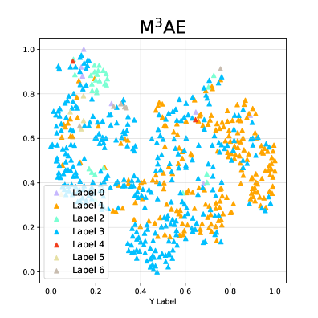
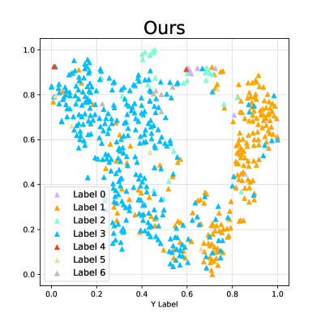
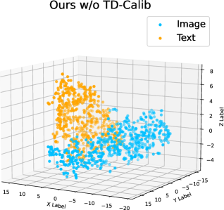
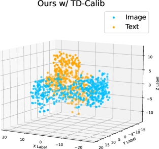

# 本研究提出了一种集成的多模态诊断框架，该框架通过重建预训练和针对性的异质性调整，实现了对不同数据源的高效融合与诊断。

发布时间：2024年04月09日

`RAG` `医学影像` `计算机辅助诊断`

> Unified Multi-modal Diagnostic Framework with Reconstruction Pre-training and Heterogeneity-combat Tuning

# 摘要

> 借助大规模未标记数据集，医学多模态预训练在提升计算机辅助诊断的准确性方面显露头角。然而，现行基于掩码自编码器的方法主要关注数据层面的重建，忽略了更深层次的语义信息。此外，预训练与下游任务之间的分布差异和下游任务内部的模态差异两大异质性问题，阻碍了预训练知识的顺利迁移。针对这些难题，我们设计了统一医学多模态诊断框架（UMD），配备了专门的预训练和下游调整策略。我们提出的多级重建预训练策略（MR-Pretrain）涵盖特征级和数据级重建，引导模型深入挖掘不同模态掩码输入的语义信息。同时，为应对下游调整阶段的异质性问题，我们引入了面向任务的分布校准（TD-Calib）和梯度引导的模态协调（GM-Coord）策略，前者针对下游数据集的分布特性对预训练模型进行精细调整，后者则根据各模态的动态优化状态动态调整梯度权重。经过五个公共医学数据集的广泛测试，UMD框架展现出卓越的性能，显著超越了现有方法在各类下游任务上的表现。

> Medical multi-modal pre-training has revealed promise in computer-aided diagnosis by leveraging large-scale unlabeled datasets. However, existing methods based on masked autoencoders mainly rely on data-level reconstruction tasks, but lack high-level semantic information. Furthermore, two significant heterogeneity challenges hinder the transfer of pre-trained knowledge to downstream tasks, \textit{i.e.}, the distribution heterogeneity between pre-training data and downstream data, and the modality heterogeneity within downstream data. To address these challenges, we propose a Unified Medical Multi-modal Diagnostic (UMD) framework with tailored pre-training and downstream tuning strategies. Specifically, to enhance the representation abilities of vision and language encoders, we propose the Multi-level Reconstruction Pre-training (MR-Pretrain) strategy, including a feature-level and data-level reconstruction, which guides models to capture the semantic information from masked inputs of different modalities. Moreover, to tackle two kinds of heterogeneities during the downstream tuning, we present the heterogeneity-combat downstream tuning strategy, which consists of a Task-oriented Distribution Calibration (TD-Calib) and a Gradient-guided Modality Coordination (GM-Coord). In particular, TD-Calib fine-tunes the pre-trained model regarding the distribution of downstream datasets, and GM-Coord adjusts the gradient weights according to the dynamic optimization status of different modalities. Extensive experiments on five public medical datasets demonstrate the effectiveness of our UMD framework, which remarkably outperforms existing approaches on three kinds of downstream tasks.

[Arxiv](https://arxiv.org/abs/2404.06057)