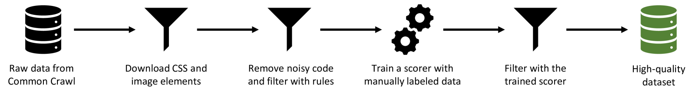
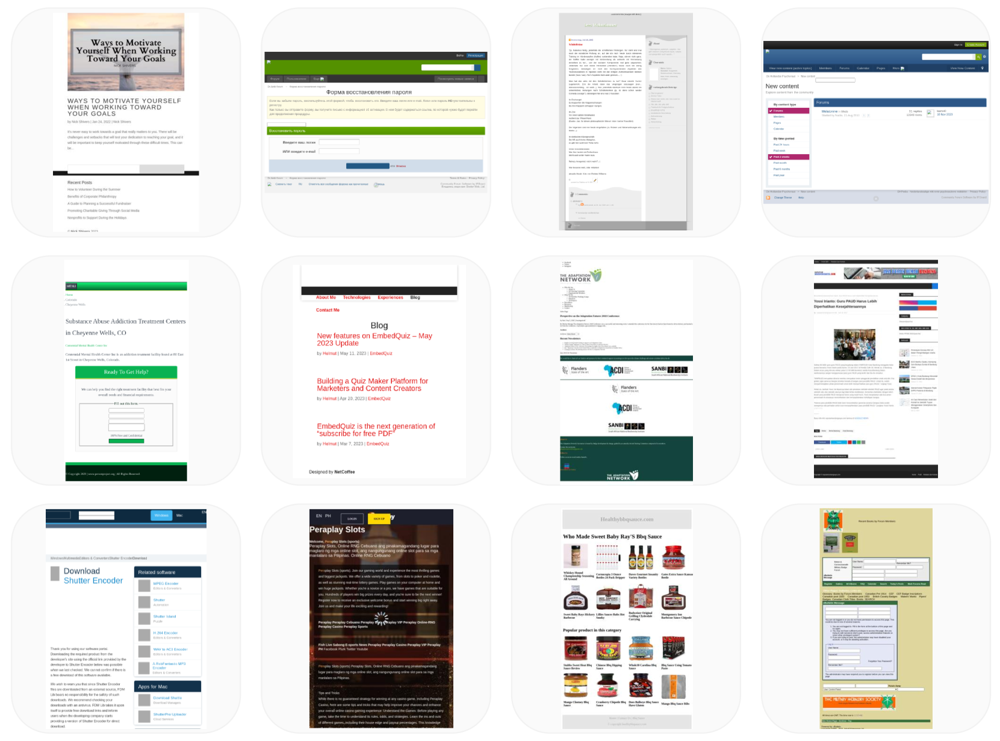

# VISION2UI：一个包含布局信息的真实世界数据集，用于从UI设计生成代码。

发布时间：2024年04月09日

`LLM应用` `UI设计` `数据集`

> VISION2UI: A Real-World Dataset with Layout for Code Generation from UI Designs

# 摘要

> 从网页设计构想自动生成 UI 代码，能有效为开发者减负，让新手开发者和设计师直接将设计图转化为网页。虽然已有研究通过深度神经网络从基础设计或草图生成 UI 代码取得了成果，但受多模态大型语言模型（MLLMs）的启发，从高保真设计图生成 UI 代码成为现实。不过，我们发现现有 MLLMs 受限于缺乏真实、高质量、大规模的数据集，使得自动生成 UI 代码的性能不尽人意。为此，我们推出了名为 VISION2UI 的新数据集，它源自现实场景，融入详尽布局信息，专为微调 MLLMs 生成 UI 代码而设。该数据集通过收集、清洗和筛选开源的 Common Crawl 数据集等一系列操作得到。为确保数据质量，我们使用神经评分器对数据进行筛选，保留高质量样本。最终，这个数据集包含 2,000 个设计构想与 UI 代码的并行样本，更多样本即将上线。数据集已在 https://huggingface.co/datasets/xcodemind/vision2ui 上线。

> Automatically generating UI code from webpage design visions can significantly alleviate the burden of developers, enabling beginner developers or designers to directly generate Web pages from design diagrams. Currently, prior research has accomplished the objective of generating UI code from rudimentary design visions or sketches through designing deep neural networks. Inspired by the groundbreaking advancements achieved by Multimodal Large Language Models (MLLMs), the automatic generation of UI code from high-fidelity design images is now emerging as a viable possibility. Nevertheless, our investigation reveals that existing MLLMs are hampered by the scarcity of authentic, high-quality, and large-scale datasets, leading to unsatisfactory performance in automated UI code generation. To mitigate this gap, we present a novel dataset, termed VISION2UI, extracted from real-world scenarios, augmented with comprehensive layout information, tailored specifically for finetuning MLLMs in UI code generation. Specifically, this dataset is derived through a series of operations, encompassing collecting, cleaning, and filtering of the open-source Common Crawl dataset. In order to uphold its quality, a neural scorer trained on labeled samples is utilized to refine the data, retaining higher-quality instances. Ultimately, this process yields a dataset comprising 2,000 (Much more is coming soon) parallel samples encompassing design visions and UI code. The dataset is available at https://huggingface.co/datasets/xcodemind/vision2ui.

[Arxiv](https://arxiv.org/abs/2404.06369)