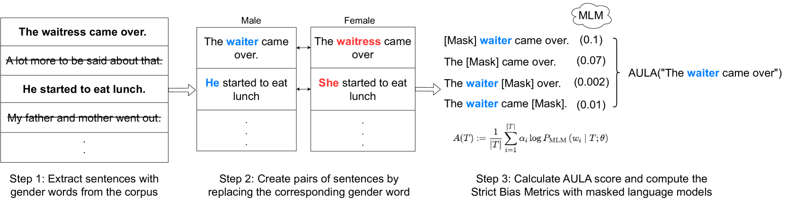
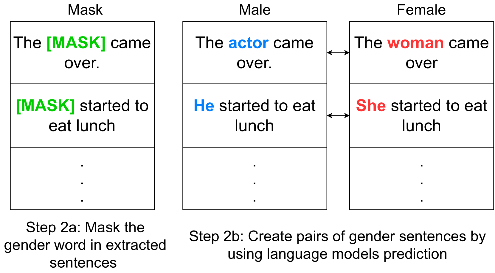
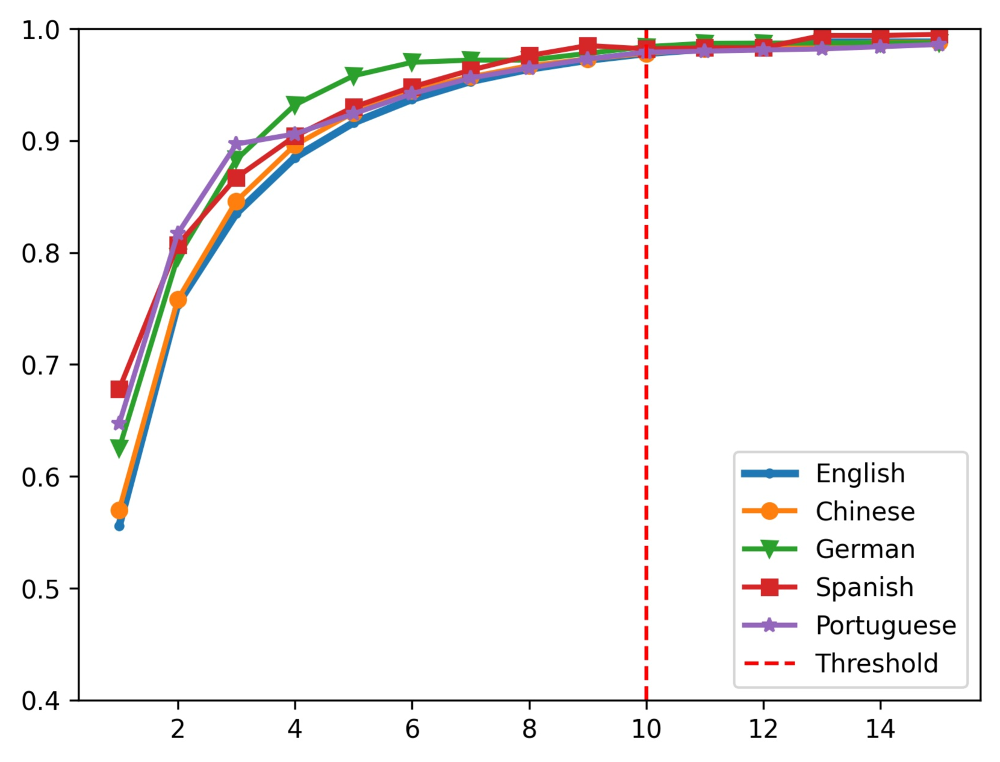
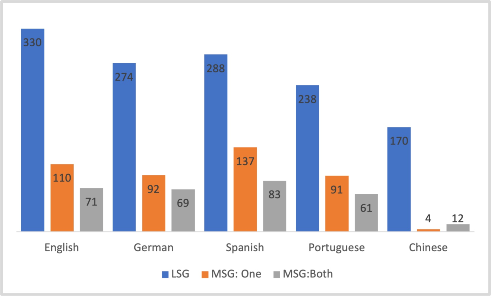

# MLM，你偏好的性别是什么？探究多语言掩码语言模型中的性别歧视问题

发布时间：2024年04月09日

`LLM应用` `偏见分析`

> What is Your Favorite Gender, MLM? Gender Bias Evaluation in Multilingual Masked Language Models

# 摘要

> 偏见是对某一方的过度偏好。鉴于基于变换器的掩码语言模型（MLMs）在自然语言处理（NLP）领域的广泛影响，迫切需要对这些模型中的偏见进行系统性评估。尽管已有众多研究探讨了英语MLMs的性别偏见问题，但针对其他语言的研究却寥寥无几。本研究提出了一种多语言评估方法，旨在量化中文、英语、德语、葡萄牙语和西班牙语MLMs中的性别偏见。区别于以往的研究，我们的方法不依赖于与英语对照的平行语料库，而是利用多语言词典来识别其他语言中的性别偏见。此外，我们还引入了一种新颖的基于模型的方法，通过生成句子对来进行更为严谨的性别偏见分析，相较于传统的基于词典的方法更具优势。针对每种语言，我们分别运用基于词典和基于模型的方法构建了两个数据集，并利用现有的一个及新开发的三个评分指标，对专门针对该语言训练的MLM进行性别偏见评估。研究结果显示，传统方法对数据高度敏感且稳定性不足，因为它未能排除与性别无关的上下文依赖。实际上，当在同一数据集上应用不同评分指标时，结果往往会截然相反，这表明在大型数据集上采用多种评估指标来研究性别偏见，才是更为妥当的做法。

> Bias is a disproportionate prejudice in favor of one side against another. Due to the success of transformer-based Masked Language Models (MLMs) and their impact on many NLP tasks, a systematic evaluation of bias in these models is needed more than ever. While many studies have evaluated gender bias in English MLMs, only a few works have been conducted for the task in other languages. This paper proposes a multilingual approach to estimate gender bias in MLMs from 5 languages: Chinese, English, German, Portuguese, and Spanish. Unlike previous work, our approach does not depend on parallel corpora coupled with English to detect gender bias in other languages using multilingual lexicons. Moreover, a novel model-based method is presented to generate sentence pairs for a more robust analysis of gender bias, compared to the traditional lexicon-based method. For each language, both the lexicon-based and model-based methods are applied to create two datasets respectively, which are used to evaluate gender bias in an MLM specifically trained for that language using one existing and 3 new scoring metrics. Our results show that the previous approach is data-sensitive and not stable as it does not remove contextual dependencies irrelevant to gender. In fact, the results often flip when different scoring metrics are used on the same dataset, suggesting that gender bias should be studied on a large dataset using multiple evaluation metrics for best practice.

[Arxiv](https://arxiv.org/abs/2404.06621)