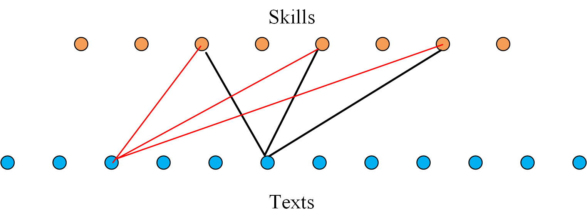
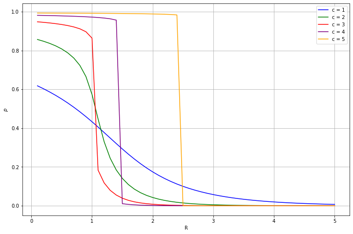
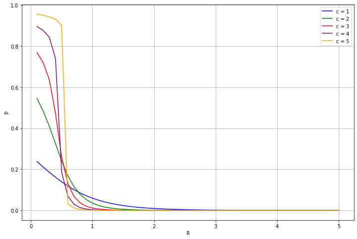
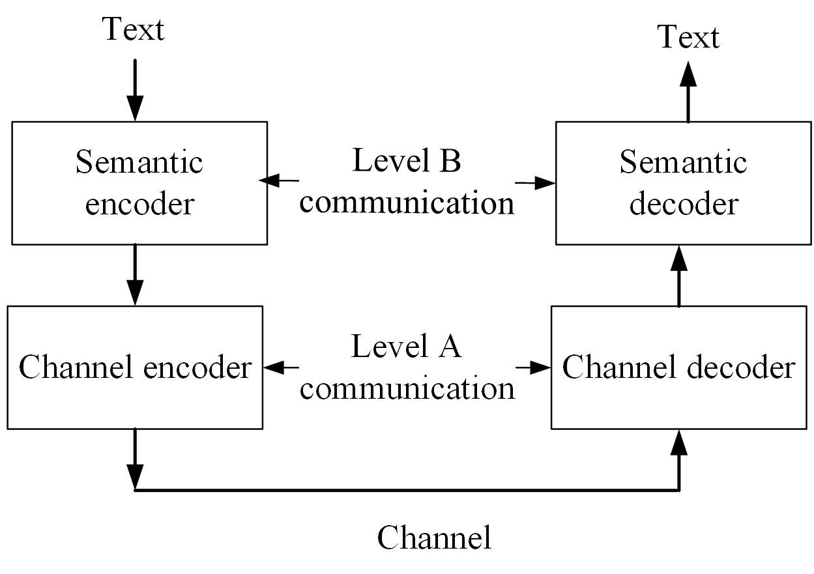

# 抽象学习者学习语义语言的数学理论探究

发布时间：2024年04月10日

`LLM理论` `语义压缩`

> A Mathematical Theory for Learning Semantic Languages by Abstract Learners

# 摘要

> 近期大型语言模型（LLMs）的研究进展揭示了一个现象：当系统参数数量和训练数据规模达到一定界限时，模型便能展现出新的能力（即学习到的技能）。这一现象的具体机制尚不明晰，是当前研究的热点。借鉴文献[1]中提出的技能-文本二分图模型，我们构建了一个数学理论，以解释技能习得的过程，并将其融入学习或训练过程中。我们的模型将技能-文本二分图中的技能学习视为低密度奇偶校验（LDPC）编码和不规则重复槽ALOHA（IRSA）中的迭代解码过程。通过密度演化分析，我们发现当训练文本与技能数量的比例突破某一阈值，技能便开始显现。此外，我们的研究还推导出了测试误差与训练文本规模的缩放法则。训练结束后，我们提出了一种语义压缩方法，并探讨了其在语义通信领域的潜在应用。

> Recent advances in Large Language Models (LLMs) have demonstrated the emergence of capabilities (learned skills) when the number of system parameters and the size of training data surpass certain thresholds. The exact mechanisms behind such phenomena are not fully understood and remain a topic of active research. Inspired by the skill-text bipartite graph model presented in [1] for modeling semantic language, we develop a mathematical theory to explain the emergence of learned skills, taking the learning (or training) process into account. Our approach models the learning process for skills in the skill-text bipartite graph as an iterative decoding process in Low-Density Parity Check (LDPC) codes and Irregular Repetition Slotted ALOHA (IRSA). Using density evolution analysis, we demonstrate the emergence of learned skills when the ratio of the size of training texts to the number of skills exceeds a certain threshold. Our analysis also yields a scaling law for testing errors relative to the size of training texts. Upon completion of the training, we propose a method for semantic compression and discuss its application in semantic communication.

[Arxiv](https://arxiv.org/abs/2404.07009)