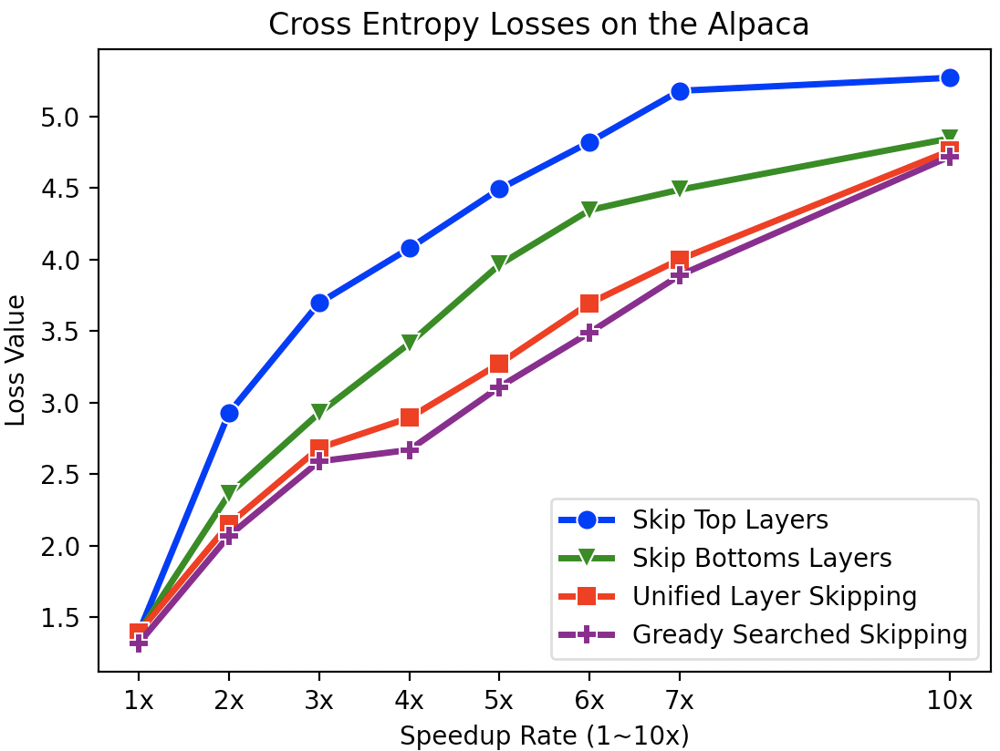

# 通过统一的层跳过技巧，我们能够加快大型语言模型的推理速度。

发布时间：2024年04月10日

`LLM理论` `机器翻译` `文本摘要`

> Accelerating Inference in Large Language Models with a Unified Layer Skipping Strategy

# 摘要

> 近期研究发现，动态计算技术通过巧妙的启发式或附加预测机制，实现大型语言模型（LLMs）的计算层跳过，从而加速处理。但现行解码策略因样本不同而分配不同的计算资源，难以确保加速效果的稳定性和精确性。更甚者，这些方法常导致模型层表示的剧烈变动，影响模型性能。为此，我们提出了一种统一层跳过策略，根据预定的加速目标来均衡地跳过中间层计算。此策略不受样本差异影响，兼容批量处理和缓存技术，更贴合实际应用需求。在机器翻译和文本摘要两大任务的测试中，统一层跳过策略在既定加速目标下，显著提升了推理效率和模型处理能力，超越了传统动态计算方法。

> Recently, dynamic computation methods have shown notable acceleration for Large Language Models (LLMs) by skipping several layers of computations through elaborate heuristics or additional predictors. However, in the decoding process of existing approaches, different samples are assigned different computational budgets, which cannot guarantee a stable and precise acceleration effect. Furthermore, existing approaches generally skip multiple contiguous layers at the bottom or top of the layers, leading to a drastic change in the model's layer-wise representations, and thus a consequent performance degeneration. Therefore, we propose a Unified Layer Skipping strategy, which selects the number of layers to skip computation based solely on the target speedup ratio, and then skips the corresponding number of intermediate layer computations in a balanced manner. Since the Unified Layer Skipping strategy is independent of input samples, it naturally supports popular acceleration techniques such as batch decoding and KV caching, thus demonstrating more practicality for real-world applications. Experimental results on two common tasks, i.e., machine translation and text summarization, indicate that given a target speedup ratio, the Unified Layer Skipping strategy significantly enhances both the inference performance and the actual model throughput over existing dynamic approaches.

[Arxiv](https://arxiv.org/abs/2404.06954)