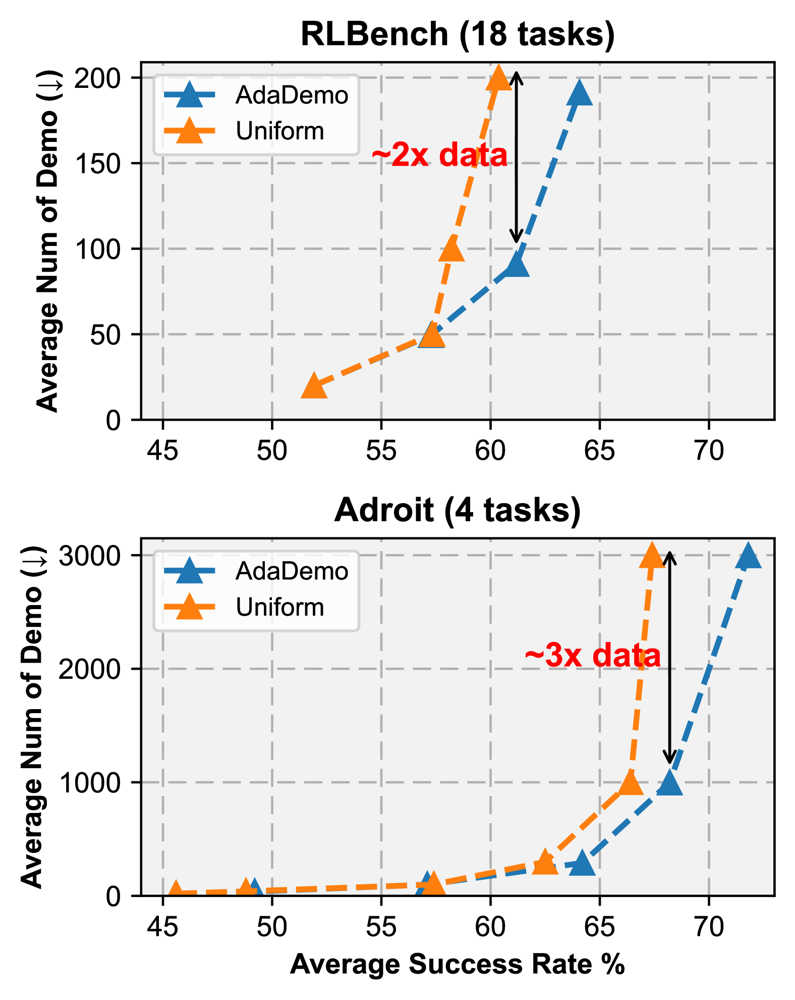
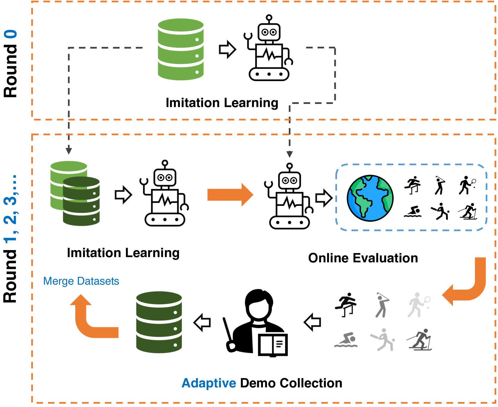
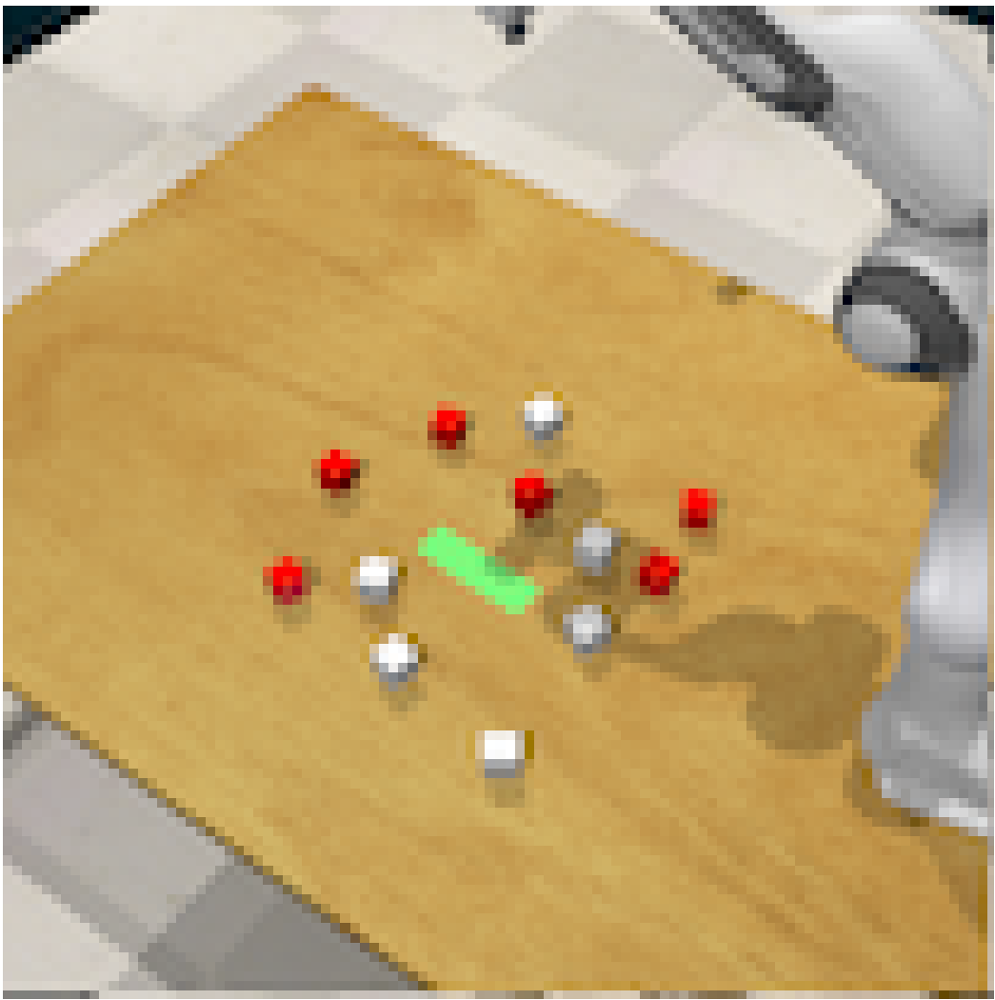
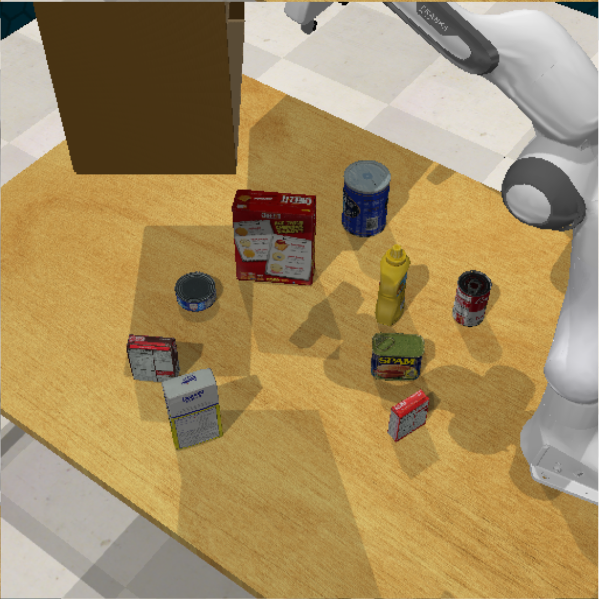
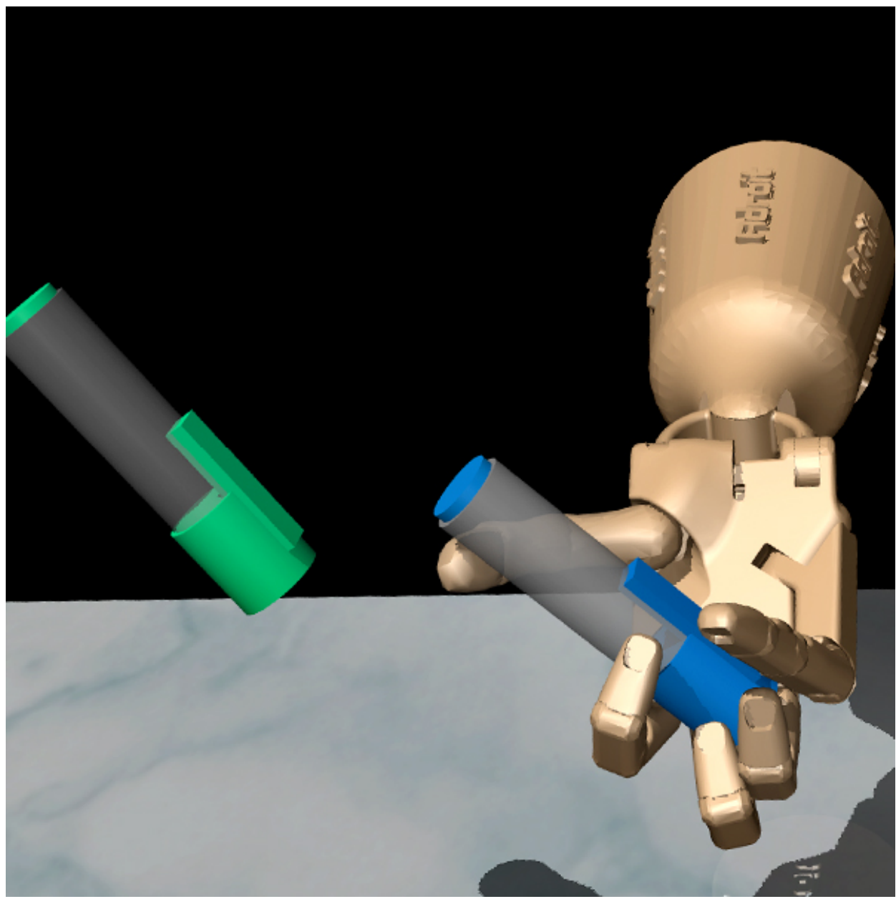

# AdaDemo 通过数据高效的方式扩展通用机器人代理的演示，助力其更好地学习和适应多样化任务。

发布时间：2024年04月10日

`Agent` `机器人` `模仿学习`

> AdaDemo: Data-Efficient Demonstration Expansion for Generalist Robotic Agent

# 摘要

> 受到语言和视觉基础模型巨大成功的激励，机器人学习领域正积极探索通过模仿学习开发全能机器人代理的方法，这一方法依赖于大量高质量的演示数据集。本研究的目标是以数据高效的方式扩展演示，以促进全能机器人代理的学习。我们提出了AdaDemo（自适应在线演示扩展），这是一个创新框架，通过主动并持续地扩充演示数据集，有效提升了多任务策略学习的性能。AdaDemo智能地收集新演示，针对现有策略的不足之处进行优化，确保数据的使用效率达到最大化。在两个机器人操作基准测试（RLBench和Adroit）的22项任务中进行全面评估，我们证明了AdaDemo能够通过生成高质量的演示数据集，以数据高效的方式逐步提升策略性能。

> Encouraged by the remarkable achievements of language and vision foundation models, developing generalist robotic agents through imitation learning, using large demonstration datasets, has become a prominent area of interest in robot learning. The efficacy of imitation learning is heavily reliant on the quantity and quality of the demonstration datasets. In this study, we aim to scale up demonstrations in a data-efficient way to facilitate the learning of generalist robotic agents. We introduce AdaDemo (Adaptive Online Demonstration Expansion), a general framework designed to improve multi-task policy learning by actively and continually expanding the demonstration dataset. AdaDemo strategically collects new demonstrations to address the identified weakness in the existing policy, ensuring data efficiency is maximized. Through a comprehensive evaluation on a total of 22 tasks across two robotic manipulation benchmarks (RLBench and Adroit), we demonstrate AdaDemo's capability to progressively improve policy performance by guiding the generation of high-quality demonstration datasets in a data-efficient manner.

[Arxiv](https://arxiv.org/abs/2404.07428)