# 探究大型语言模型在代码摘要任务上的表现

发布时间：2024年04月10日

`LLM应用` `软件工程` `代码摘要`

> Analyzing the Performance of Large Language Models on Code Summarization

# 摘要

> 像 Llama 2 这样的大型语言模型在处理自然语言和源代码相关的任务时表现出色，尤其是在代码摘要和生成方面。我们发现，对于代码摘要任务，模型对单个样本的处理效果很大程度上取决于代码与数据集中对应的自然语言参考描述之间的子词标记匹配程度。这种匹配往往是因为标准数据集中的参考描述与其所描述的函数名高度相似。我们还发现，这种匹配主要出现在代码的函数名部分，并对移除函数名和代码结构后的模型表现进行了对比。此外，我们还发现，使用诸如BLEU和BERTScore等多种评估指标，由于它们之间的高度相关性，实际上并没有为我们提供太多额外的信息。

> Large language models (LLMs) such as Llama 2 perform very well on tasks that involve both natural language and source code, particularly code summarization and code generation. We show that for the task of code summarization, the performance of these models on individual examples often depends on the amount of (subword) token overlap between the code and the corresponding reference natural language descriptions in the dataset. This token overlap arises because the reference descriptions in standard datasets (corresponding to docstrings in large code bases) are often highly similar to the names of the functions they describe. We also show that this token overlap occurs largely in the function names of the code and compare the relative performance of these models after removing function names versus removing code structure. We also show that using multiple evaluation metrics like BLEU and BERTScore gives us very little additional insight since these metrics are highly correlated with each other.

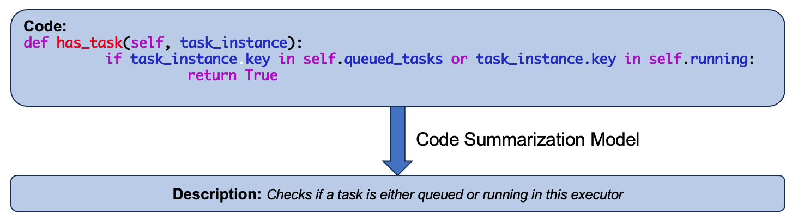

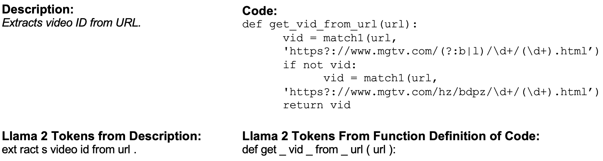

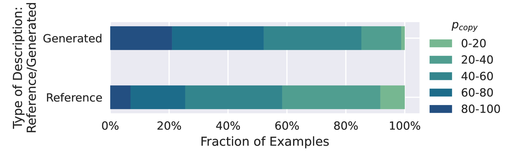

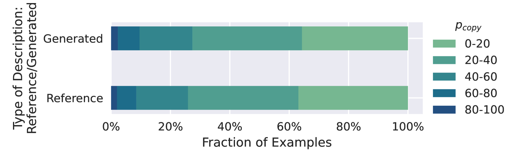

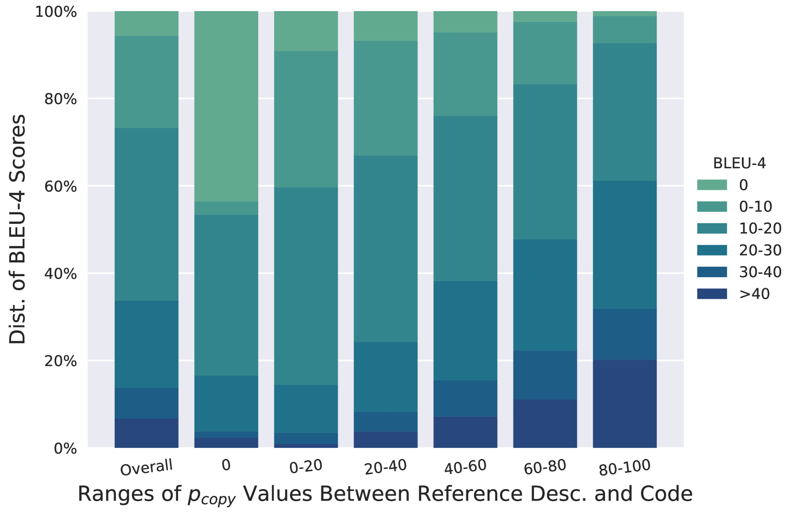

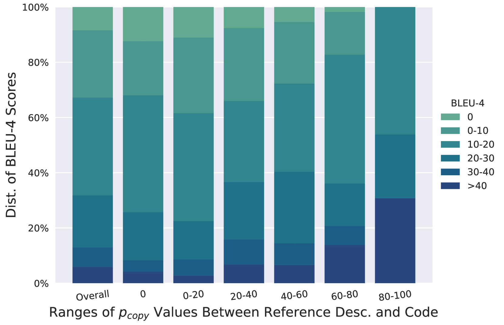

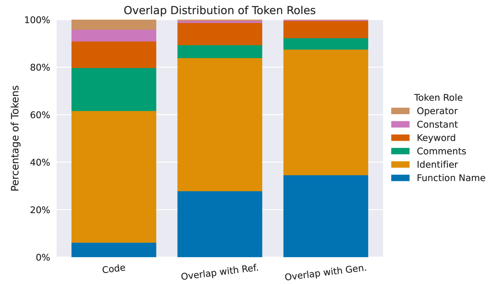

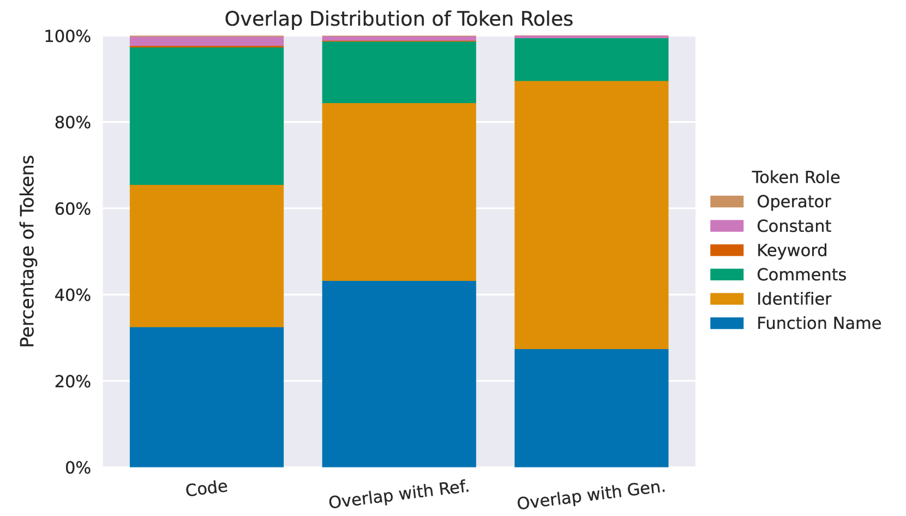

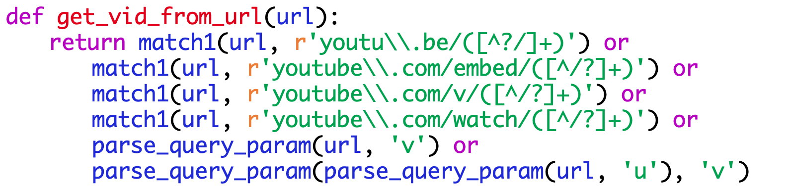

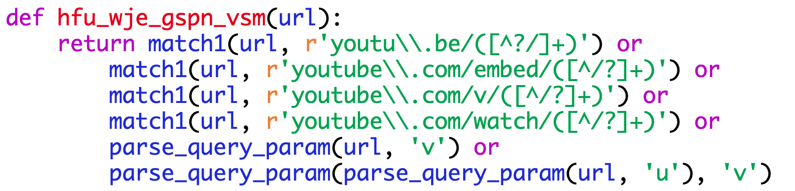

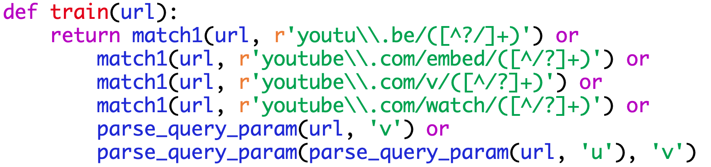

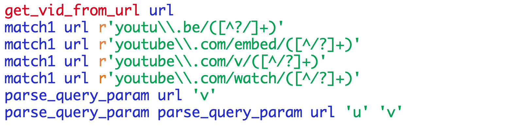

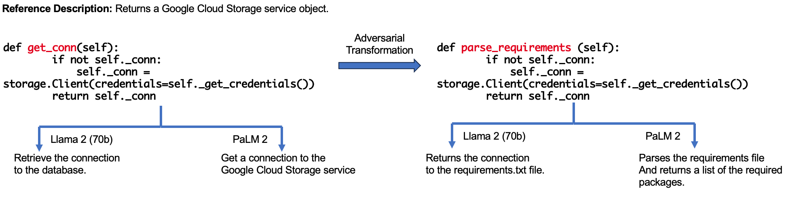

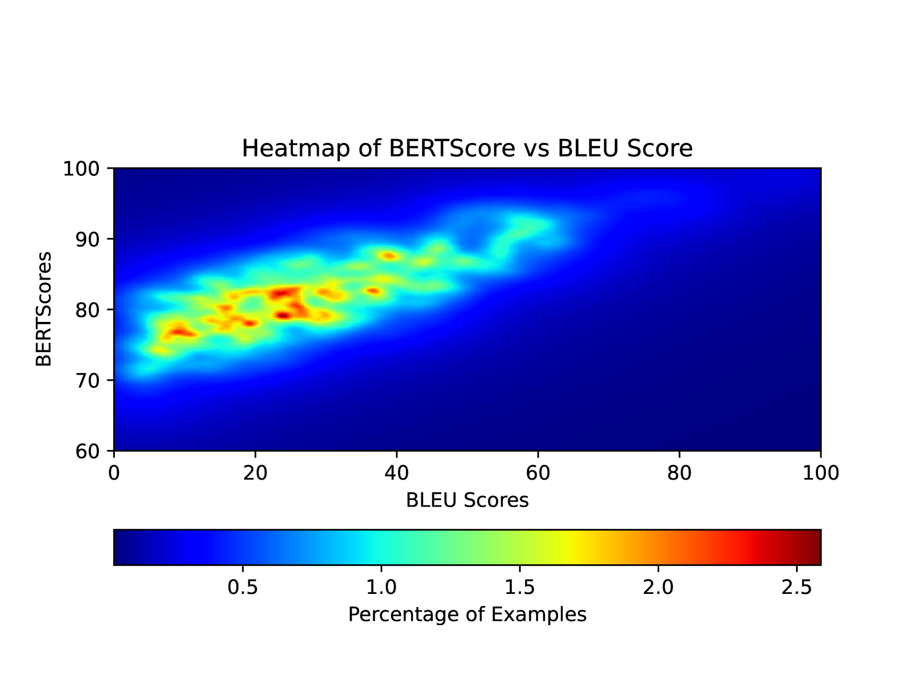

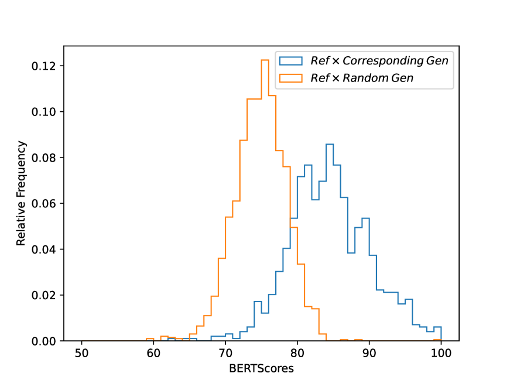

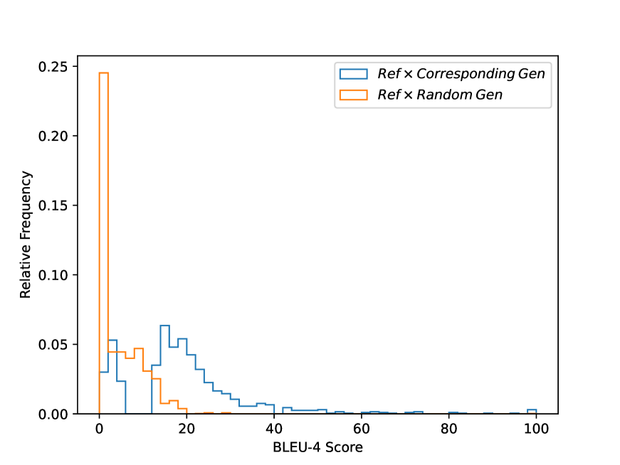

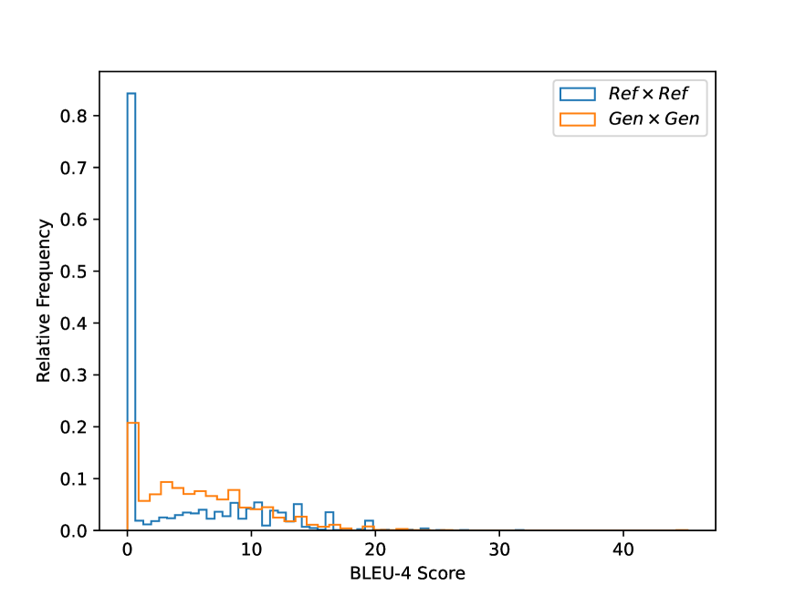

[Arxiv](https://arxiv.org/abs/2404.08018)