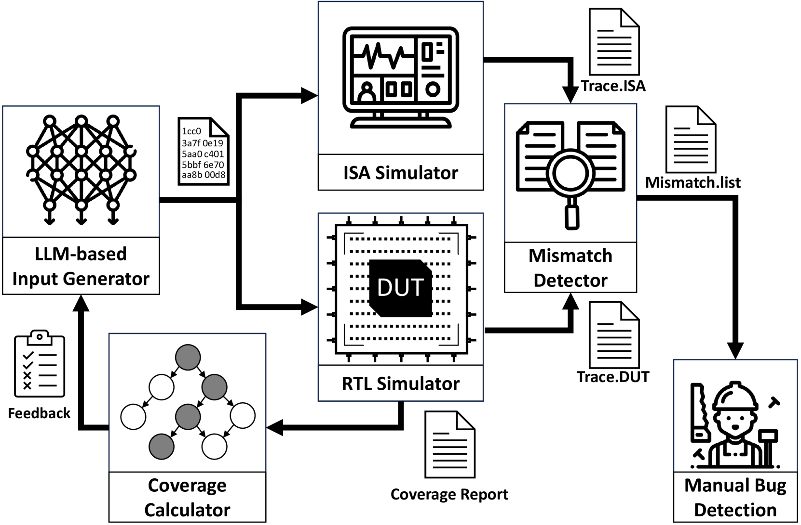
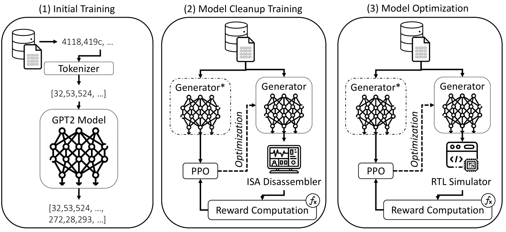
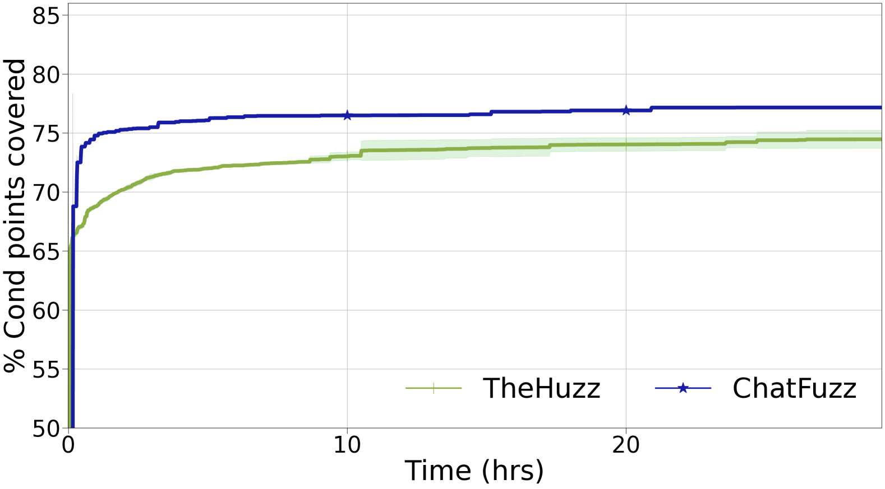

# 除了随机输入，我们还探索了一种基于机器学习的创新硬件模糊测试方法。

发布时间：2024年04月10日

`RAG` `硬件安全` `模糊测试`

> Beyond Random Inputs: A Novel ML-Based Hardware Fuzzing

# 摘要

> 现代计算机系统将硬件视为信任基础，但其复杂性不断增加，导致跨层攻击可利用的安全漏洞。传统硬件漏洞检测手段，如随机回归和形式验证，存在局限：随机回归虽可扩展但速度缓慢，形式验证则受制于人工努力和状态膨胀。硬件模糊测试作为探索和发现现代处理器等复杂设计安全漏洞的有效手段，其覆盖率、可扩展性和效率均优于传统方法。然而，现有最先进的模糊器在实际时间内难以全面覆盖复杂的硬件设计，往往连70%的覆盖率都难以达到。为此，我们提出了一种创新的基于机器学习的硬件模糊测试工具——ChatFuzz，以应对这一挑战。该方法借助类似ChatGPT的大型语言模型来解析处理器语言，专注于机器代码和汇编代码序列的生成。通过集成强化学习，我们引导输入生成过程，并通过代码覆盖率指标对输入进行奖励。我们选用开源的基于RISCV的RocketCore处理器作为测试平台，ChatFuzz仅需52分钟便达到了75%的条件覆盖率，而最先进的模糊器需要长达30小时。此外，在130小时的时间窗口内，当提供有限的10个模拟实例/许可证时，我们的模糊器能够达到80%的覆盖率。在此期间，共执行了199K个测试用例，其中6K个与处理器的标准模型存在差异。我们的分析发现了超过10个独特的不匹配问题，包括RocketCore中的两个新漏洞和与RISC-V ISA Simulator的差异。

> Modern computing systems heavily rely on hardware as the root of trust. However, their increasing complexity has given rise to security-critical vulnerabilities that cross-layer at-tacks can exploit. Traditional hardware vulnerability detection methods, such as random regression and formal verification, have limitations. Random regression, while scalable, is slow in exploring hardware, and formal verification techniques are often concerned with manual effort and state explosions. Hardware fuzzing has emerged as an effective approach to exploring and detecting security vulnerabilities in large-scale designs like modern processors. They outperform traditional methods regarding coverage, scalability, and efficiency. However, state-of-the-art fuzzers struggle to achieve comprehensive coverage of intricate hardware designs within a practical timeframe, often falling short of a 70% coverage threshold. We propose a novel ML-based hardware fuzzer, ChatFuzz, to address this challenge. Ourapproach leverages LLMs like ChatGPT to understand processor language, focusing on machine codes and generating assembly code sequences. RL is integrated to guide the input generation process by rewarding the inputs using code coverage metrics. We use the open-source RISCV-based RocketCore processor as our testbed. ChatFuzz achieves condition coverage rate of 75% in just 52 minutes compared to a state-of-the-art fuzzer, which requires a lengthy 30-hour window to reach a similar condition coverage. Furthermore, our fuzzer can attain 80% coverage when provided with a limited pool of 10 simulation instances/licenses within a 130-hour window. During this time, it conducted a total of 199K test cases, of which 6K produced discrepancies with the processor's golden model. Our analysis identified more than 10 unique mismatches, including two new bugs in the RocketCore and discrepancies from the RISC-V ISA Simulator.

[Arxiv](https://arxiv.org/abs/2404.06856)