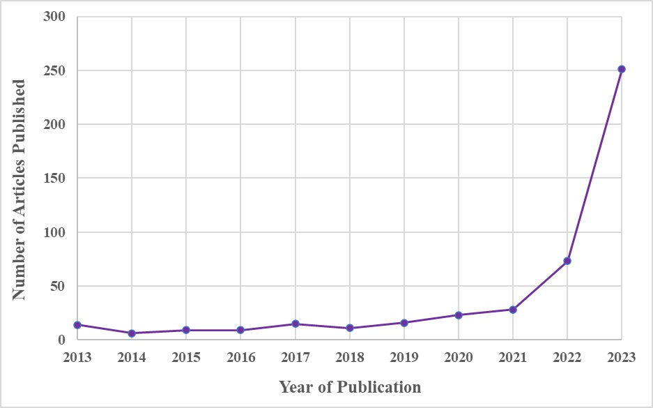
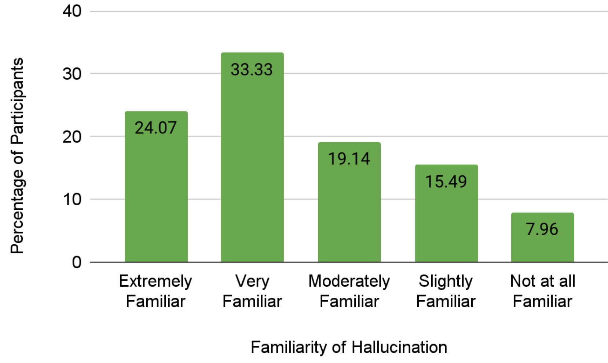
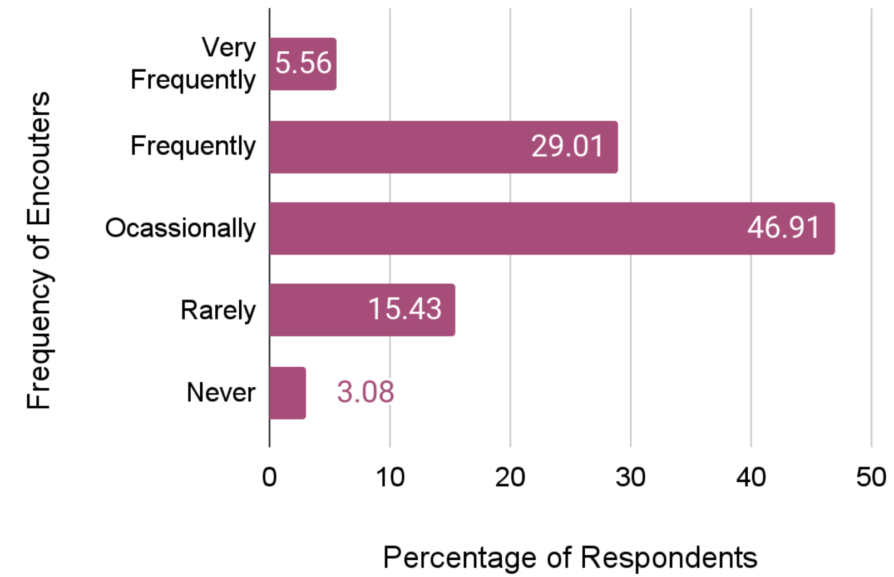

# 《自信还是荒谬？——自然语言处理中“幻觉”现象的批判性审视与挑战探讨》

发布时间：2024年04月10日

`LLM理论` `社会学
````

> "Confidently Nonsensical?'': A Critical Survey on the Perspectives and Challenges of 'Hallucinations' in NLP

# 摘要

> 通过深入分析103篇NLP领域的同行评审文献，我们探究了大型语言模型（LLM）中幻觉现象的特点。全面审视社会学和技术文献后，我们发现对“幻觉”这一术语尚无共识。进一步地，我们对171位NLP和AI行业的专家进行了问卷调查，收集了关于幻觉的多元看法。研究揭示了在NLP领域内对幻觉进行明确界定和构建框架的重要性，并指出了可能面临的挑战。调查结果还为我们提供了关于幻觉对社会产生的影响及其深远后果的宏观认识。

> We investigate how hallucination in large language models (LLM) is characterized in peer-reviewed literature using a critical examination of 103 publications across NLP research. Through a comprehensive review of sociological and technological literature, we identify a lack of agreement with the term `hallucination.' Additionally, we conduct a survey with 171 practitioners from the field of NLP and AI to capture varying perspectives on hallucination. Our analysis underscores the necessity for explicit definitions and frameworks outlining hallucination within NLP, highlighting potential challenges, and our survey inputs provide a thematic understanding of the influence and ramifications of hallucination in society.








[Arxiv](https://arxiv.org/abs/2404.07461)