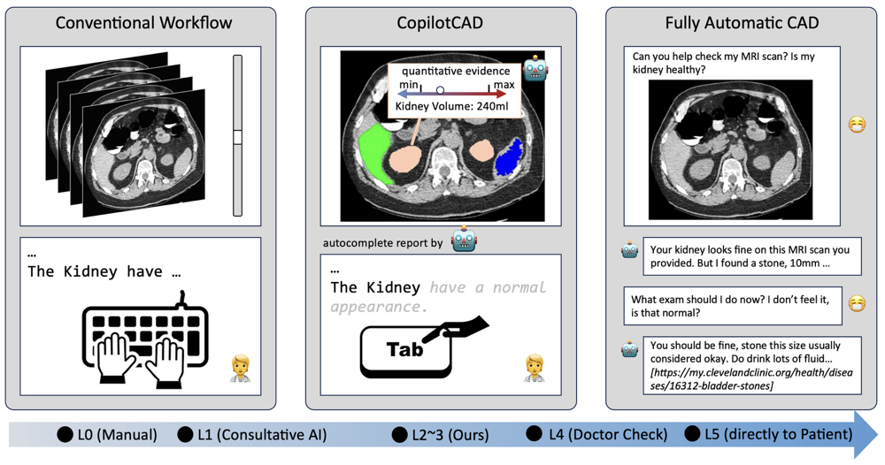
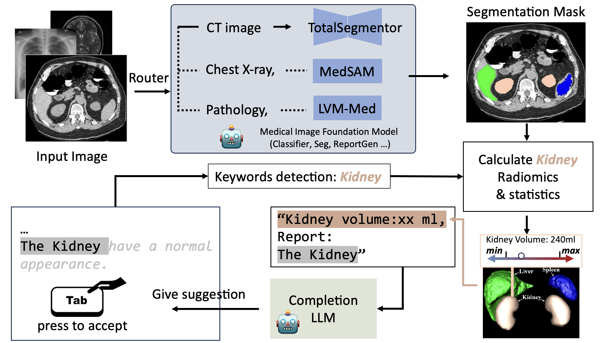
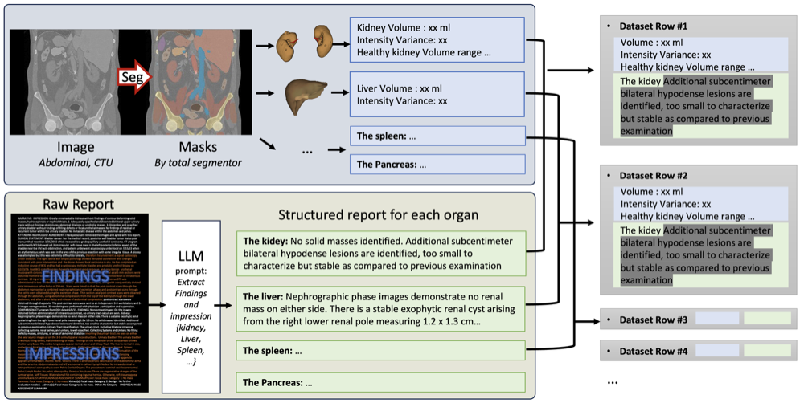
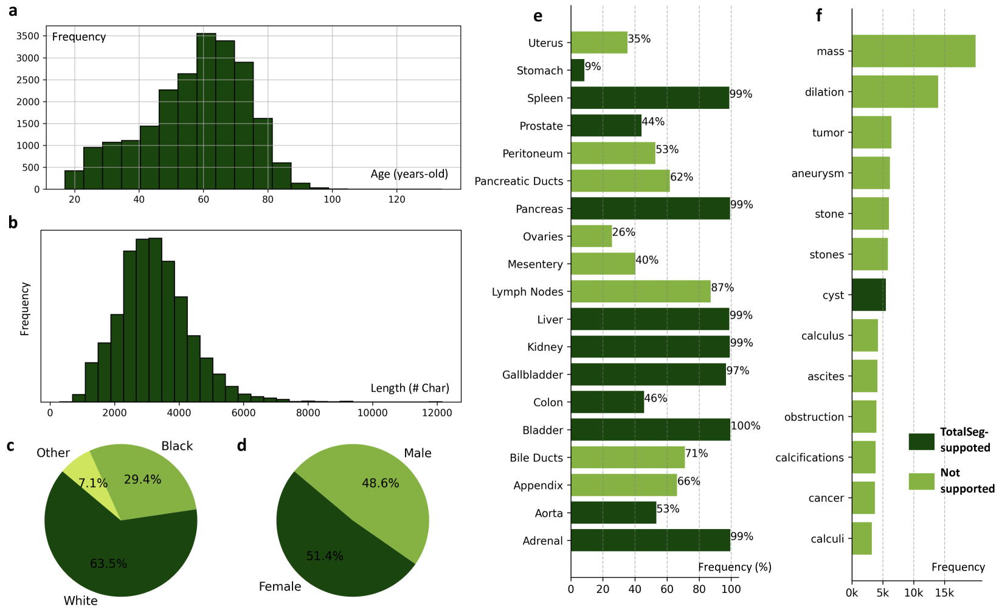
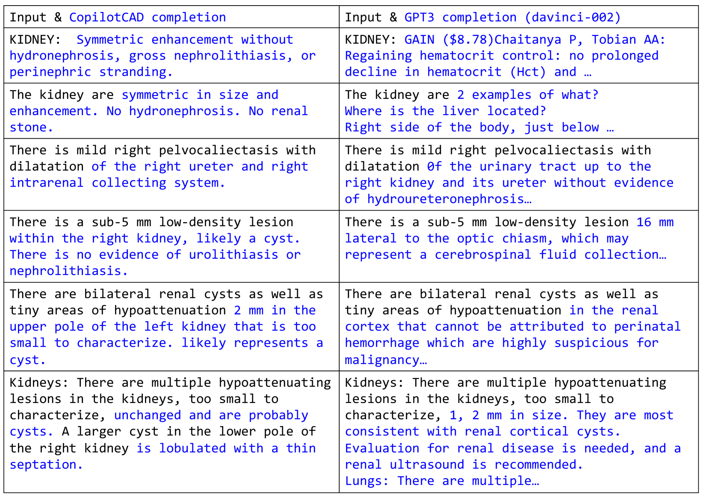
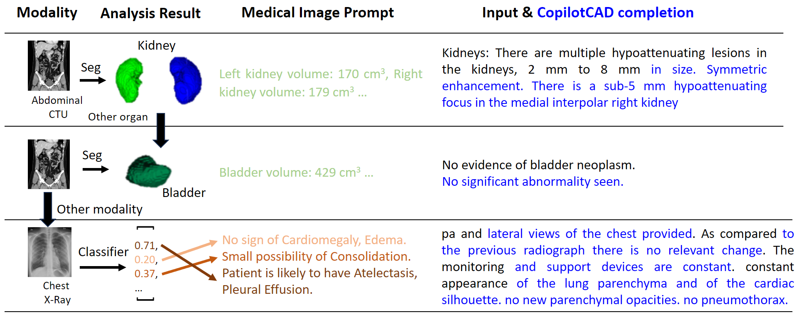

# CopilotCAD：借助医学影像基础模型的报告完善功能及定量分析，为放射科医师提供强大支持

发布时间：2024年04月10日

`LLM应用` `放射科` `人工智能辅助诊断`

> CopilotCAD: Empowering Radiologists with Report Completion Models and Quantitative Evidence from Medical Image Foundation Models

# 摘要

> 计算机辅助诊断系统展现出在放射科实践中提升诊断精确度和效率的巨大潜力。然而，传统系统多集中于通过文本报告或图像分类提供结果，将自己视作独立决策者，而非辅助者，未能充分发挥放射科医生的专业优势。本研究提出了一种创新模式，旨在打造一个能够借助大型语言模型和医学图像分析工具来增强放射科医生能力的辅助系统。我们设计了一个协作框架，将语言模型和医学图像分析结果与放射科医生的专业知识相结合，以实现放射学报告的高效、安全生成，并充分利用AI的计算能力和医疗专家的经验。这一方法使放射科医生能够制作更精细的诊断报告，提升患者治疗效果，同时减轻医生的工作负担。我们的研究方法突显了AI在医疗诊断中作为辅助工具的巨大潜力，倡导技术与专业技能的紧密结合，共同推动放射科学科的进步。

> Computer-aided diagnosis systems hold great promise to aid radiologists and clinicians in radiological clinical practice and enhance diagnostic accuracy and efficiency. However, the conventional systems primarily focus on delivering diagnostic results through text report generation or medical image classification, positioning them as standalone decision-makers rather than helpers and ignoring radiologists' expertise. This study introduces an innovative paradigm to create an assistive co-pilot system for empowering radiologists by leveraging Large Language Models (LLMs) and medical image analysis tools. Specifically, we develop a collaborative framework to integrate LLMs and quantitative medical image analysis results generated by foundation models with radiologists in the loop, achieving efficient and safe generation of radiology reports and effective utilization of computational power of AI and the expertise of medical professionals. This approach empowers radiologists to generate more precise and detailed diagnostic reports, enhancing patient outcomes while reducing the burnout of clinicians. Our methodology underscores the potential of AI as a supportive tool in medical diagnostics, promoting a harmonious integration of technology and human expertise to advance the field of radiology.

[Arxiv](https://arxiv.org/abs/2404.07424)