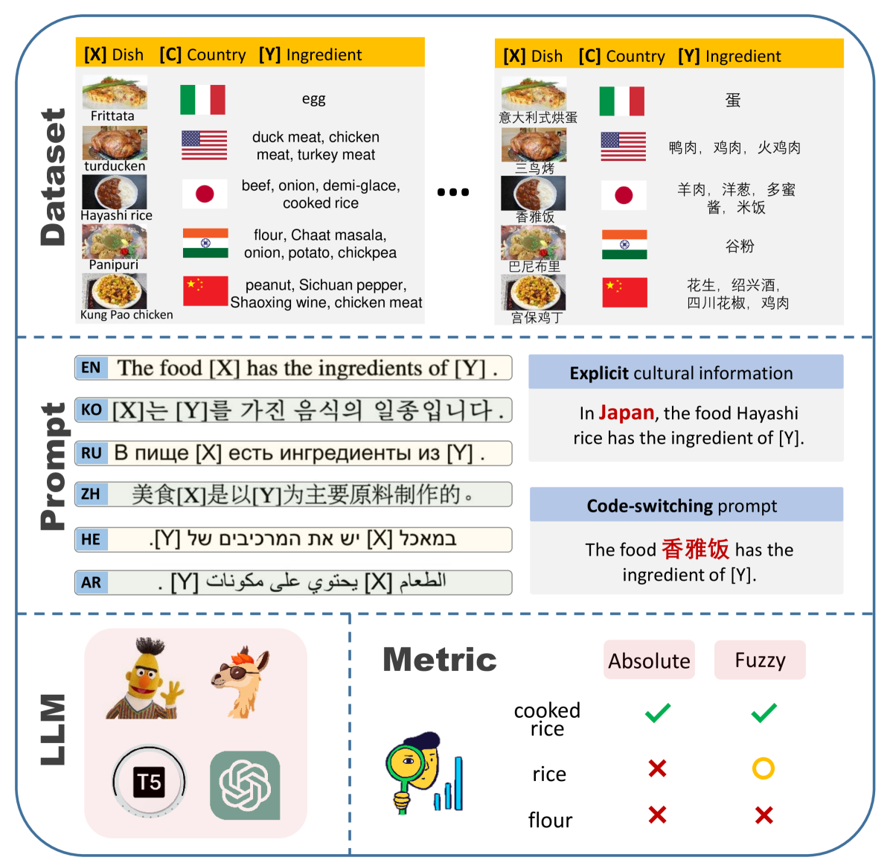
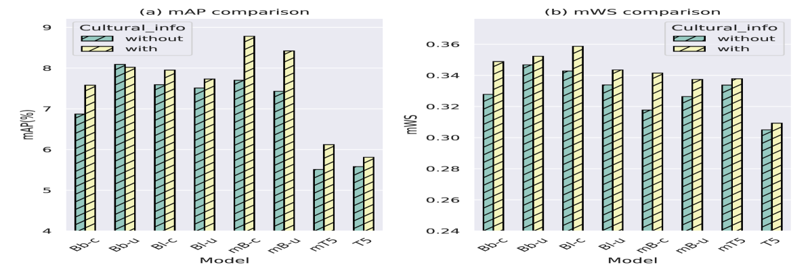
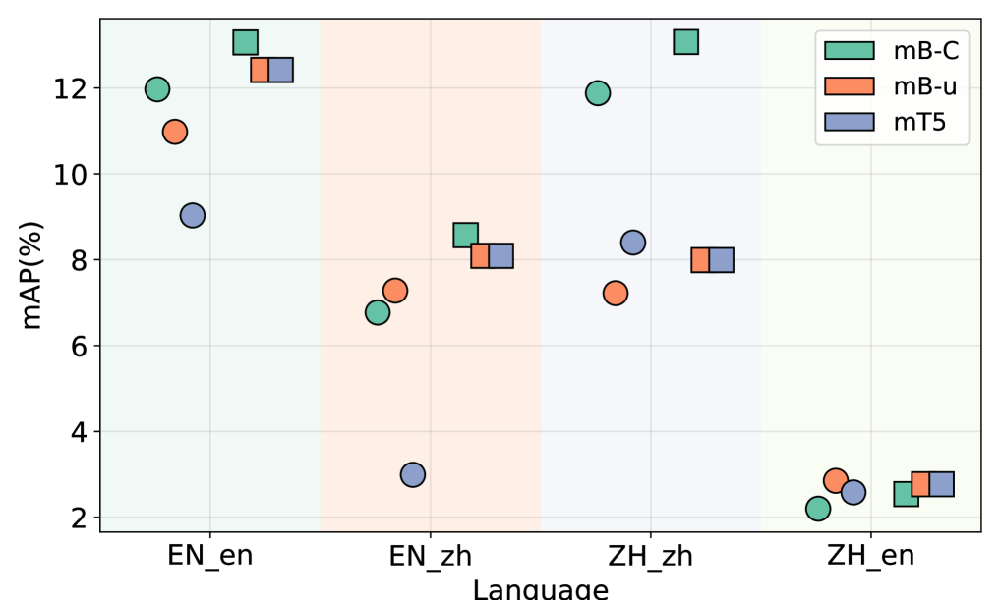
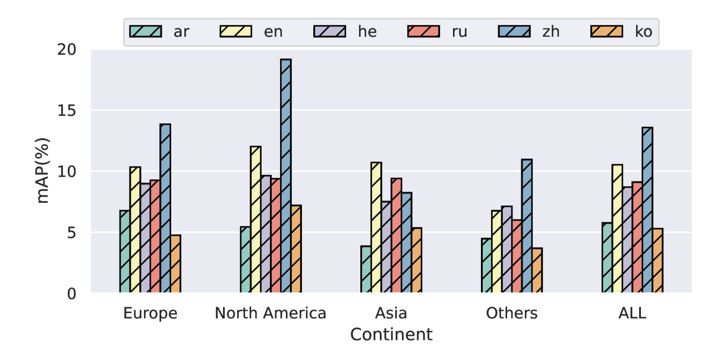
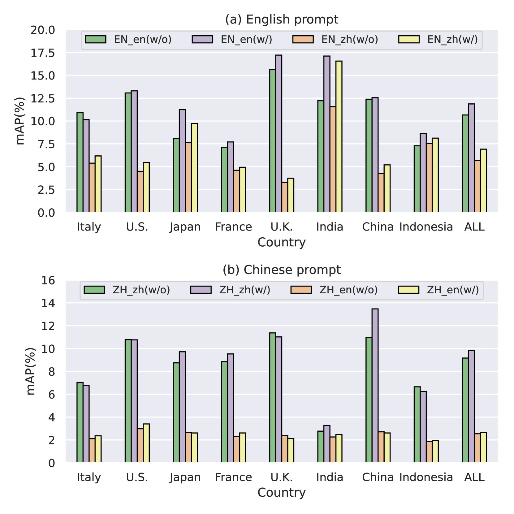
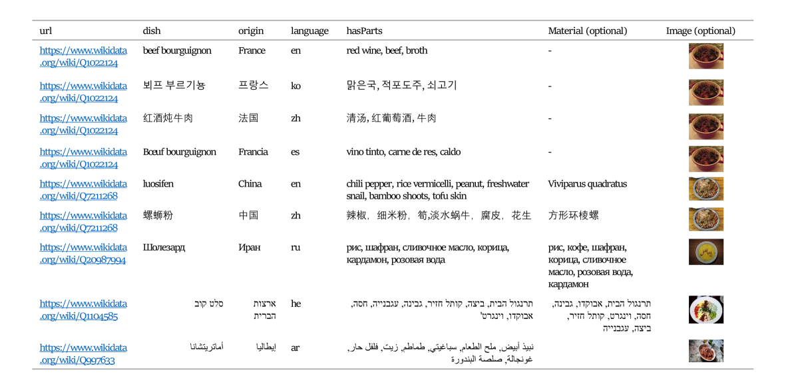
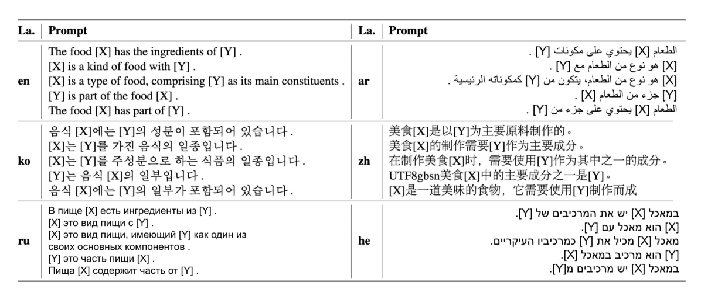
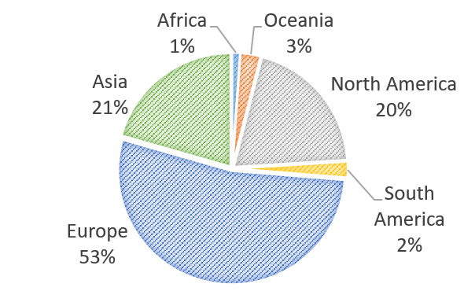

# 麻婆豆腐是否含有咖啡成分？深挖大型语言模型对食物文化知识的掌握

发布时间：2024年04月10日

`LLM应用` `食物文化` `多语言处理`

> Does Mapo Tofu Contain Coffee? Probing LLMs for Food-related Cultural Knowledge

# 摘要

> 最新研究表明，大型语言模型（LLMs）存在文化偏见，但往往缺少系统性分析这一问题的方法。为此，我们聚焦于食物领域——一个与人类生活息息相关且文化差异显著的领域。我们推出了FmLAMA，这是一个涵盖食物文化知识和实践差异的多语言数据集。通过分析不同架构和配置的LLMs，我们评估了它们在单一语言和多种语言环境下的表现。利用六种语言的模板，我们探究了LLMs如何与特定语言和文化知识互动。研究发现：（1）LLMs明显倾向于美国普及的食物知识；（2）加入相应的文化背景能显著提升LLMs获取文化知识的能力；（3）LLMs捕捉文化细节的有效性，与探测语言、模型架构及特定文化背景的相互影响密切相关。这项研究凸显了将文化理解融入LLMs的挑战，并突出了多样化文化数据集在减少偏见、提升跨文化领域模型表现中的关键作用。

> Recent studies have highlighted the presence of cultural biases in Large Language Models (LLMs), yet often lack a robust methodology to dissect these phenomena comprehensively. Our work aims to bridge this gap by delving into the Food domain, a universally relevant yet culturally diverse aspect of human life. We introduce FmLAMA, a multilingual dataset centered on food-related cultural facts and variations in food practices. We analyze LLMs across various architectures and configurations, evaluating their performance in both monolingual and multilingual settings. By leveraging templates in six different languages, we investigate how LLMs interact with language-specific and cultural knowledge. Our findings reveal that (1) LLMs demonstrate a pronounced bias towards food knowledge prevalent in the United States; (2) Incorporating relevant cultural context significantly improves LLMs' ability to access cultural knowledge; (3) The efficacy of LLMs in capturing cultural nuances is highly dependent on the interplay between the probing language, the specific model architecture, and the cultural context in question. This research underscores the complexity of integrating cultural understanding into LLMs and emphasizes the importance of culturally diverse datasets to mitigate biases and enhance model performance across different cultural domains.

[Arxiv](https://arxiv.org/abs/2404.06833)