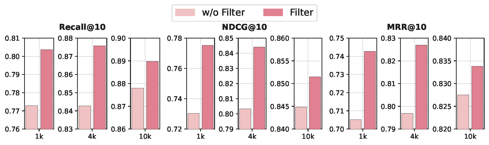

# 通过运用大型语言模型，我们能够提升企业知识库中的问答体验。

发布时间：2024年04月10日

`LLM应用` `企业知识管理` `问答系统`

> Enhancing Question Answering for Enterprise Knowledge Bases using Large Language Models

# 摘要

> 高效的知识管理对于提升企业和组织的运营与创新至关重要。通过将知识向量化，众多知识检索技术应运而生，极大地增强了知识管理系统的效能。随着生成性自然语言处理技术的飞速发展，我们现在能够从相关文档中提取出精确且连贯的答案。然而，在企业知识库领域，由于数据隐私和安全的限制，从头构建大规模训练数据集是一项艰巨的任务，往往伴随着巨大的成本。为解决这一难题，本文提出了EKRG，这是一种创新的基于大型语言模型的检索-生成框架，旨在以较低的注释成本实现企业知识库的高效问答。我们创新性地引入了一种指令调整方法，利用大型语言模型生成丰富的文档-问题对，以训练知识检索器，涵盖事实性和解决方案性知识。同时，我们还开发了一种关注相关性的师生学习策略，进一步提升了训练效率。在生成阶段，我们提出了一种新颖的思维链微调方法，赋予生成器以高效利用检索文档回答用户问题的能力。经过在真实世界数据集上的广泛测试，我们的框架已证明其有效性。

> Efficient knowledge management plays a pivotal role in augmenting both the operational efficiency and the innovative capacity of businesses and organizations. By indexing knowledge through vectorization, a variety of knowledge retrieval methods have emerged, significantly enhancing the efficacy of knowledge management systems. Recently, the rapid advancements in generative natural language processing technologies paved the way for generating precise and coherent answers after retrieving relevant documents tailored to user queries. However, for enterprise knowledge bases, assembling extensive training data from scratch for knowledge retrieval and generation is a formidable challenge due to the privacy and security policies of private data, frequently entailing substantial costs. To address the challenge above, in this paper, we propose EKRG, a novel Retrieval-Generation framework based on large language models (LLMs), expertly designed to enable question-answering for Enterprise Knowledge bases with limited annotation costs. Specifically, for the retrieval process, we first introduce an instruction-tuning method using an LLM to generate sufficient document-question pairs for training a knowledge retriever. This method, through carefully designed instructions, efficiently generates diverse questions for enterprise knowledge bases, encompassing both fact-oriented and solution-oriented knowledge. Additionally, we develop a relevance-aware teacher-student learning strategy to further enhance the efficiency of the training process. For the generation process, we propose a novel chain of thought (CoT) based fine-tuning method to empower the LLM-based generator to adeptly respond to user questions using retrieved documents. Finally, extensive experiments on real-world datasets have demonstrated the effectiveness of our proposed framework.

[Arxiv](https://arxiv.org/abs/2404.08695)