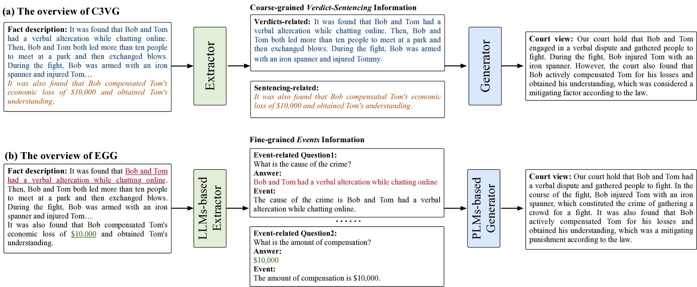
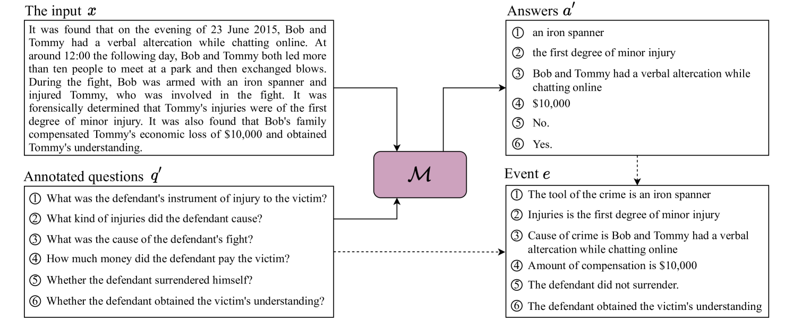
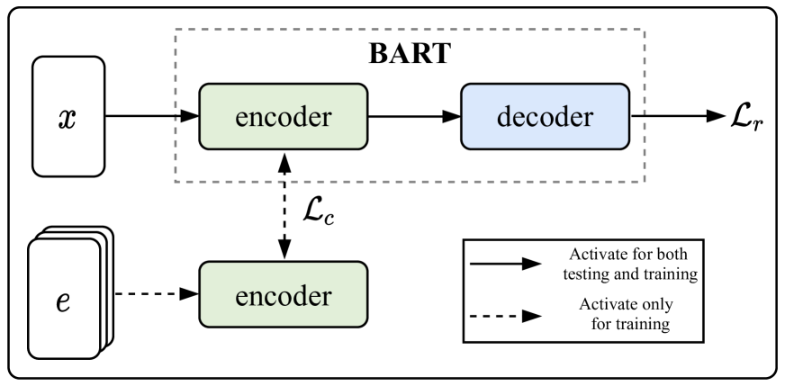
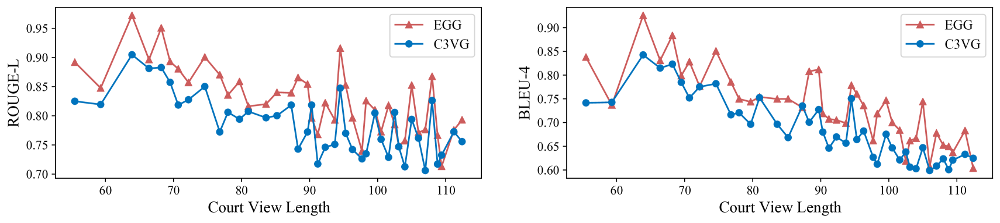
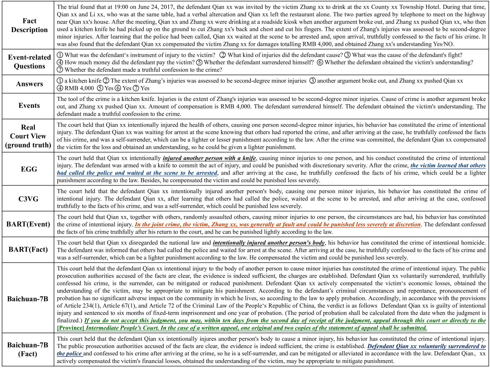

# 刑事法庭视角生成：基于事件的合作大型语言模型应用

发布时间：2024年04月10日

`LLM应用` `文本生成`

> Event Grounded Criminal Court View Generation withCooperative (Large) Language Models

# 摘要

> 随着法律智能技术的进步，刑事法庭视图生成任务日益受到重视，其目标是生成能够概括案件事实并阐释裁决依据的简明、连贯文本。现有研究通过挖掘案件事实中的关键信息来形成法庭观点，通常采用粗略的信息划分方法（如按裁决相关句子分类）进行预测。但这一方法无法充分捕捉案件细节的复杂性，例如多样的犯罪要素与法律事件。针对这一问题，本研究提出了一种名为事件驱动生成（EGG）的新方法，该方法结合（大型）语言模型，通过引入细致的事件信息来生成刑事法庭视图。我们首先开发了一种基于LLMs的事件提取方法，无需大量标注数据即可识别案件事实中的事件。接着，我们将这些事件与案件事实结合，共同生成法庭视图。考虑到LLMs在EGG提取阶段的计算成本，我们还提出了一种不依赖LLMs的EGG方法，能够在推理阶段省去对LLMs进行事件提取的需要。在真实案件数据集上的广泛实验表明，我们的方法具有显著的效果。

> With the development of legal intelligence, Criminal Court View Generation has attracted much attention as a crucial task of legal intelligence, which aims to generate concise and coherent texts that summarize case facts and provide explanations for verdicts. Existing researches explore the key information in case facts to yield the court views. Most of them employ a coarse-grained approach that partitions the facts into broad segments (e.g., verdict-related sentences) to make predictions. However, this approach fails to capture the complex details present in the case facts, such as various criminal elements and legal events. To this end, in this paper, we propose an Event Grounded Generation (EGG) method for criminal court view generation with cooperative (Large) Language Models, which introduces the fine-grained event information into the generation. Specifically, we first design a LLMs-based extraction method that can extract events in case facts without massive annotated events. Then, we incorporate the extracted events into court view generation by merging case facts and events. Besides, considering the computational burden posed by the use of LLMs in the extraction phase of EGG, we propose a LLMs-free EGG method that can eliminate the requirement for event extraction using LLMs in the inference phase. Extensive experimental results on a real-world dataset clearly validate the effectiveness of our proposed method.

[Arxiv](https://arxiv.org/abs/2404.07001)