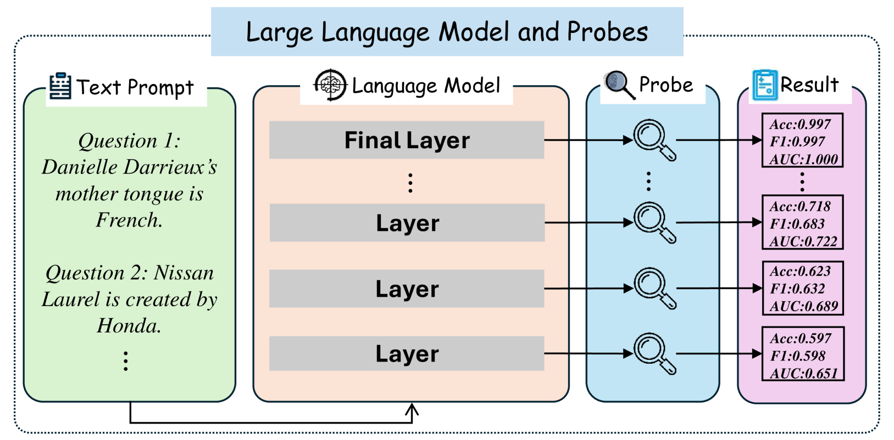
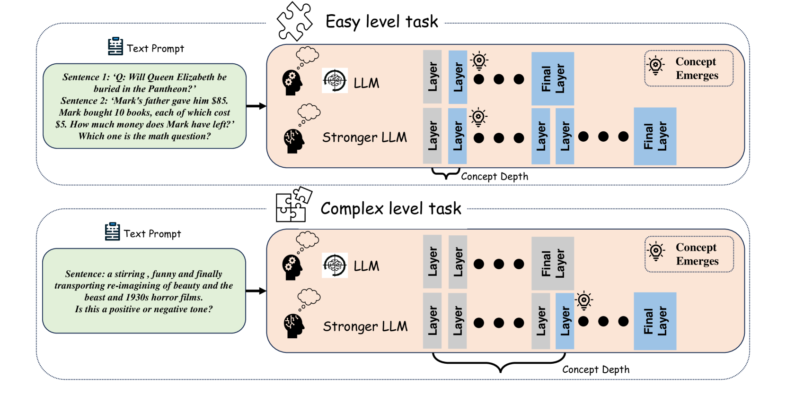
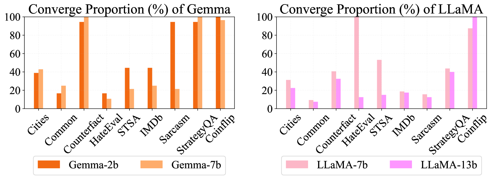
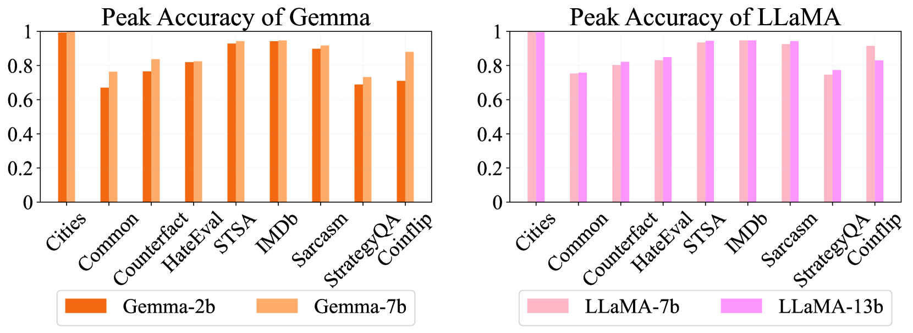
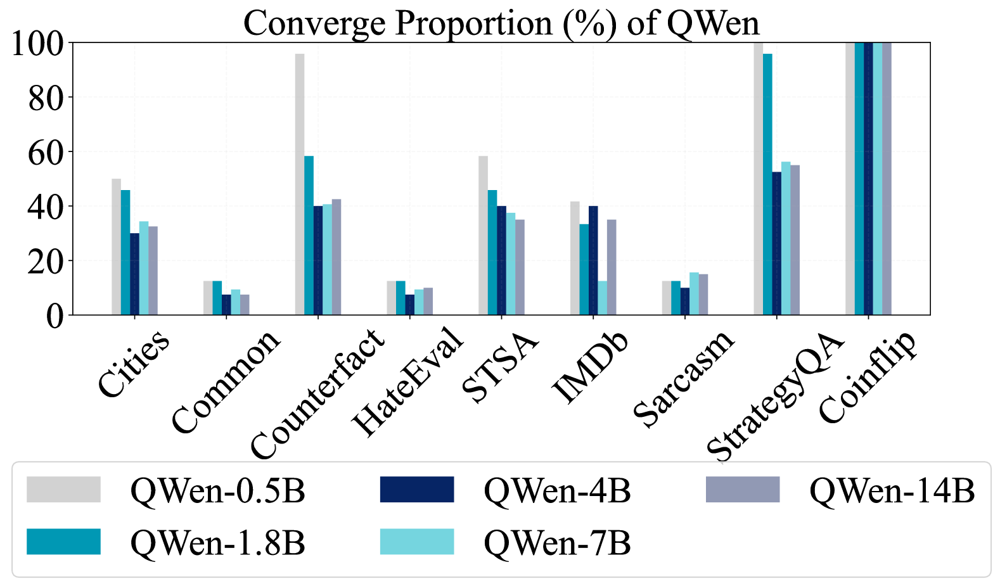
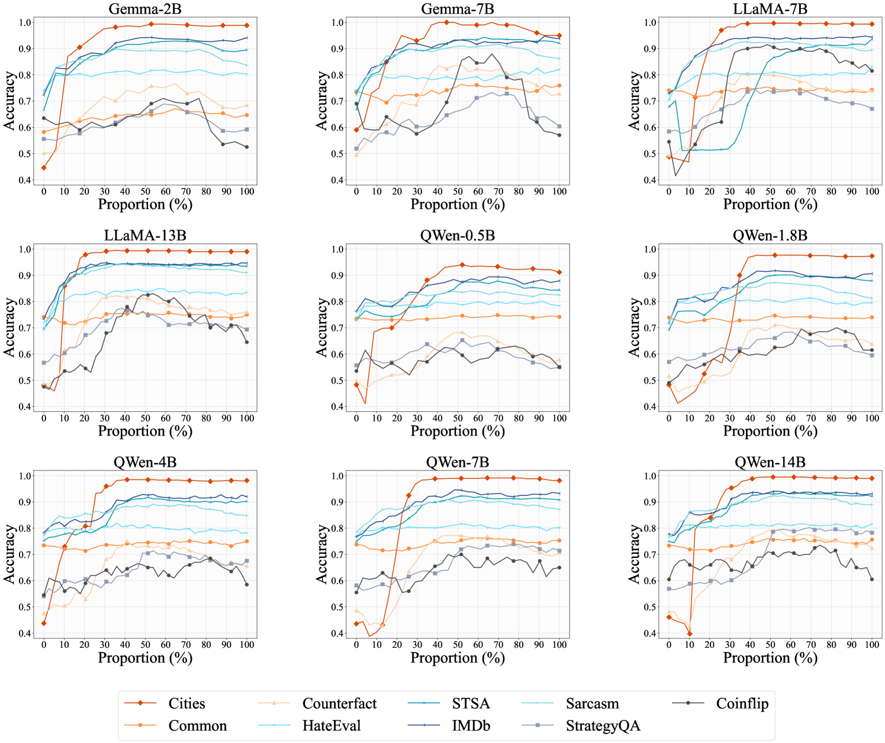
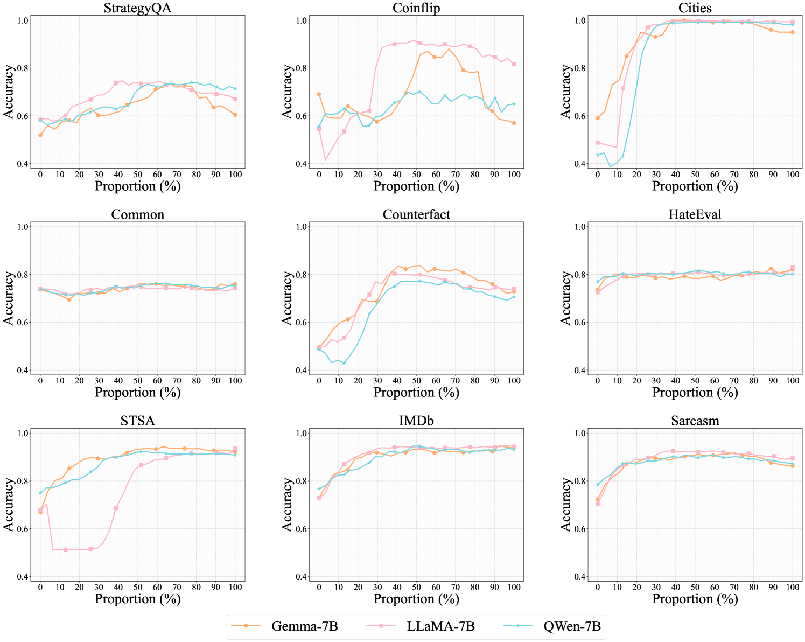
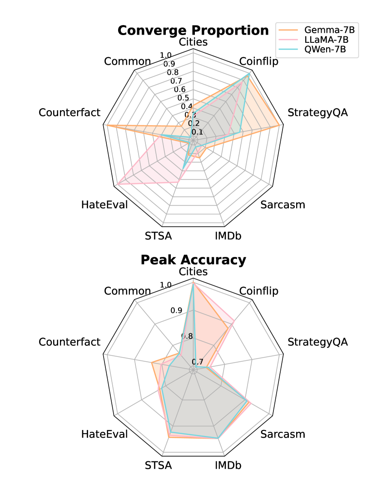
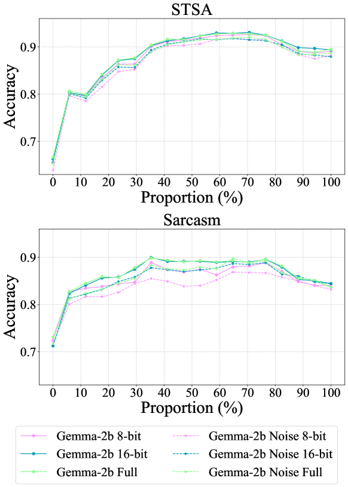

# 深入概念探究：大型语言模型是如何在各自的层次上吸收知识的呢？

发布时间：2024年04月10日

`LLM理论` `人工智能` `机器学习`

> Exploring Concept Depth: How Large Language Models Acquire Knowledge at Different Layers?

# 摘要

> 本研究深入探讨了大型语言模型中不同层次学习各种概念的现象，难度较高的概念通常在更深层得到充分理解。我们将概念的难易程度按抽象级别划分，大致归为事实、情感和推理三大类，每类都包含了一系列任务，难度由浅入深。如事实类任务，从识别谎言到解决数学难题皆有涉及。通过探测技术，我们提取了模型各层级的表征，并应用于分类任务。研究发现，模型能高效地完成简单任务的分类，这表明这些概念在较浅的层级就已掌握。而复杂任务的识别可能仅限于更深的层级。本文进一步讨论了这些发现对于揭示模型学习机制和内在表征的认识意义。相关实现代码已在 \url{https://github.com/Luckfort/CD} 上发布。

> This paper studies the phenomenon that different concepts are learned in different layers of large language models, i.e. more difficult concepts are fully acquired with deeper layers. We define the difficulty of concepts by the level of abstraction, and here it is crudely categorized by factual, emotional, and inferential. Each category contains a spectrum of tasks, arranged from simple to complex. For example, within the factual dimension, tasks range from lie detection to categorizing mathematical problems. We employ a probing technique to extract representations from different layers of the model and apply these to classification tasks. Our findings reveal that models tend to efficiently classify simpler tasks, indicating that these concepts are learned in shallower layers. Conversely, more complex tasks may only be discernible at deeper layers, if at all. This paper explores the implications of these findings for our understanding of model learning processes and internal representations. Our implementation is available at \url{https://github.com/Luckfort/CD}.

[Arxiv](https://arxiv.org/abs/2404.07066)