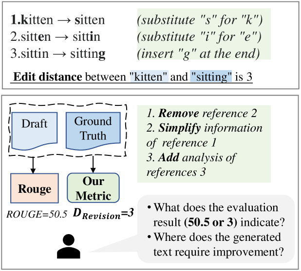
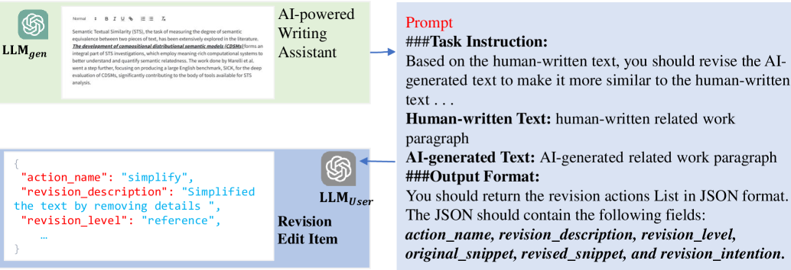

# 将视角从模型转向人类，修订距离被提出作为评估基于大型语言模型（LLMs）应用中文本质量的新指标。

发布时间：2024年04月10日

`LLM应用` `写作辅助` `人工智能评估`

> From Model-centered to Human-Centered: Revision Distance as a Metric for Text Evaluation in LLMs-based Applications

# 摘要

> 对大型语言模型（LLMs）的评估至关重要，尤其是在实际应用场景中。传统评估方法主要针对LLM开发，往往忽视了用户体验，仅提供数字分数。本研究将评估重心从模型转向人，聚焦于AI写作辅助应用中的用户体验。我们提出的“修订距离”这一新度量，通过LLMs提出类似人类写作过程中的修订建议，通过计算这些建议的修订编辑数量来衡量。这一度量利用详细的修订信息，能够提供超越单纯分数的、易于人类理解的文本评估结果。研究结果表明，在简易写作任务中，“修订距离”与现有评估标准（如ROUGE、Bert-score和GPT-score）相吻合，同时提供了更深入、细致的反馈，更有效地区分不同文本。在复杂的学术写作任务中，“修订距离”依然能够提供可靠的评估，而其他评估方法则可能遇到困难。此外，在缺少参考文本的情况下，该度量方法同样展现出巨大的应用潜力。

> Evaluating large language models (LLMs) is fundamental, particularly in the context of practical applications. Conventional evaluation methods, typically designed primarily for LLM development, yield numerical scores that ignore the user experience. Therefore, our study shifts the focus from model-centered to human-centered evaluation in the context of AI-powered writing assistance applications. Our proposed metric, termed ``Revision Distance,'' utilizes LLMs to suggest revision edits that mimic the human writing process. It is determined by counting the revision edits generated by LLMs. Benefiting from the generated revision edit details, our metric can provide a self-explained text evaluation result in a human-understandable manner beyond the context-independent score. Our results show that for the easy-writing task, ``Revision Distance'' is consistent with established metrics (ROUGE, Bert-score, and GPT-score), but offers more insightful, detailed feedback and better distinguishes between texts. Moreover, in the context of challenging academic writing tasks, our metric still delivers reliable evaluations where other metrics tend to struggle. Furthermore, our metric also holds significant potential for scenarios lacking reference texts.

[Arxiv](https://arxiv.org/abs/2404.07108)