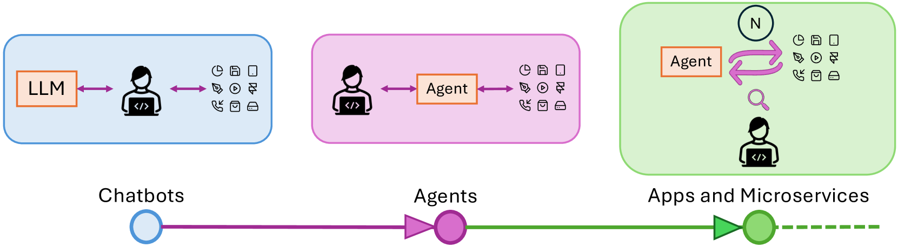

# GoEX：探索构建自主大型语言模型应用运行时的视角与设计理念

发布时间：2024年04月10日

`LLM应用` `人工智能` `软件工程`

> GoEX: Perspectives and Designs Towards a Runtime for Autonomous LLM Applications

# 摘要

> 大型语言模型（LLMs）正突破其仅在对话系统中提供信息的界限，转而积极参与工具互动和实际操作，以服务于现实世界的应用和服务。目前，人们在实际应用LLM生成的结果之前，需要先确认其正确性和适用性，这一过程充满挑战，因为代码理解向来不易。本文探讨了未来人类如何与自主LLMs高效合作、委派任务并进行监督。我们主张，在很多场景下，“事后验证”——即在看到输出后再确认行动的正确性——比“事前验证”要简单得多。实现事后验证的关键，在于引入直观的撤销功能，并为LLM生成的行为设置损害控制，以降低潜在风险。这样一来，人们可以撤销LLM生成结果的影响，或者确信风险是可控的。我们认为，这对于让LLM代理在有限的人类参与下，与各种应用和服务互动，至关重要。我们介绍了我们的开源运行时环境——Gorilla Execution Engine（GoEX），它用于执行LLM的操作，并提出了实现LLM与应用程序在最少人类监督下相互交互的目标所面临的开放性研究问题。GoEX的源代码已在 https://github.com/ShishirPatil/gorilla/ 上发布。

> Large Language Models (LLMs) are evolving beyond their classical role of providing information within dialogue systems to actively engaging with tools and performing actions on real-world applications and services. Today, humans verify the correctness and appropriateness of the LLM-generated outputs (e.g., code, functions, or actions) before putting them into real-world execution. This poses significant challenges as code comprehension is well known to be notoriously difficult. In this paper, we study how humans can efficiently collaborate with, delegate to, and supervise autonomous LLMs in the future. We argue that in many cases, "post-facto validation" - verifying the correctness of a proposed action after seeing the output - is much easier than the aforementioned "pre-facto validation" setting. The core concept behind enabling a post-facto validation system is the integration of an intuitive undo feature, and establishing a damage confinement for the LLM-generated actions as effective strategies to mitigate the associated risks. Using this, a human can now either revert the effect of an LLM-generated output or be confident that the potential risk is bounded. We believe this is critical to unlock the potential for LLM agents to interact with applications and services with limited (post-facto) human involvement. We describe the design and implementation of our open-source runtime for executing LLM actions, Gorilla Execution Engine (GoEX), and present open research questions towards realizing the goal of LLMs and applications interacting with each other with minimal human supervision. We release GoEX at https://github.com/ShishirPatil/gorilla/.

[Arxiv](https://arxiv.org/abs/2404.06921)