# GoodDrag：探索扩散模型在拖拽编辑中的优良实践方法

发布时间：2024年04月10日

`RAG` `计算机视觉` `图像处理`

> GoodDrag: Towards Good Practices for Drag Editing with Diffusion Models

# 摘要

> 本文提出了GoodDrag技术，它创新性地提升了拖拽编辑的稳定性与图像清晰度。区别于传统方法在处理累积扰动时的不足，GoodDrag采用了AlDD框架，在扩散过程中巧妙地结合拖拽与去噪，显著增强了图像的真实度。我们还设计了一种保留信息的运动监督机制，确保在精确操控的同时，减少图像伪影。此外，我们为拖拽编辑领域贡献了新数据集Drag100，并结合大型多模态模型，制定了新的质量评估指标：Dragging Accuracy Index和Gemini Score。大量实验验证了GoodDrag技术在视觉和数值上均优于现有顶尖技术。更多详情，请访问项目页面：https://gooddrag.github.io。

> In this paper, we introduce GoodDrag, a novel approach to improve the stability and image quality of drag editing. Unlike existing methods that struggle with accumulated perturbations and often result in distortions, GoodDrag introduces an AlDD framework that alternates between drag and denoising operations within the diffusion process, effectively improving the fidelity of the result. We also propose an information-preserving motion supervision operation that maintains the original features of the starting point for precise manipulation and artifact reduction. In addition, we contribute to the benchmarking of drag editing by introducing a new dataset, Drag100, and developing dedicated quality assessment metrics, Dragging Accuracy Index and Gemini Score, utilizing Large Multimodal Models. Extensive experiments demonstrate that the proposed GoodDrag compares favorably against the state-of-the-art approaches both qualitatively and quantitatively. The project page is https://gooddrag.github.io.

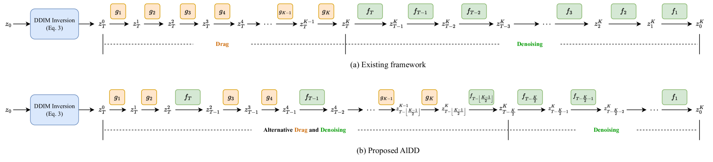

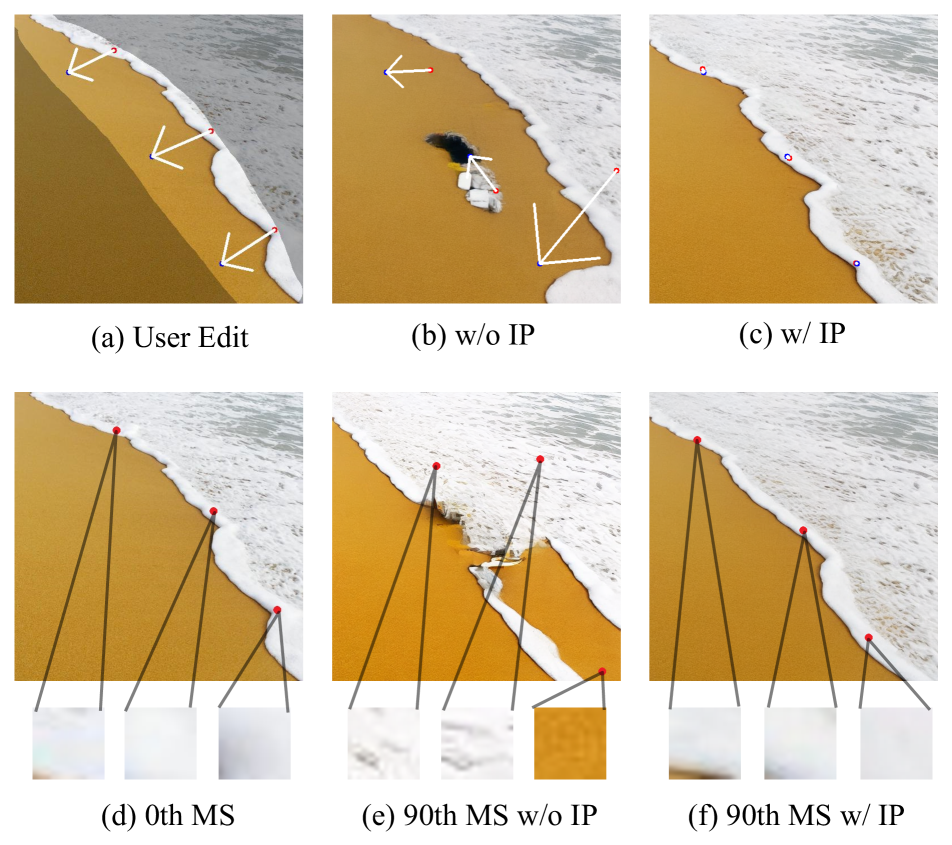

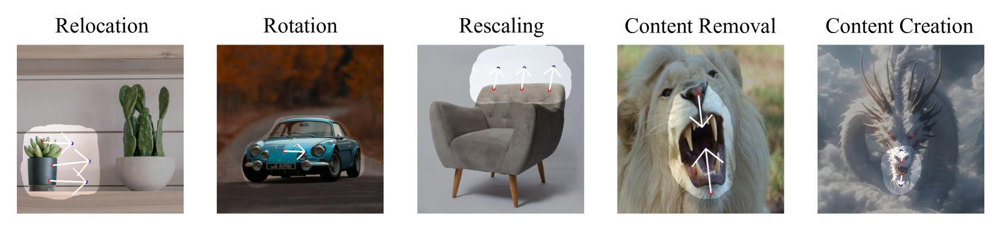

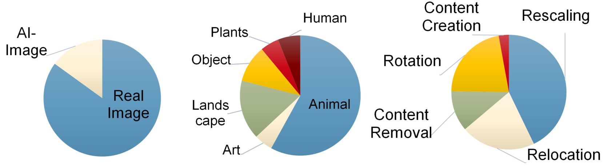

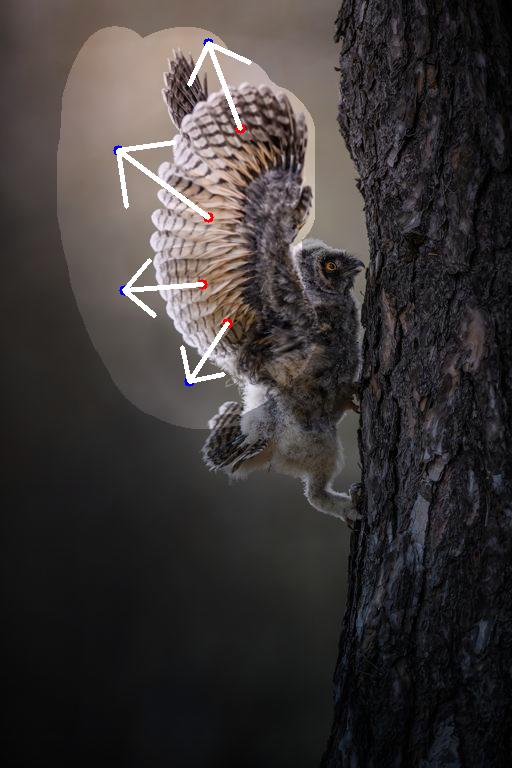

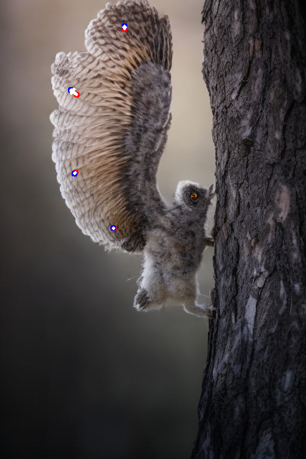

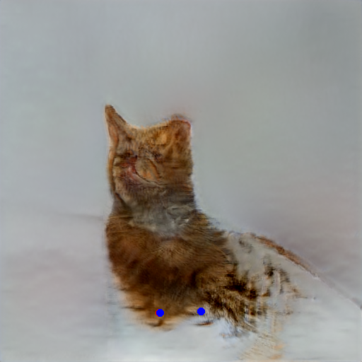

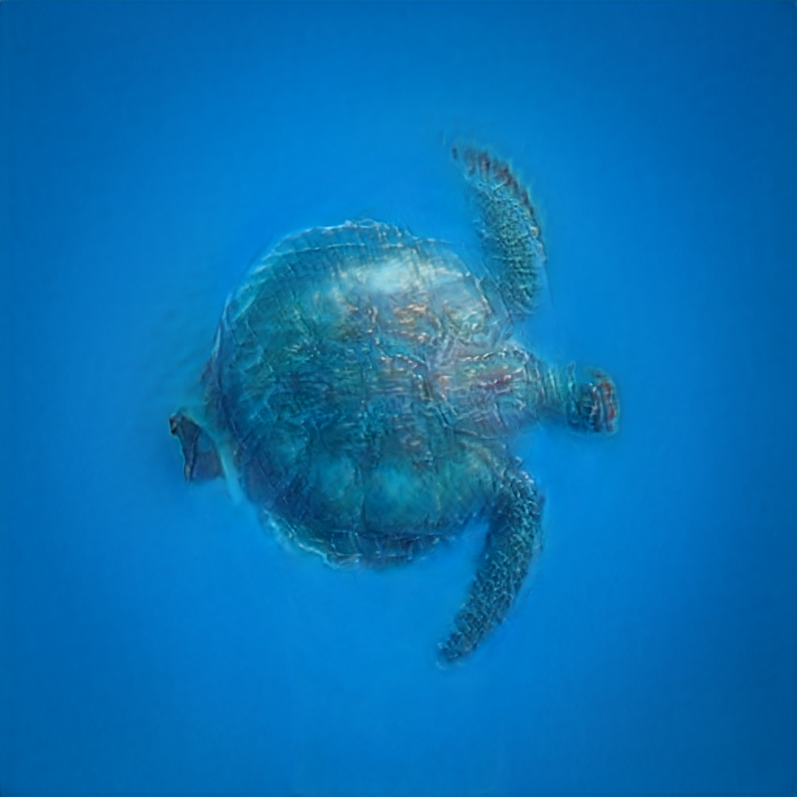

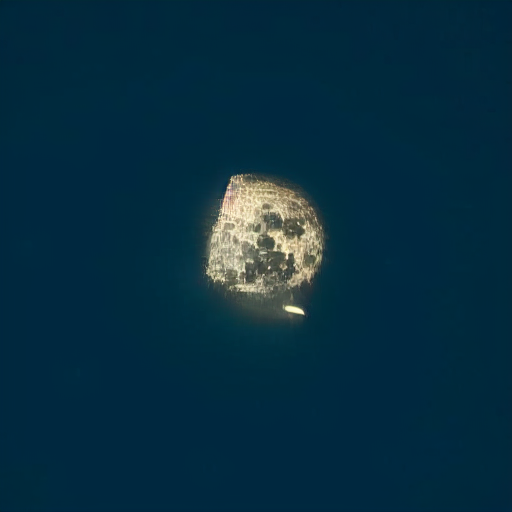

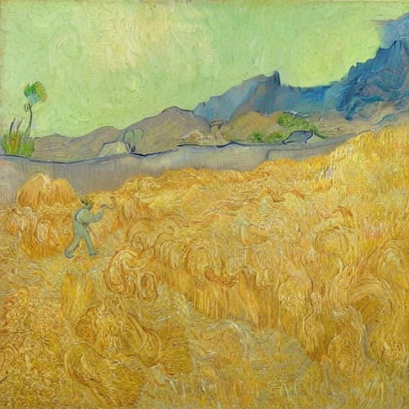

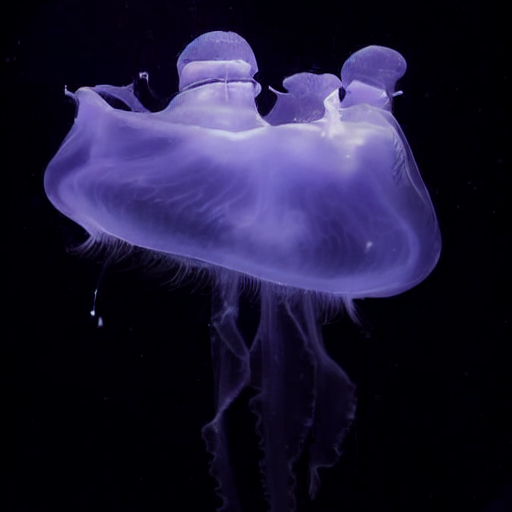

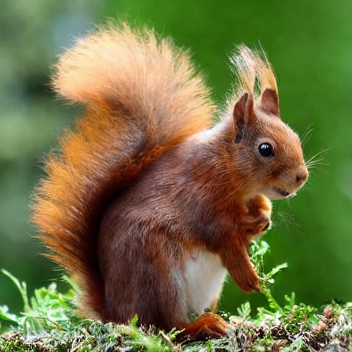

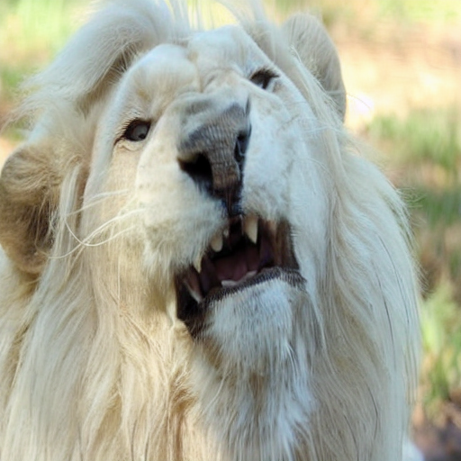

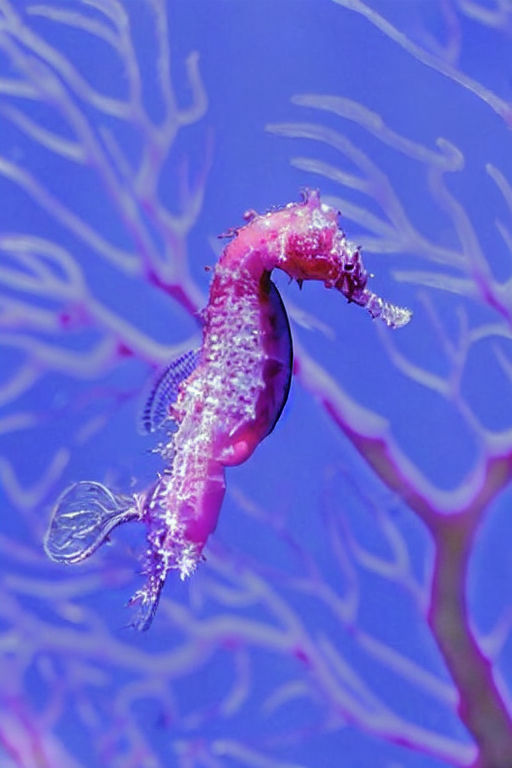

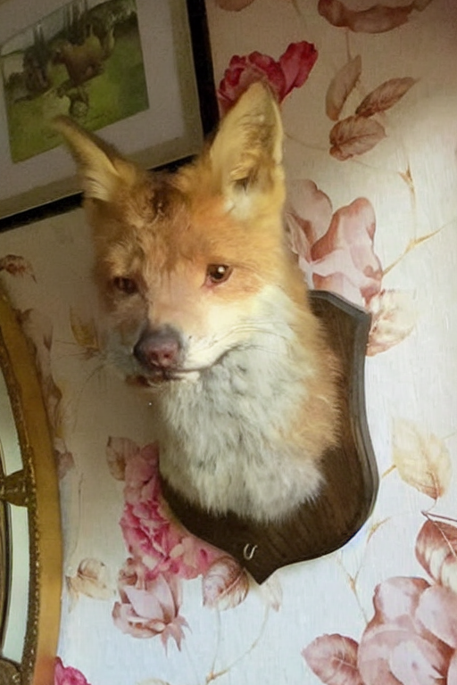

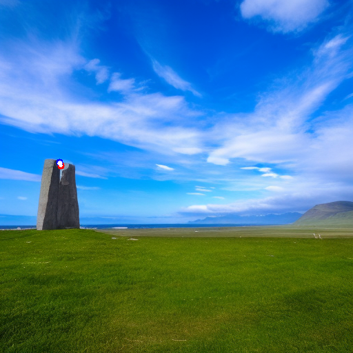

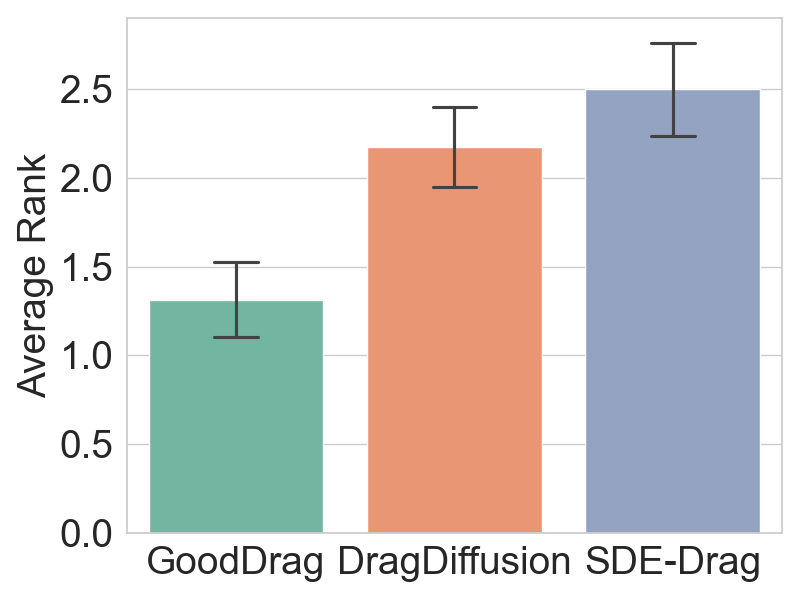

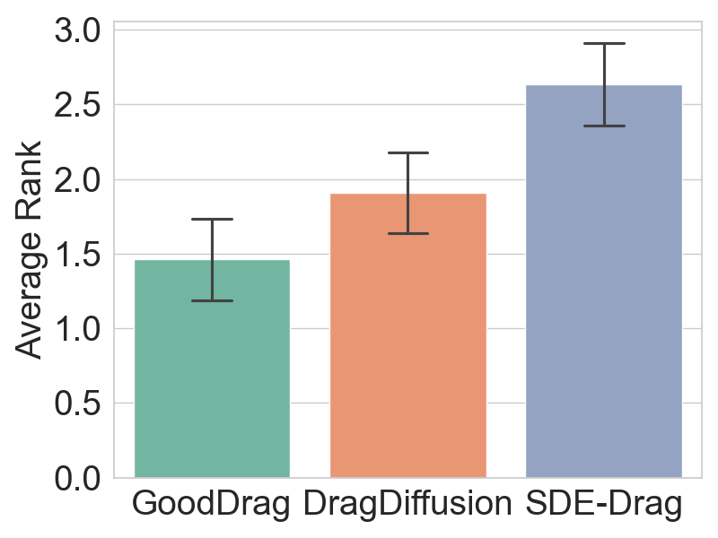

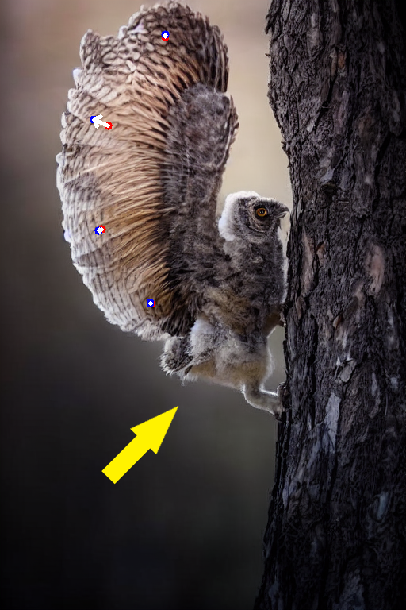

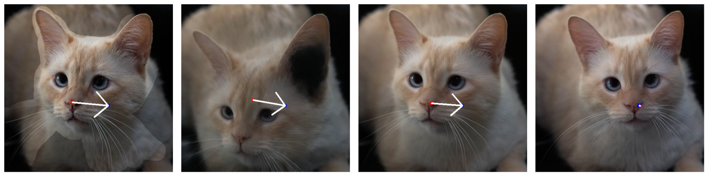

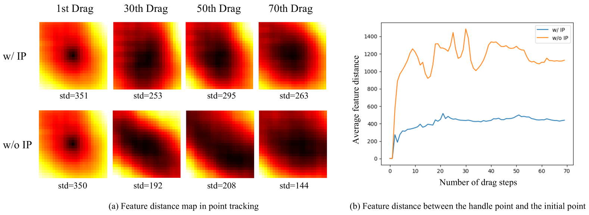

[Arxiv](https://arxiv.org/abs/2404.07206)