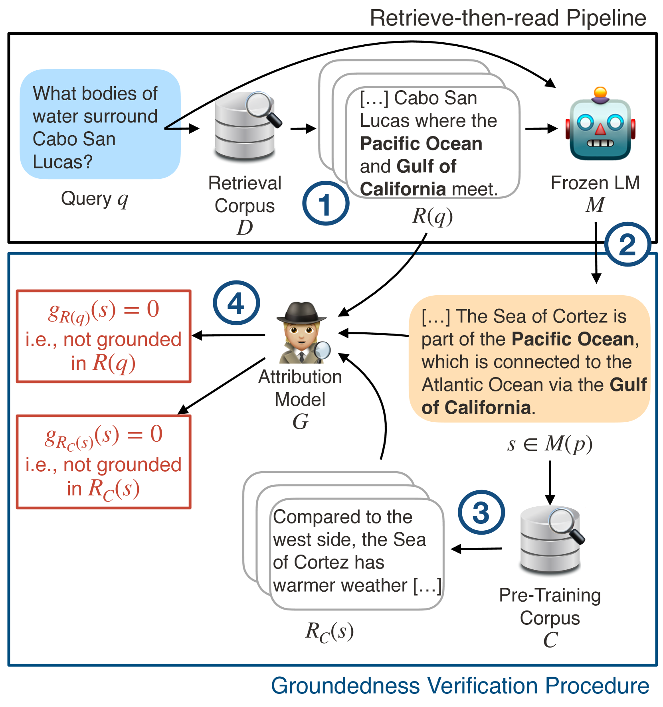
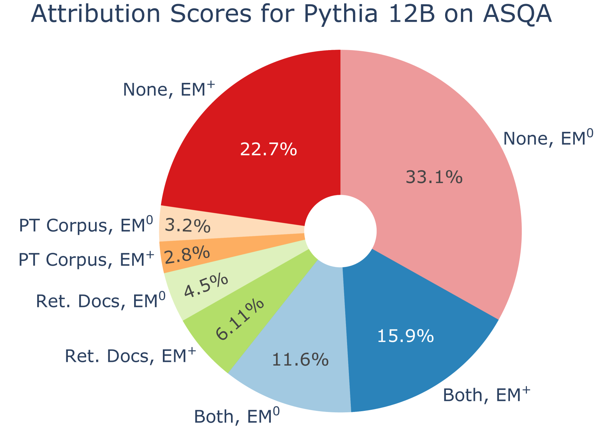
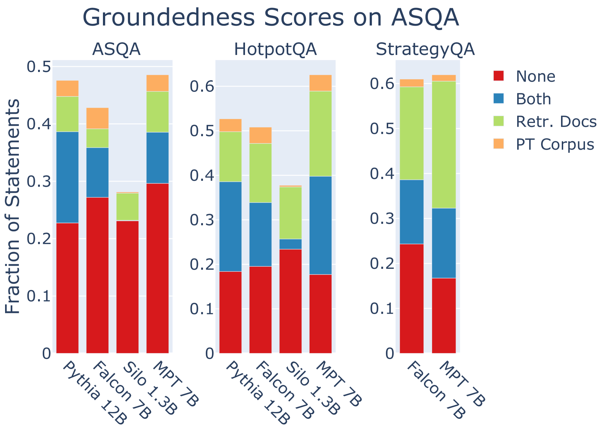
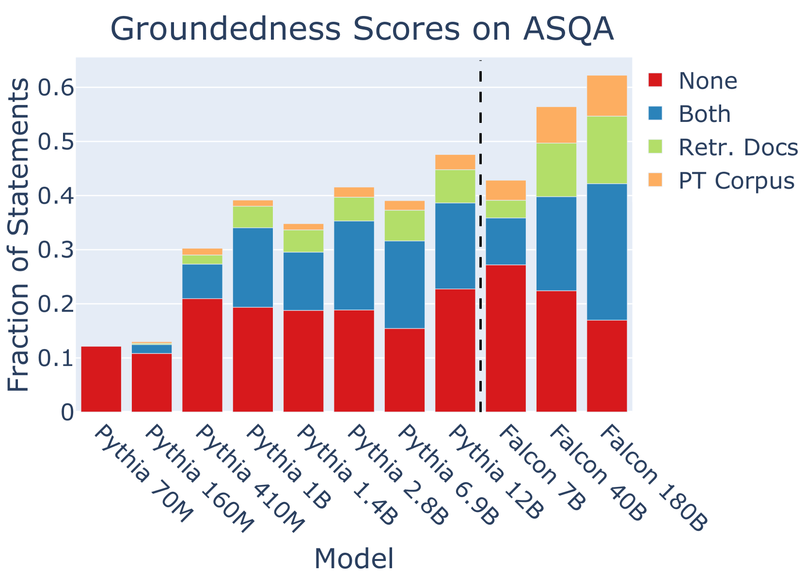
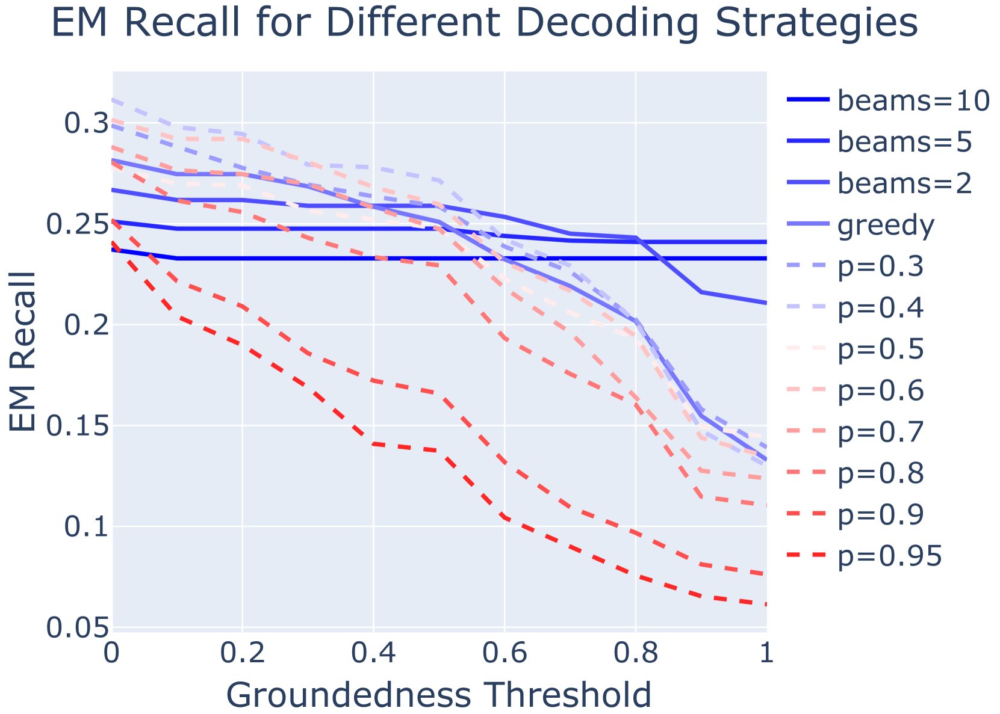
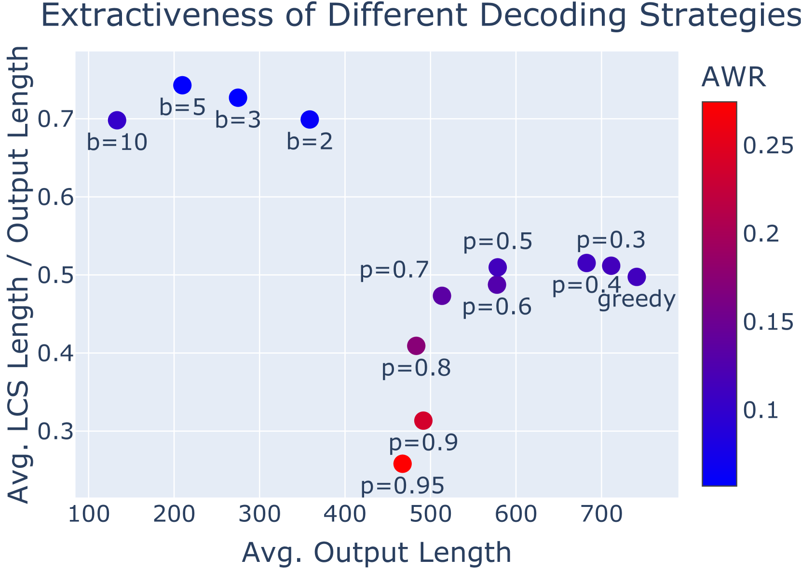
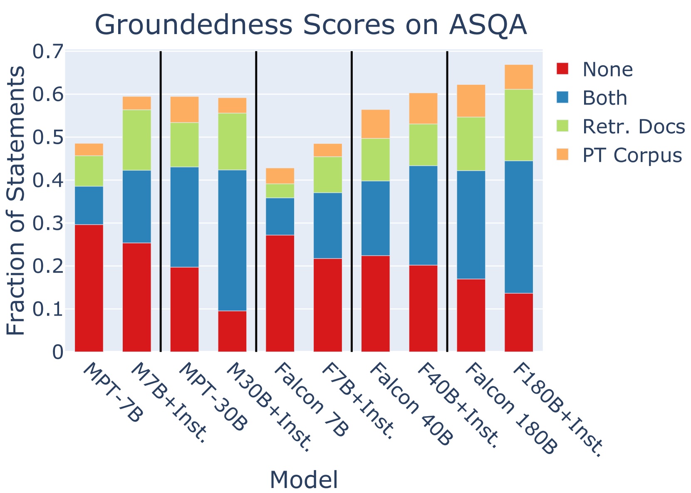
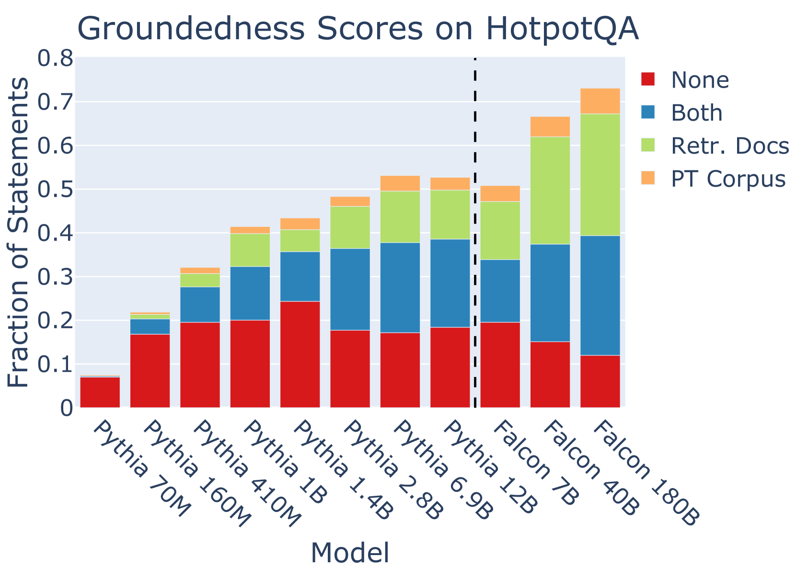
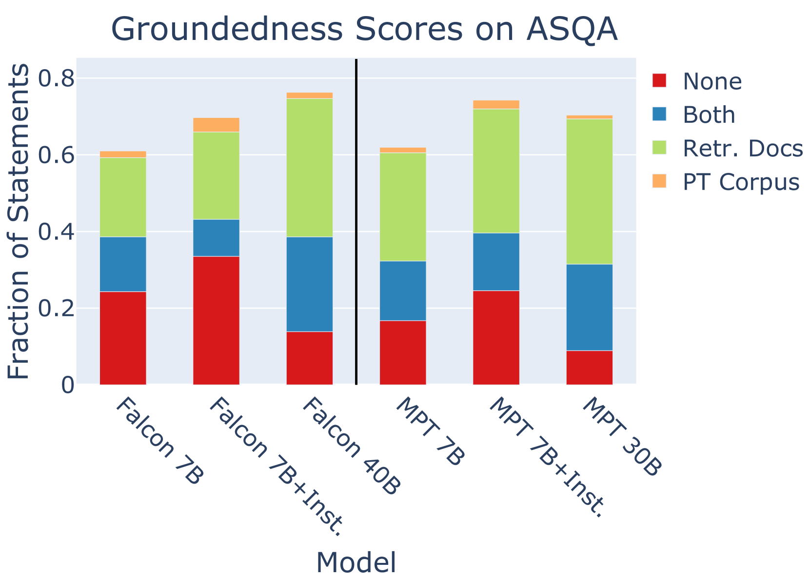

# 本实证研究深入探讨了检索辅助长篇文章生成中的 Groundedness 问题。

发布时间：2024年04月10日

`LLM应用` `问答系统` `信息检索`

> Groundedness in Retrieval-augmented Long-form Generation: An Empirical Study

# 摘要

> 本研究通过检索增强的大型语言模型（LLMs）对长篇幅问答（LFQA）中的事实基础进行了实证分析。研究发现，在三个不同数据集和四种模型系列中，即便句子中包含了准确的答案，仍有大量生成的句子缺乏事实依据。同时，我们还探讨了模型规模、解码策略和指令调整等因素对事实基础的影响。结果表明，虽然大型模型更可能使其输出具有事实基础，但正确答案的准确性仍受到幻觉的显著影响。这项研究揭示了LFQA中事实基础的挑战，并强调了在LLMs中建立更稳固机制以减少无事实依据内容产生的重要性。

> We present an empirical study of groundedness in long-form question answering (LFQA) by retrieval-augmented large language models (LLMs). In particular, we evaluate whether every generated sentence is grounded in the retrieved documents or the model's pre-training data. Across 3 datasets and 4 model families, our findings reveal that a significant fraction of generated sentences are consistently ungrounded, even when those sentences contain correct ground-truth answers. Additionally, we examine the impacts of factors such as model size, decoding strategy, and instruction tuning on groundedness. Our results show that while larger models tend to ground their outputs more effectively, a significant portion of correct answers remains compromised by hallucinations. This study provides novel insights into the groundedness challenges in LFQA and underscores the necessity for more robust mechanisms in LLMs to mitigate the generation of ungrounded content.

[Arxiv](https://arxiv.org/abs/2404.07060)