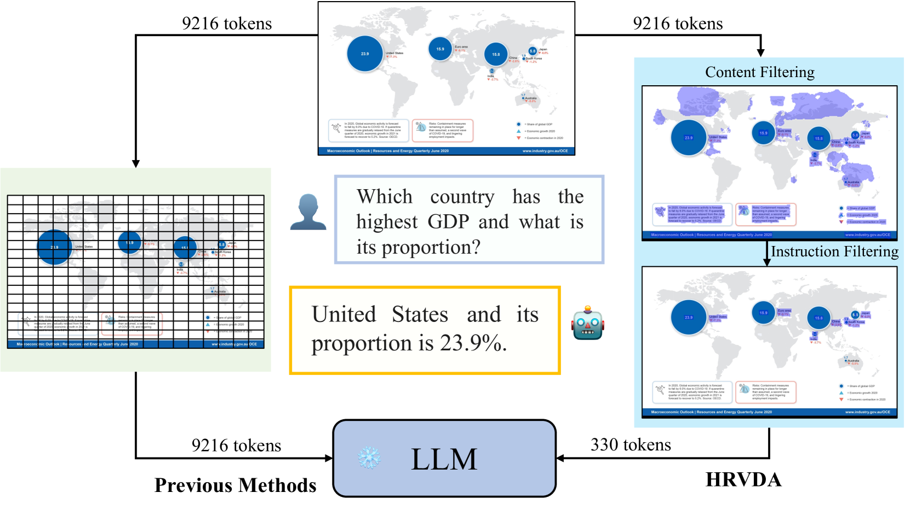
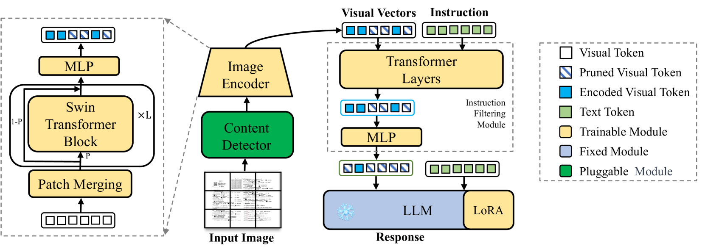
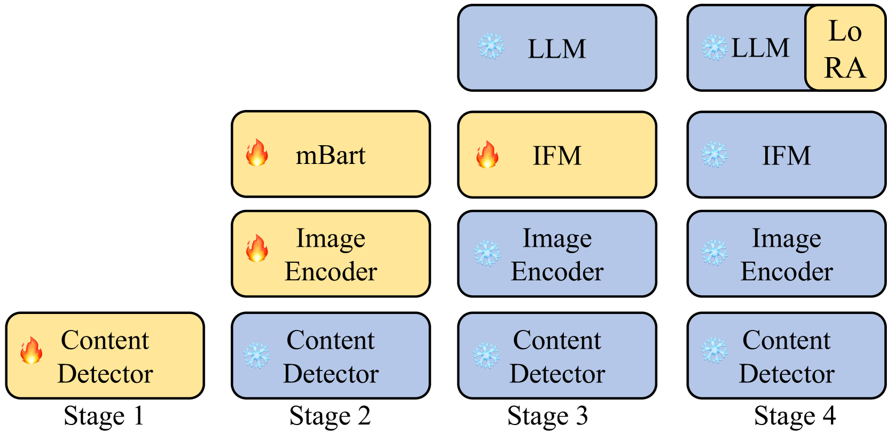
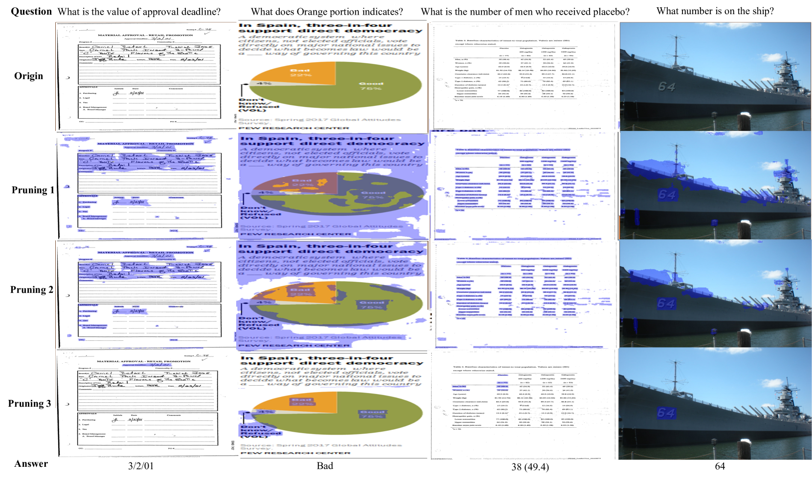
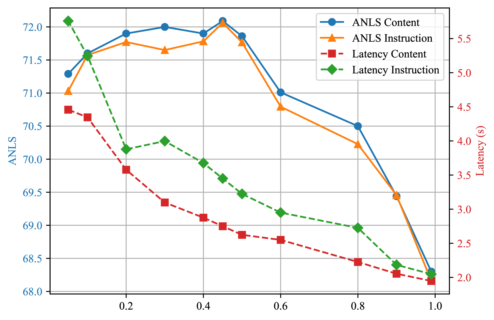
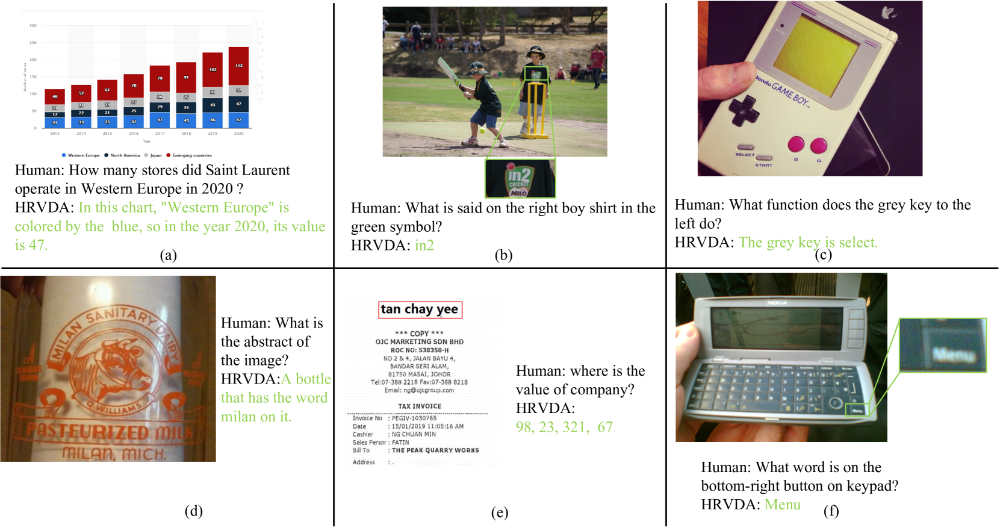
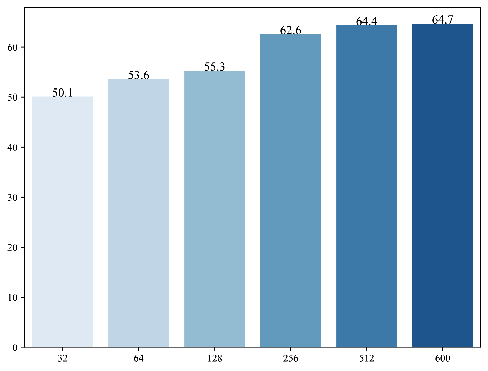
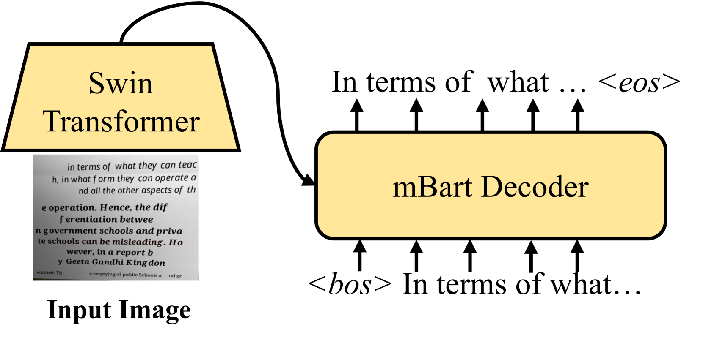
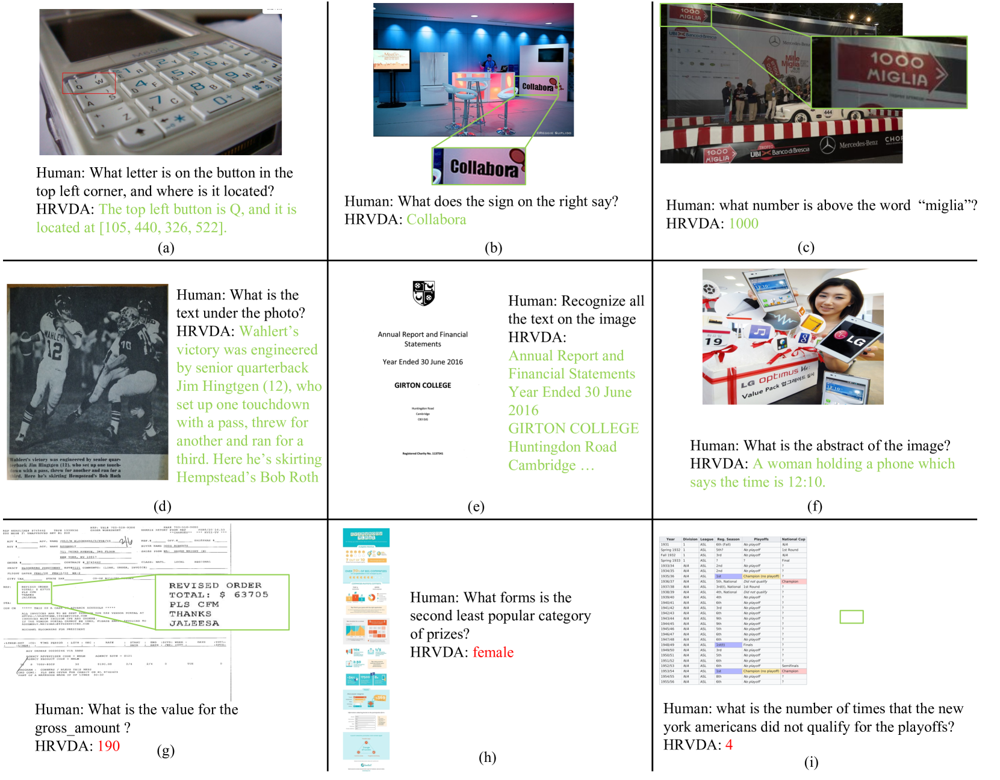
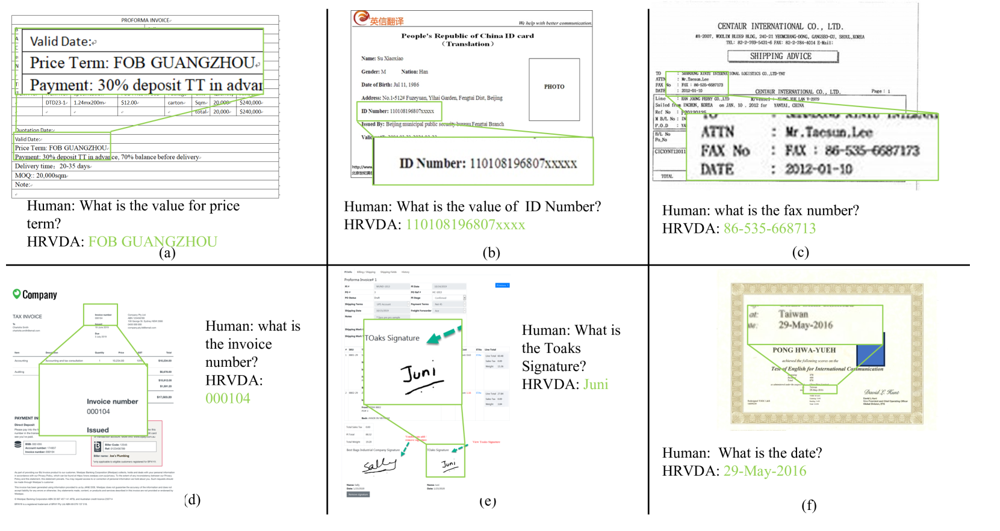

# HRVDA：高清视觉文档辅助工具

发布时间：2024年04月10日

`LLM应用` `视觉文档理解` `高分辨率图像处理`

> HRVDA: High-Resolution Visual Document Assistant

# 摘要

> 通过利用庞大的训练数据，多模态大型语言模型（MLLMs）已经展现出了卓越的视觉理解能力，并在众多任务中取得了优异的成绩。然而，在视觉文档理解这一领域，它们的表现还有很大的提升空间。这主要是因为视觉文档理解任务要求更为精细的预测。在处理自然场景时，MLLMs通常依赖低分辨率的图像，这会导致大量视觉信息的流失。同时，通用型的MLLMs在执行针对文档的指令时并不擅长。为此，我们设计了一个高分辨率视觉文档助手（HRVDA），旨在缩小MLLMs与视觉文档理解之间的差距。该模型通过内容过滤和指令过滤两个机制，有效筛选出与内容和指令无关的视觉标记，实现了对高分辨率图像的高效训练和快速推理。我们还创建了一个专门针对文档的视觉指令调整数据集，并采用多阶段训练策略，以增强模型对文档的理解能力。大量实验证明，我们的模型在多个文档理解数据集上达到了最先进的水平，同时保持了与低分辨率模型相媲美的训练效率和推理速度。

> Leveraging vast training data, multimodal large language models (MLLMs) have demonstrated formidable general visual comprehension capabilities and achieved remarkable performance across various tasks. However, their performance in visual document understanding still leaves much room for improvement. This discrepancy is primarily attributed to the fact that visual document understanding is a fine-grained prediction task. In natural scenes, MLLMs typically use low-resolution images, leading to a substantial loss of visual information. Furthermore, general-purpose MLLMs do not excel in handling document-oriented instructions. In this paper, we propose a High-Resolution Visual Document Assistant (HRVDA), which bridges the gap between MLLMs and visual document understanding. This model employs a content filtering mechanism and an instruction filtering module to separately filter out the content-agnostic visual tokens and instruction-agnostic visual tokens, thereby achieving efficient model training and inference for high-resolution images. In addition, we construct a document-oriented visual instruction tuning dataset and apply a multi-stage training strategy to enhance the model's document modeling capabilities. Extensive experiments demonstrate that our model achieves state-of-the-art performance across multiple document understanding datasets, while maintaining training efficiency and inference speed comparable to low-resolution models.

[Arxiv](https://arxiv.org/abs/2404.06918)