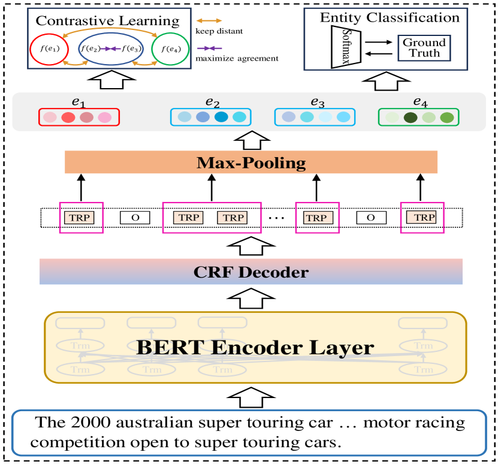
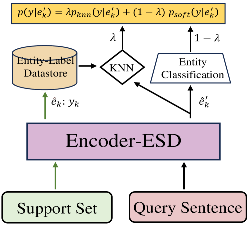
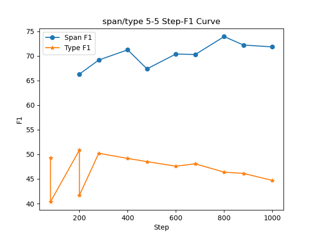
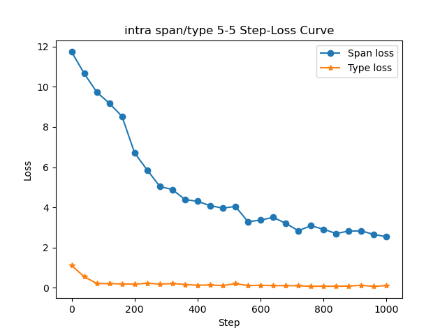

# 本文提出了一种结合实体感知对比学习的方法，用于少样本命名实体识别（NER）的混合多阶段解码策略。

发布时间：2024年04月10日

`Agent` `命名实体识别`

> Hybrid Multi-stage Decoding for Few-shot NER with Entity-aware Contrastive Learning

# 摘要

> 少样本命名实体识别（Few-shot NER）通过少量标注样本，能识别出新型命名实体。传统方法在处理计算负担和负样本数量时显得力不从心。本文提出了一种新型方法——实体感知对比学习（MsFNER），它将命名实体识别任务分为两个阶段：实体跨度识别和实体分类。MsFNER的实施包括训练、微调和推理三个环节。训练阶段，我们利用元学习策略，分别独立训练出最佳的实体跨度检测和实体分类模型，并引入对比学习模块，以增强实体分类的表示能力。微调阶段，我们针对目标领域的支持数据集对这两个模型进行微调。在推理阶段，对未标注数据先进行实体跨度检测，再结合实体分类模型和KNN算法共同确定实体跨度。我们在FewNERD公开数据集上进行的实验结果显示，MsFNER的性能显著提升。

> Few-shot named entity recognition can identify new types of named entities based on a few labeled examples. Previous methods employing token-level or span-level metric learning suffer from the computational burden and a large number of negative sample spans. In this paper, we propose the Hybrid Multi-stage Decoding for Few-shot NER with Entity-aware Contrastive Learning (MsFNER), which splits the general NER into two stages: entity-span detection and entity classification. There are 3 processes for introducing MsFNER: training, finetuning, and inference. In the training process, we train and get the best entity-span detection model and the entity classification model separately on the source domain using meta-learning, where we create a contrastive learning module to enhance entity representations for entity classification. During finetuning, we finetune the both models on the support dataset of target domain. In the inference process, for the unlabeled data, we first detect the entity-spans, then the entity-spans are jointly determined by the entity classification model and the KNN. We conduct experiments on the open FewNERD dataset and the results demonstrate the advance of MsFNER.

[Arxiv](https://arxiv.org/abs/2404.06970)