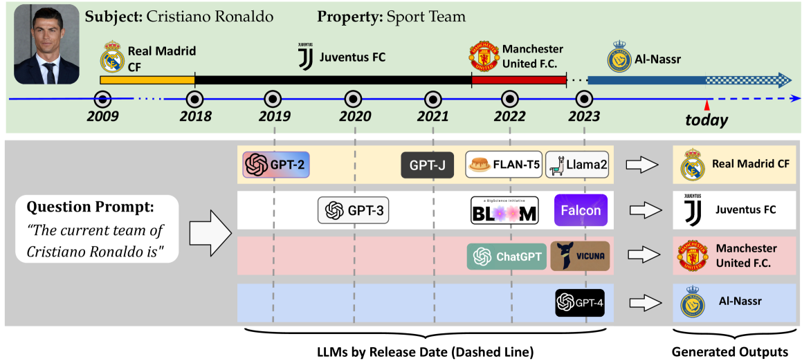
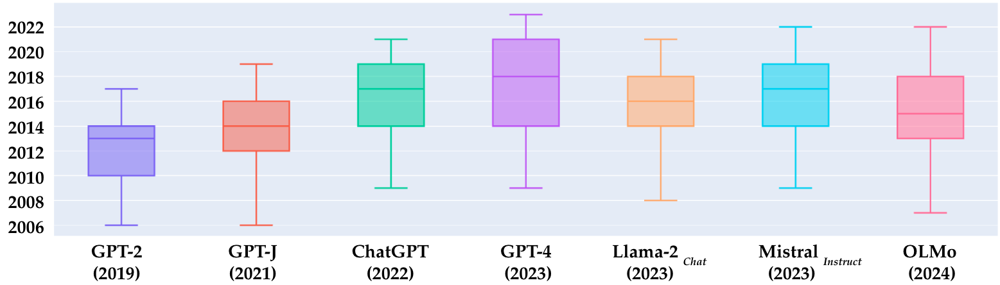
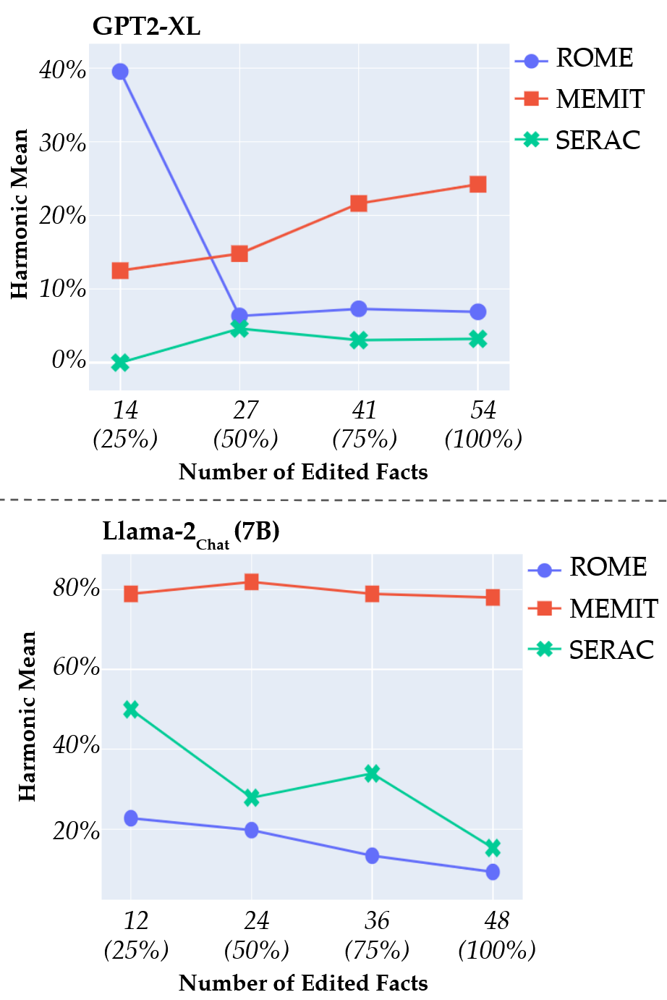
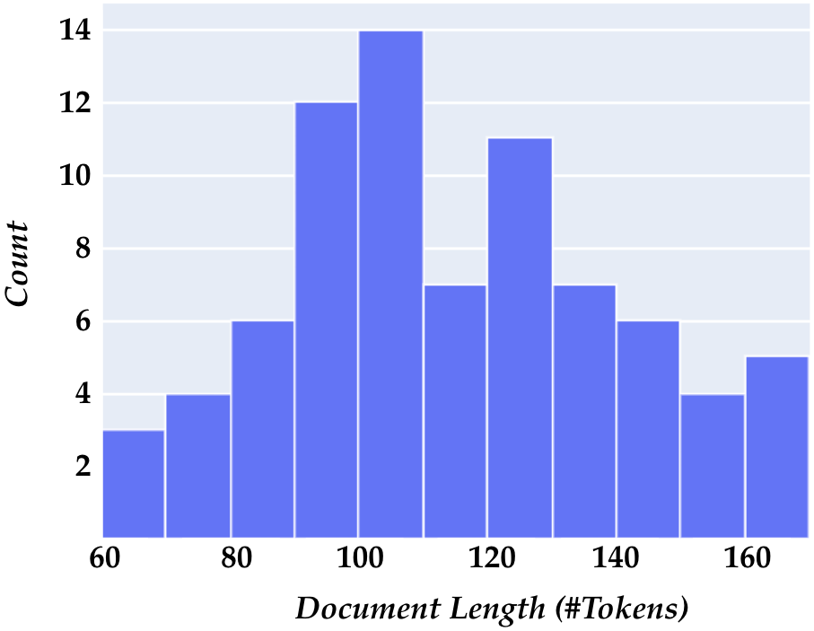
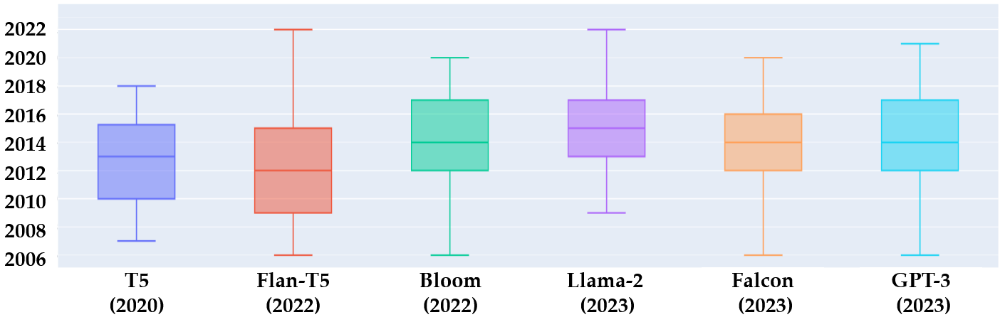
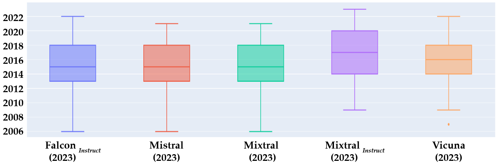

# 你的大型语言模型（LLM）是否已落伍？本文旨在对 LLM 及其对齐算法进行基准测试，以评估它们处理时间敏感知识的能力。

发布时间：2024年04月10日

`LLM应用` `知识库` `基准测试`

> Is Your LLM Outdated? Benchmarking LLMs & Alignment Algorithms for Time-Sensitive Knowledge

# 摘要

> 本研究探讨了大型语言模型（LLMs）作为知识库的适宜性，特别关注如何确保这些模型中的事实知识能够与时俱进。鉴于目前尚缺乏对LLMs中过时知识识别的研究，我们设计并构建了一个动态基准测试，它能够为每个目标事实问题提供最新的基准答案。我们对十八个开源和闭源的先进LLMs进行了评估，这些评估基于从Wikidata实时检索的时间敏感知识。我们挑选了政治、体育和组织等时间敏感领域的特定事实，并估算了模型在预训练和微调阶段所学习信息的时效性。在研究的第二部分，我们检验了知识编辑方法在更新LLMs事实知识方面的有效性，并将其与检索增强生成的性能进行了对比。这个动态基准测试旨在评估LLMs的时效性，并可通过共享代码、数据集以及评估和可视化工具，扩展应用于其他领域的评估。

> We study the appropriateness of Large Language Models (LLMs) as knowledge repositories. We focus on the challenge of maintaining LLMs' factual knowledge up-to-date over time. Motivated by the lack of studies on identifying outdated knowledge within LLMs, we design and develop a dynamic benchmark with up-to-date ground truth answers for each target factual question. We evaluate eighteen open-source and closed-source state-of-the-art LLMs on time-sensitive knowledge retrieved in real-time from Wikidata. We select time-sensitive domain facts in politics, sports, and organizations, and estimate the recency of the information learned by the model during pre-training\fine-tuning. In the second contribution, we evaluate the effectiveness of knowledge editing methods for aligning LLMs with up-to-date factual knowledge and compare their performance with Retrieval Augmented Generation. The dynamic benchmark is designed to be used as-is to assess LLMs's up-to-dateness, as well as to be extended to other domains by sharing the code, the dataset, as well as evaluation and visualization scripts.

[Arxiv](https://arxiv.org/abs/2404.08700)