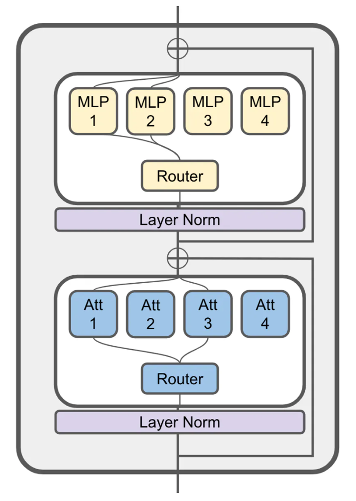
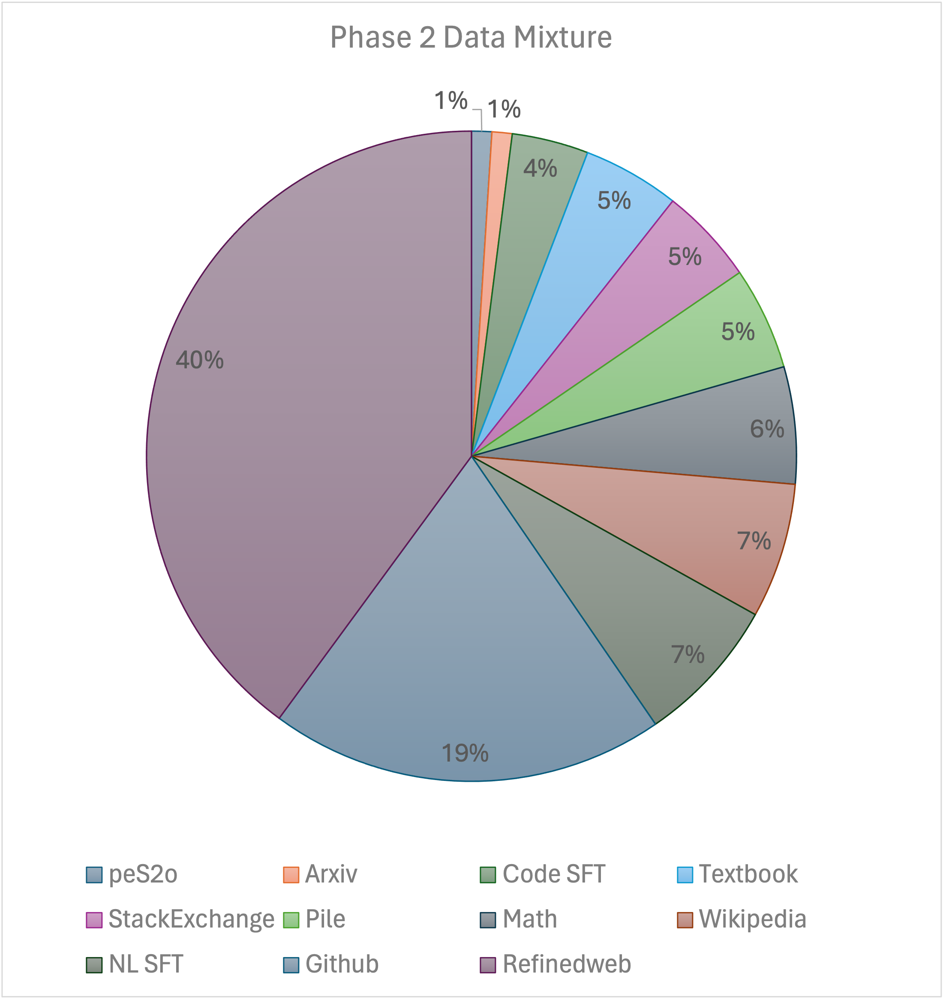
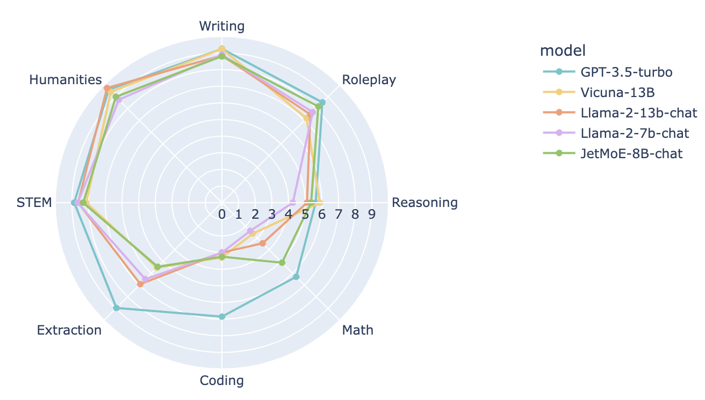

# JetMoE：以百万美元级成本实现Llama2级别性能

发布时间：2024年04月10日

`LLM理论` `人工智能` `资源优化`

> JetMoE: Reaching Llama2 Performance with 0.1M Dollars

# 摘要

> 大型语言模型（LLMs）成就斐然，但其资源消耗的日益增长却成为了构建强大、普及的超人类智能的一大阻碍。本报告向我们展示了JetMoE-8B，这是一款新型LLM，仅耗资不足百万美元便完成了训练。它利用了1.25万亿个来自精选开源语料库的令牌和3万个H100 GPU小时。JetMoE-8B虽成本低廉，却展现出卓越的性能，不仅在性能上超越了Llama2-7B模型，其聊天版本JetMoE-8B-Chat也超过了Llama2-13B-Chat模型。这一成就揭示了LLM训练的性价比远高于一般认知。JetMoE-8B采用了高效的稀疏门控混合专家（SMoE）架构，由注意力和前馈专家构成，两层均实现了稀疏激活。这使得JetMoE-8B在每个输入令牌上仅激活20亿参数，相比于Llama2-7B，推理计算量减少了大约70%，同时拥有80亿参数。此外，JetMoE-8B对学术界极为友好，仅使用公开数据集和训练代码。本报告详尽阐述了所有训练参数和数据配比，旨在推动开源基础模型的发展。这种开放性旨在促进合作，加速可获取、高效率LLM领域的进一步发展。模型权重已在https://github.com/myshell-ai/JetMoE上公开，供人下载。

> Large Language Models (LLMs) have achieved remarkable results, but their increasing resource demand has become a major obstacle to the development of powerful and accessible super-human intelligence. This report introduces JetMoE-8B, a new LLM trained with less than $0.1 million, using 1.25T tokens from carefully mixed open-source corpora and 30,000 H100 GPU hours. Despite its low cost, the JetMoE-8B demonstrates impressive performance, with JetMoE-8B outperforming the Llama2-7B model and JetMoE-8B-Chat surpassing the Llama2-13B-Chat model. These results suggest that LLM training can be much more cost-effective than generally thought. JetMoE-8B is based on an efficient Sparsely-gated Mixture-of-Experts (SMoE) architecture, composed of attention and feedforward experts. Both layers are sparsely activated, allowing JetMoE-8B to have 8B parameters while only activating 2B for each input token, reducing inference computation by about 70% compared to Llama2-7B. Moreover, JetMoE-8B is highly open and academia-friendly, using only public datasets and training code. All training parameters and data mixtures have been detailed in this report to facilitate future efforts in the development of open foundation models. This transparency aims to encourage collaboration and further advancements in the field of accessible and efficient LLMs. The model weights are publicly available at https://github.com/myshell-ai/JetMoE.

[Arxiv](https://arxiv.org/abs/2404.07413)