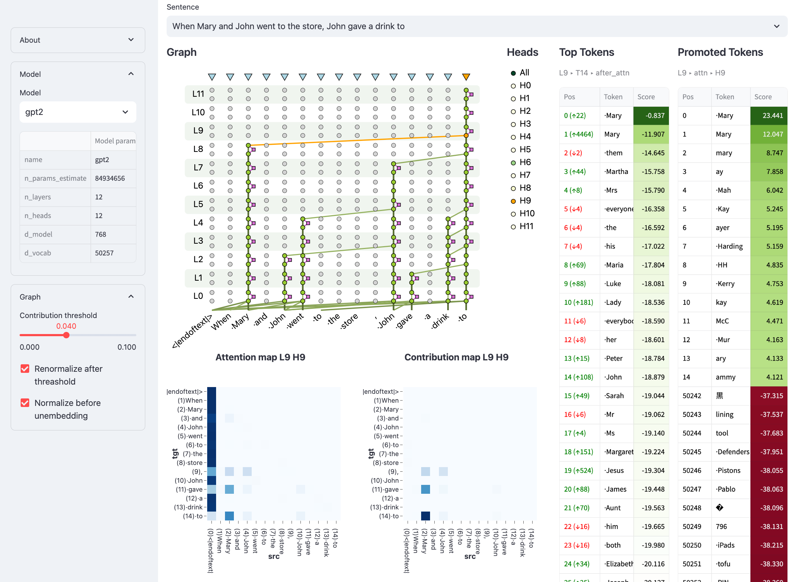

# LM 透明度工具：深入剖析 Transformer 语言模型的互动利器

发布时间：2024年04月10日

`LLM理论` `机器学习` `模型解释性`

> LM Transparency Tool: Interactive Tool for Analyzing Transformer Language Models

# 摘要

> 我们推出了LM透明度工具（LM-TT），这是一款开源的交互式分析工具，专门用于透视基于Transformer架构的语言模型的内部运作。与传统工具仅关注决策环节的局部不同，我们的框架设计让整个预测流程一目了然，并能追踪模型行为，从顶层的表示到模型内部极为细致的部分。它主要具备三大功能：（1）揭示输入输出信息流的关键环节，（2）将模型块的变动归因于特定的注意力头和前馈神经网络，并（3）解释这些头和神经元的作用。此工具的核心在于展现每个步骤中模型组件的重要性。因此，我们能够精准地识别出在预测中起关键作用的模型组件。鉴于在庞大的模型中识别哪些组件值得关注至关重要，我们相信LM-TT将在研究和实际应用中极大地助力解释性社区的工作。

> We present the LM Transparency Tool (LM-TT), an open-source interactive toolkit for analyzing the internal workings of Transformer-based language models. Differently from previously existing tools that focus on isolated parts of the decision-making process, our framework is designed to make the entire prediction process transparent, and allows tracing back model behavior from the top-layer representation to very fine-grained parts of the model. Specifically, it (1) shows the important part of the whole input-to-output information flow, (2) allows attributing any changes done by a model block to individual attention heads and feed-forward neurons, (3) allows interpreting the functions of those heads or neurons. A crucial part of this pipeline is showing the importance of specific model components at each step. As a result, we are able to look at the roles of model components only in cases where they are important for a prediction. Since knowing which components should be inspected is key for analyzing large models where the number of these components is extremely high, we believe our tool will greatly support the interpretability community both in research settings and in practical applications.

[Arxiv](https://arxiv.org/abs/2404.07004)