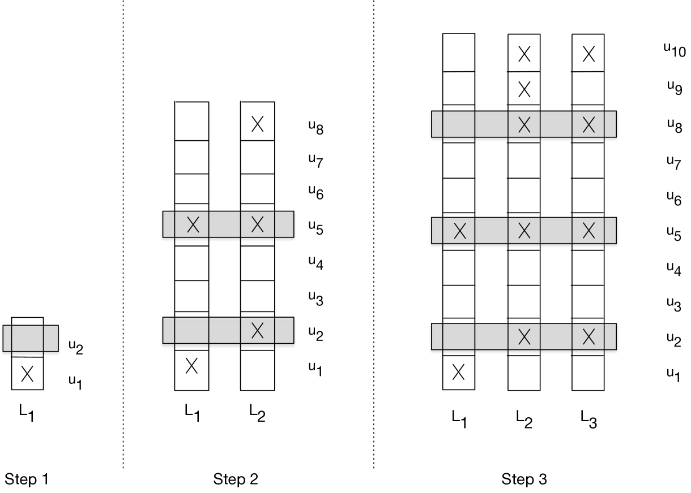
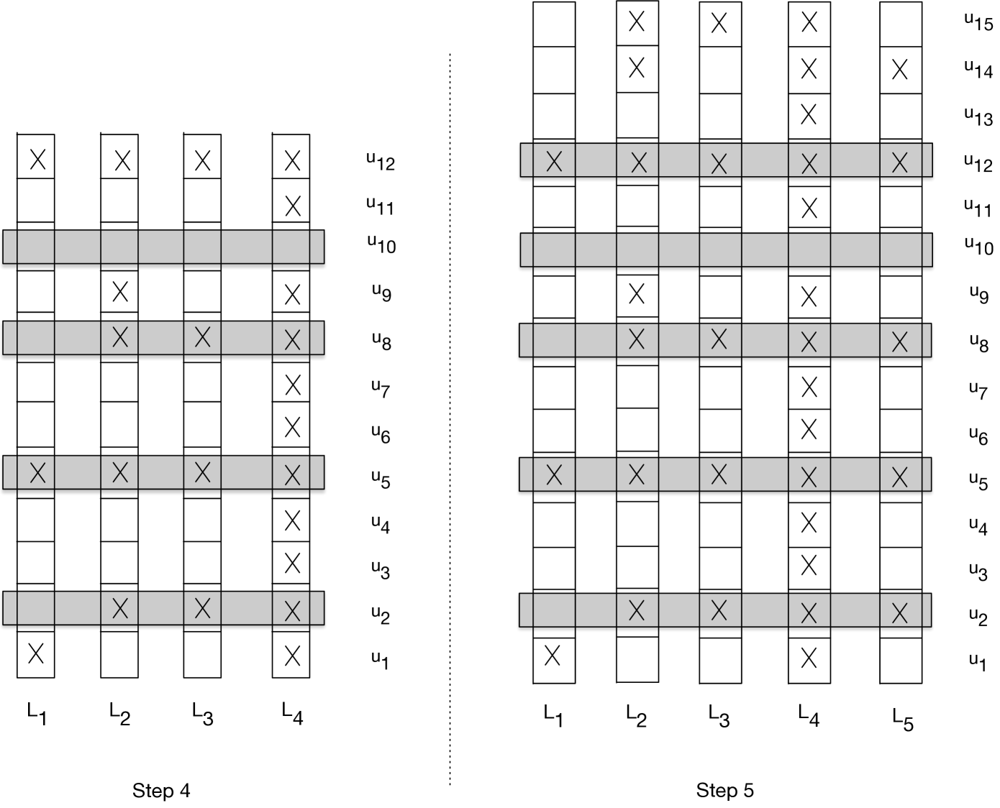

# 极限下的语言生成

发布时间：2024年04月10日

`LLM理论` `语言生成` `计算理论`

> Language Generation in the Limit

# 摘要

> 尽管大型语言模型结构复杂，但其核心的语言生成问题其实简单明了：基于有限的未知语言样本，创造出训练数据中未曾出现的新字符串。本文仅基于这一前提，探讨语言生成的可能性，不做额外假设。设想一个对手列出了一种未知语言 L 的所有字符串，而这个语言仅从众多候选语言中选出。一个计算代理致力于学习并生成 L 语言的内容；我们认为，当代理在对手枚举 L 语言的某个阶段后，能够创造出完全属于 L 且对手未曾提及的新元素时，代理就实现了对 L 语言的极限生成。我们发现，存在这样的代理，能够对任何可数的候选语言集合实现极限生成。这一发现与 Gold 和 Angluin 在语言学习领域的经典研究形成鲜明对比，他们的研究目标是从样本中识别未知语言；这表明，识别语言与生成语言本质上是两个不同的问题。

> Although current large language models are complex, the most basic specifications of the underlying language generation problem itself are simple to state: given a finite set of training samples from an unknown language, produce valid new strings from the language that don't already appear in the training data. Here we ask what we can conclude about language generation using only this specification, without further assumptions. In particular, suppose that an adversary enumerates the strings of an unknown target language L that is known only to come from one of a possibly infinite list of candidates. A computational agent is trying to learn to generate from this language; we say that the agent generates from L in the limit if after some finite point in the enumeration of L, the agent is able to produce new elements that come exclusively from L and that have not yet been presented by the adversary. Our main result is that there is an agent that is able to generate in the limit for every countable list of candidate languages. This contrasts dramatically with negative results due to Gold and Angluin in a well-studied model of language learning where the goal is to identify an unknown language from samples; the difference between these results suggests that identifying a language is a fundamentally different problem than generating from it.

[Arxiv](https://arxiv.org/abs/2404.06757)