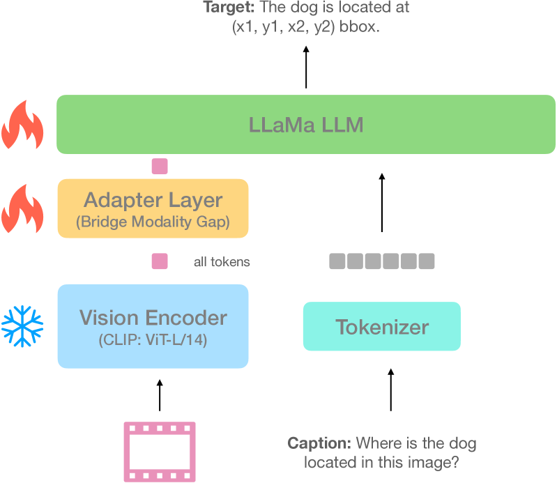

# 通过学习识别物体的位置，视觉-大型语言模型在空间推理方面的表现得到了显著提升。

发布时间：2024年04月10日

`LLM应用` `视觉-语言处理` `空间感知`

> Learning to Localize Objects Improves Spatial Reasoning in Visual-LLMs

# 摘要

> 将大型语言模型融入视觉任务，诞生了视觉-大型语言模型（V-LLMs），在视觉问答等视觉-语言任务上表现卓越。然而，现有的V-LLMs如BLIP-2、LLaVA在空间推理和定位识别方面尚显不足。这些模型虽能输出详尽的文本答案，却在区分左右等简单任务上力不从心。本研究致力于探索如何利用基于图像空间坐标的微调目标，增强V-LLMs的空间感知能力。我们找到了最佳的坐标表达方式、高效的微调策略和生成伪数据的方法，显著提升了V-LLMs的空间感知。此外，我们的模型在图像和视频的视觉问答任务中表现更佳，减少了不期望的幻觉，提供了更精准的上下文对象描述。通过一系列实验，我们证明了所提出框架在五个视觉-语言任务和十四个数据集上的显著性能提升。

> Integration of Large Language Models (LLMs) into visual domain tasks, resulting in visual-LLMs (V-LLMs), has enabled exceptional performance in vision-language tasks, particularly for visual question answering (VQA). However, existing V-LLMs (e.g. BLIP-2, LLaVA) demonstrate weak spatial reasoning and localization awareness. Despite generating highly descriptive and elaborate textual answers, these models fail at simple tasks like distinguishing a left vs right location. In this work, we explore how image-space coordinate based instruction fine-tuning objectives could inject spatial awareness into V-LLMs. We discover optimal coordinate representations, data-efficient instruction fine-tuning objectives, and pseudo-data generation strategies that lead to improved spatial awareness in V-LLMs. Additionally, our resulting model improves VQA across image and video domains, reduces undesired hallucination, and generates better contextual object descriptions. Experiments across 5 vision-language tasks involving 14 different datasets establish the clear performance improvements achieved by our proposed framework.

[Arxiv](https://arxiv.org/abs/2404.07449)