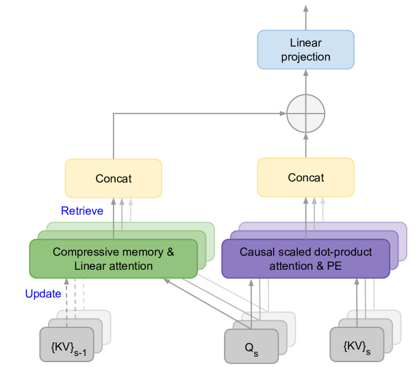
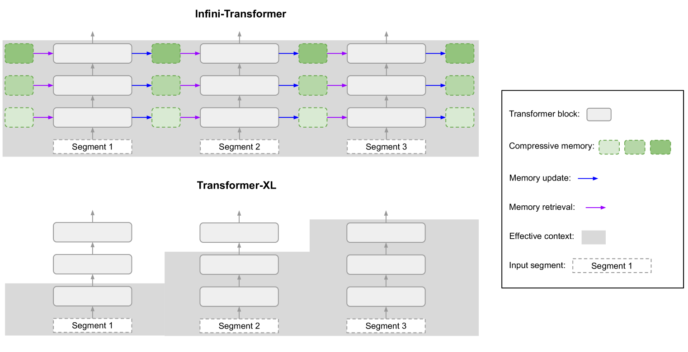
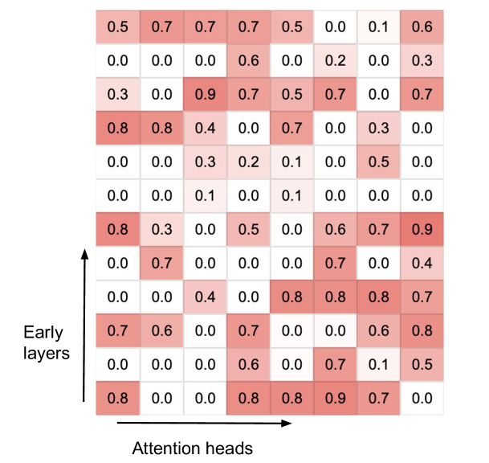
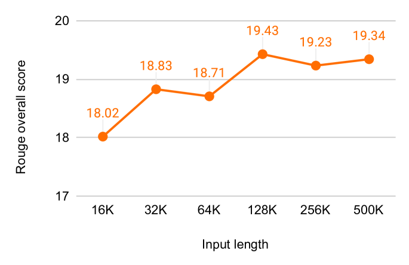

# 全面覆盖：搭载无限注意力机制的高效无限上下文变换器，让每个细节都得到关注。

发布时间：2024年04月10日

`LLM理论` `语言模型` `长文本处理`

> Leave No Context Behind: Efficient Infinite Context Transformers with Infini-attention

# 摘要

> 本文介绍了一种创新方法，让基于Transformer的大型语言模型（LLMs）能够处理无限长的输入，同时确保内存和计算资源的可控性。核心创新是一种名为Infini-attention的新型注意力机制，它将压缩记忆融入传统注意力机制，并在单个Transformer模块内巧妙融合了掩蔽式局部注意力与长期线性注意力。通过在长文本建模、百万级序列长度的密钥检索以及五十万字书籍摘要等任务上的实践，我们验证了这一方法的卓越性能，这些实验涵盖了1B和8B规模的LLMs。该方法仅引入了有限的内存参数，为LLMs的快速流式推理提供了可能。

> This work introduces an efficient method to scale Transformer-based Large Language Models (LLMs) to infinitely long inputs with bounded memory and computation. A key component in our proposed approach is a new attention technique dubbed Infini-attention. The Infini-attention incorporates a compressive memory into the vanilla attention mechanism and builds in both masked local attention and long-term linear attention mechanisms in a single Transformer block. We demonstrate the effectiveness of our approach on long-context language modeling benchmarks, 1M sequence length passkey context block retrieval and 500K length book summarization tasks with 1B and 8B LLMs. Our approach introduces minimal bounded memory parameters and enables fast streaming inference for LLMs.

[Arxiv](https://arxiv.org/abs/2404.07143)