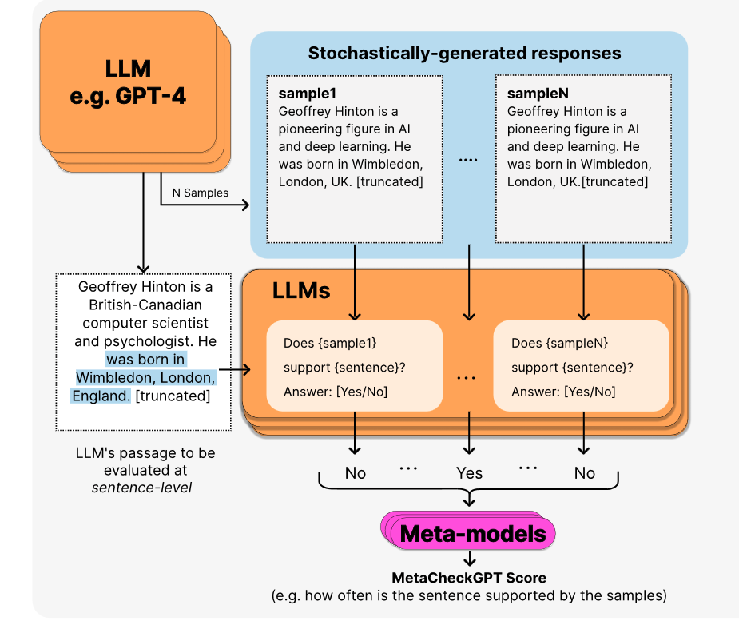
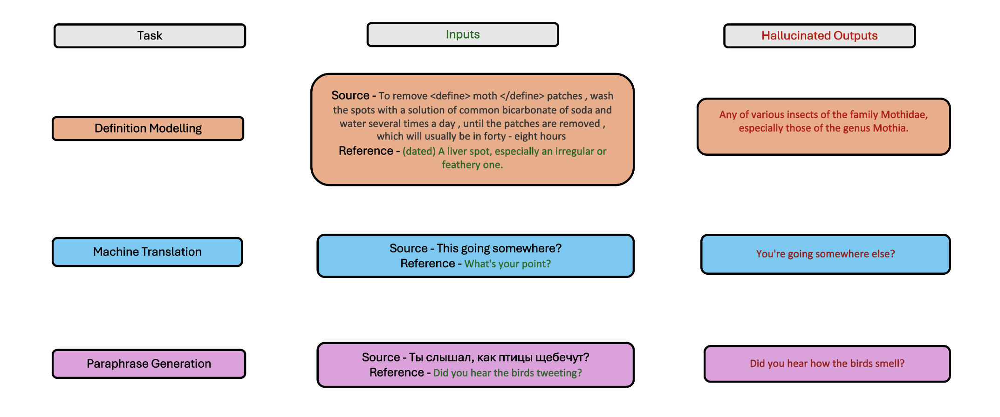

# MetaCheckGPT —— 通过 LLM 的不确定性和元模型实现多任务幻觉检测

发布时间：2024年04月10日

`RAG` `模型评估与融合`

> MetaCheckGPT -- A Multi-task Hallucination Detection Using LLM Uncertainty and Meta-models

# 摘要

> 本文展示了我们在SemEval-2024任务6中夺冠的策略。我们构建了一个大型语言模型的元回归器框架，专门用于模型评估与融合，成功登顶排行榜。通过挖掘众多语言模型中的不确定性信号，我们的方法能够更加有效地识别并抵御幻觉现象。

> This paper presents our winning solution for the SemEval-2024 Task 6 competition. We propose a meta-regressor framework of large language models (LLMs) for model evaluation and integration that achieves the highest scores on the leader board. Our approach leverages uncertainty signals present in a diverse basket of LLMs to detect hallucinations more robustly.

[Arxiv](https://arxiv.org/abs/2404.06948)