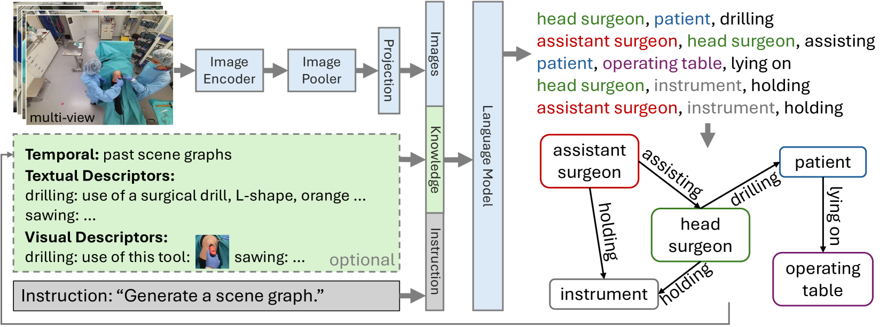

# ORacle：面向整体OR领域建模的知识引导型大型视觉-语言模型

发布时间：2024年04月10日

`Agent` `手术室` `视觉-语言模型`

> ORacle: Large Vision-Language Models for Knowledge-Guided Holistic OR Domain Modeling

# 摘要

> 全球每天进行的无数手术，都在各具特色的手术室中展开，这些手术室不仅布局各异，参与人员、使用的工具和设备也不尽相同。这种多样性给全面理解手术室带来了挑战，因为需要模型具备超越初始训练数据集的泛化能力。为了应对这一挑战，我们推出了ORacle，这是一款先进的视觉-语言模型，专为全面建模手术室领域而设计。它融合了多视角和时间序列功能，并能在推理时利用外部知识，适应新的手术场景。通过我们创新的数据增强框架，ORacle的能力得到了加强，该框架大幅扩展了训练数据的多样性，确保了ORacle能够有效运用所学知识。在严格的测试中，无论是场景图生成还是4D-OR数据集的下游任务，ORacle都展现出了业界领先的性能，且相较于现有模型，需要的数据量更少。它还能识别和解释之前未见过的视角、动作和工具设备的外观，显示出其强大的适应性。这预示着ORacle将大幅提升手术室领域建模的扩展性和经济性，并为手术数据科学的发展开辟新径。我们的代码和数据将在论文被接受后公开发布。

> Every day, countless surgeries are performed worldwide, each within the distinct settings of operating rooms (ORs) that vary not only in their setups but also in the personnel, tools, and equipment used. This inherent diversity poses a substantial challenge for achieving a holistic understanding of the OR, as it requires models to generalize beyond their initial training datasets. To reduce this gap, we introduce ORacle, an advanced vision-language model designed for holistic OR domain modeling, which incorporates multi-view and temporal capabilities and can leverage external knowledge during inference, enabling it to adapt to previously unseen surgical scenarios. This capability is further enhanced by our novel data augmentation framework, which significantly diversifies the training dataset, ensuring ORacle's proficiency in applying the provided knowledge effectively. In rigorous testing, in scene graph generation, and downstream tasks on the 4D-OR dataset, ORacle not only demonstrates state-of-the-art performance but does so requiring less data than existing models. Furthermore, its adaptability is displayed through its ability to interpret unseen views, actions, and appearances of tools and equipment. This demonstrates ORacle's potential to significantly enhance the scalability and affordability of OR domain modeling and opens a pathway for future advancements in surgical data science. We will release our code and data upon acceptance.

[Arxiv](https://arxiv.org/abs/2404.07031)