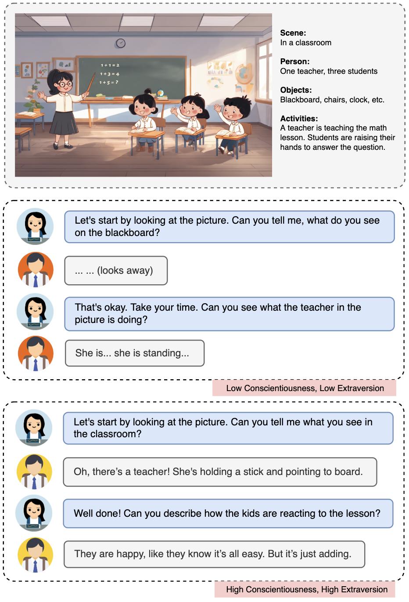
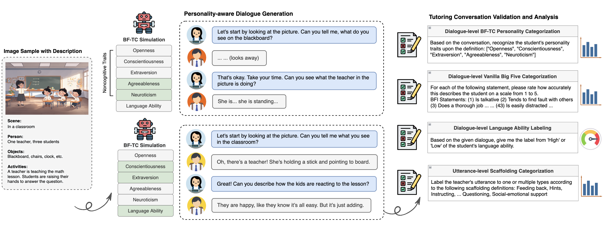
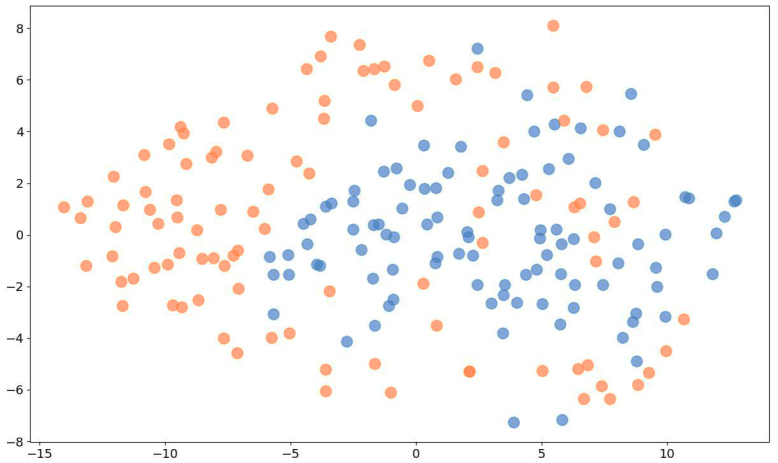
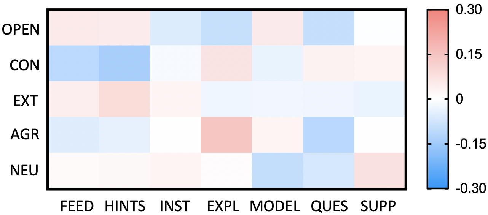
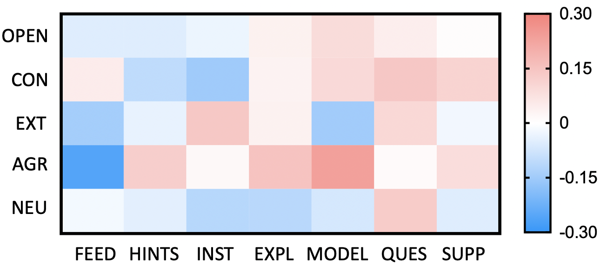
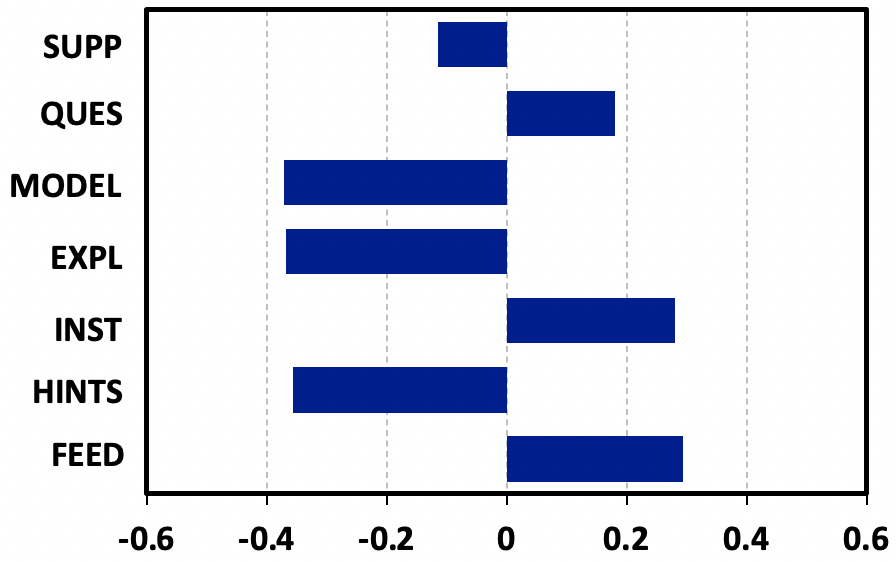

# 为了会话式智能辅导系统，我们开发了一种能够感知学生个性的模拟技术。

发布时间：2024年04月10日

`LLM应用` `人工智能`

> Personality-aware Student Simulation for Conversational Intelligent Tutoring Systems

# 摘要

> 智能辅导系统（ITSs）能够根据学生的需求提供定制化的学习体验。随着大型语言模型（LLMs）的兴起，人机互动得到显著改善，促进了对话式ITS在数学、语言学习等多个领域的应用。在对话式教学中，针对学生个体差异进行识别和适应，能有效提升学生的学习积极性和效率。尽管如此，如何在对话式ITS中准确刻画和模拟学生特征，仍是一个难题。本研究提出了一种新框架，通过细化和融合学生的认知与非认知特征，构建多样化的学生档案，并运用LLMs在语言学习环境中实现具有个性化特征的学生模拟。我们对框架进行了多维度验证，并通过教师与学生的视角进行了深入分析。实验结果显示，当前顶尖的LLMs能够根据学生的语言能力和个性特征，生成多样化的回应，进而激发教师采取相应的适应性辅导策略。

> Intelligent Tutoring Systems (ITSs) can provide personalized and self-paced learning experience. The emergence of large language models (LLMs) further enables better human-machine interaction, and facilitates the development of conversational ITSs in various disciplines such as math and language learning. In dialogic teaching, recognizing and adapting to individual characteristics can significantly enhance student engagement and learning efficiency. However, characterizing and simulating student's persona remain challenging in training and evaluating conversational ITSs. In this work, we propose a framework to construct profiles of different student groups by refining and integrating both cognitive and noncognitive aspects, and leverage LLMs for personality-aware student simulation in a language learning scenario. We further enhance the framework with multi-aspect validation, and conduct extensive analysis from both teacher and student perspectives. Our experimental results show that state-of-the-art LLMs can produce diverse student responses according to the given language ability and personality traits, and trigger teacher's adaptive scaffolding strategies.

[Arxiv](https://arxiv.org/abs/2404.06762)