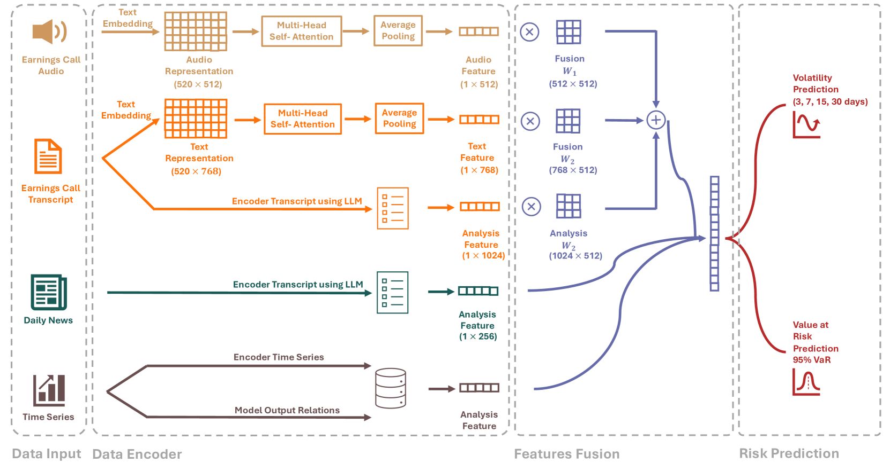
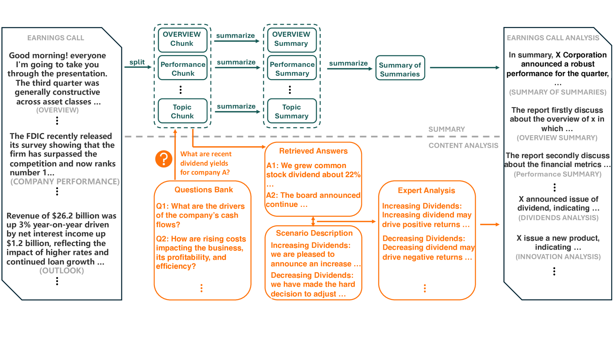

# RiskLabs 项目：运用融合多源数据的大型语言模型来预测金融风险

发布时间：2024年04月10日

`LLM应用` `风险管理`

> RiskLabs: Predicting Financial Risk Using Large Language Model Based on Multi-Sources Data

# 摘要

> AI技术，尤其是大型语言模型（LLMs）在金融领域的融合，正受到学术界的高度关注。尽管有所进步，但现有研究主要集中于财务文本摘要、问答（Q&A）和股票走势预测（二元分类）等任务，而在利用LLMs进行金融风险预测方面尚存在明显不足。为填补这一空白，本文提出了\textbf{RiskLabs}框架，这是一个创新的解决方案，它运用LLMs来分析并预测金融风险。RiskLabs巧妙地融合了包括盈利电话会议（ECCs）中的文本和语音信息、市场相关的时间序列数据，以及ECC发布前后的新闻上下文数据在内的多种金融数据类型。我们采用的多阶段方法首先利用LLMs处理ECC数据，接着搜集并处理ECC前的时间序列数据，以建立跨时段的风险模型。RiskLabs通过多模态融合技术整合这些多元数据特征，实现全面的多任务金融风险预测。实验结果证明，RiskLabs在预测金融市场波动和差异方面表现出色。通过对比实验，我们发现不同数据源对金融风险评估的贡献，并探讨了LLMs在这一过程中的重要作用。我们的研究成果不仅推动了AI在金融领域的应用，也为利用LLMs进行金融风险评估开辟了新路径。

> The integration of Artificial Intelligence (AI) techniques, particularly large language models (LLMs), in finance has garnered increasing academic attention. Despite progress, existing studies predominantly focus on tasks like financial text summarization, question-answering (Q$\&$A), and stock movement prediction (binary classification), with a notable gap in the application of LLMs for financial risk prediction. Addressing this gap, in this paper, we introduce \textbf{RiskLabs}, a novel framework that leverages LLMs to analyze and predict financial risks. RiskLabs uniquely combines different types of financial data, including textual and vocal information from Earnings Conference Calls (ECCs), market-related time series data, and contextual news data surrounding ECC release dates. Our approach involves a multi-stage process: initially extracting and analyzing ECC data using LLMs, followed by gathering and processing time-series data before the ECC dates to model and understand risk over different timeframes. Using multimodal fusion techniques, RiskLabs amalgamates these varied data features for comprehensive multi-task financial risk prediction. Empirical experiment results demonstrate RiskLab's effectiveness in forecasting both volatility and variance in financial markets. Through comparative experiments, we demonstrate how different data sources contribute to financial risk assessment and discuss the critical role of LLMs in this context. Our findings not only contribute to the AI in finance application but also open new avenues for applying LLMs in financial risk assessment.

[Arxiv](https://arxiv.org/abs/2404.07452)