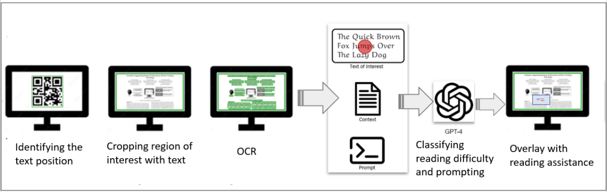

# SARA：智能AI阅读助手，助力阅读理解

发布时间：2024年04月10日

`LLM应用` `混合现实` `眼动追踪`

> SARA: Smart AI Reading Assistant for Reading Comprehension

# 摘要

> SARA 融合了眼动追踪技术与尖端的大型语言模型，打造了一个混合现实平台，旨在通过实时个性化辅助功能，提升用户的阅读体验。它通过监测用户的眼球运动，精准捕捉到引起最多关注的文本部分，这些区域往往暗示着用户可能存在的理解难点。整个过程涵盖文本识别与提取、视线追踪与校准，以及对阅读难度的评估等关键环节。根据这些分析，SARA 会生成针对性的辅助方案，以虚拟图层的形式直接展现在用户视野中的难懂文本上。这种智能辅助能够帮助用户轻松应对生词和复杂句型，提供额外语境、释义调整以及多语种支持。SARA 的这一创新尝试预示着它将重塑阅读体验，并有效提升读者的阅读水平。

> SARA integrates Eye Tracking and state-of-the-art large language models in a mixed reality framework to enhance the reading experience by providing personalized assistance in real-time. By tracking eye movements, SARA identifies the text segments that attract the user's attention the most and potentially indicate uncertain areas and comprehension issues. The process involves these key steps: text detection and extraction, gaze tracking and alignment, and assessment of detected reading difficulty. The results are customized solutions presented directly within the user's field of view as virtual overlays on identified difficult text areas. This support enables users to overcome challenges like unfamiliar vocabulary and complex sentences by offering additional context, rephrased solutions, and multilingual help. SARA's innovative approach demonstrates it has the potential to transform the reading experience and improve reading proficiency.

[Arxiv](https://arxiv.org/abs/2404.06906)